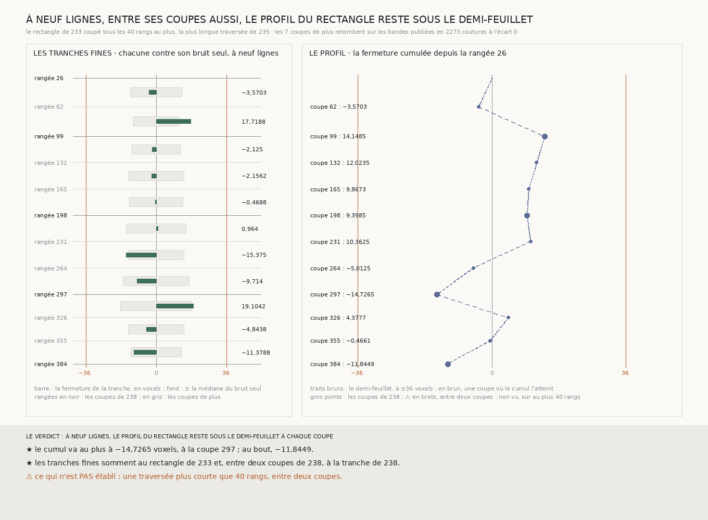

# `239` — Entre deux coupes de `224`, le profil du plus grand rectangle reste-t-il sous le demi-feuillet ? Oui, à la portée de `235` : coupé tous les 29 à 37 rangs, son cumul ne dépasse jamais 14,7265 voxels

*La plus longue traversée que `235` publie donne une portée de 40 rangées. Chaque tranche de `238` est partagée en le moins de parts égales qui ne la dépassent pas : 7 coupes de plus, qui toutes tiennent, et onze tranches fines de 29 à 37 rangées. Lues, les coupes retombent sur les bandes publiées, et les tranches fines somment exactement au rectangle de `233` comme aux tranches de `238`. À neuf lignes, le cumul depuis la rangée 26 va de −14,7265 à 14,1485 : le pic que `238` voyait à la rangée 297 reste le pic entre ses coupes. Une traversée plus courte que la portée n'est pas vue.*

## 0. Pourquoi cette tranche

`238` a coupé le plus grand rectangle de `233` aux rangées 99, 198 et 297 : son cumul y vaut 14,1485, 9,3985 et
−14,7265, loin du demi-feuillet de 36 voxels. Mais ses tranches font de 73 à 99 rangées, et entre deux coupes le profil
n'est pas vu ; la traversée du demi-feuillet par l'aile de droite, dans `235`, allait de la coupe 163 à la coupe 203.
C'est `R4-P84` : entre deux coupes de `224`, le profil du rectangle reste-t-il sous le demi-feuillet ?

⚠⚠⚠ Le fichier a été écrit avant que la moindre ligne nouvelle ne soit lue. Ce qui était vu avant d'écrire : ce que `238`
publie, et sa figure.

## 1. Les coupes de plus, dérivées

La **portée** est la plus longue traversée que `235` publie : de la première à la dernière coupe où le cumul de l'aile
de droite atteint le demi-feuillet, une portée de **40** rangées. Chaque tranche de `238` est partagée en le moins de
parts égales possible dont aucune ne la dépasse. Les rangées de partage sont gardées là où leur bande de neuf lignes tient
d'une colonne du rectangle à l'autre, et toutes tiennent : **7** coupes de plus, aux rangées 62, 132, 165, 231, 264, 326 et 355.
Aucun écart entre deux coupes ne dépasse la portée.

⭐⭐ La garantie est exacte, et c'est pour elle que rien n'est choisi : une traversée qui dure au moins la portée, d'un
seul tenant, touche forcément une coupe.

⚠⚠ Chaque coupe coûte deux cent vingt-deux colonnes de neuf lignes, 1998 chunks : la lecture en a demandé 13 986, en un
peu plus de quatre heures.

## 2. Ce qui s'est lu, et ce qui le contrôle

Seules les coupes de plus sont lues ; les quatre bandes du rectangle et les coupes de `238` gardent les pas que `233` et
`238` publient. Les chunks que la lecture compte absents du dépôt sont ceux que la présence dit absents, sur les **63** lignes lues.

Chaque coupe croise les deux colonnes de `233`, la colonne 21 de `232` et la publication de `223` ; les coupes 132 à 264
croisent aussi les deux colonnes de `224`. Les pas relus retombent en **2273** coutures, écart **0**.

Deux emboîtements, exigés à l'arrondi près. Les **11** tranches fines somment à **−11,8449** à neuf lignes, écart 0, et
−24,8959 contre −24,8959 à sept lignes ; à trois et cinq lignes, un trou sur une colonne empêche de juger. Et celles qui
tombent entre deux coupes de `238` somment à la tranche que `238` publie entre elles, jugées à **4**, **3**, **4** et **2** largeurs.

## 3. Les tranches fines, à neuf lignes

| rangées | fermeture | dispersion du pas | bruit seul : médiane | bruit seul sous la fermeture |
|---|---:|---:|---:|---:|
| 26 à 62 | −3,5703 | 0,9811 | 13,1276 | 0,1301 |
| 62 à 99 | 17,7188 | 1,0682 | 11,5625 | 0,6847 |
| 99 à 132 | −2,125 | 1,0462 | 12,5 | 0,0881 |
| 132 à 165 | −2,1562 | 1,0165 | 14,375 | 0,0781 |
| 165 à 198 | −0,4688 | 1,0634 | 13,6875 | 0,018 |
| 198 à 231 | 0,964 | 1,0976 | 15,3077 | 0,031 |
| 231 à 264 | −15,375 | 0,9528 | 14,375 | 0,5325 |
| 264 à 297 | −9,714 | 1,1578 | 17,0264 | 0,2983 |
| 297 à 326 | 19,1042 | 1,2408 | 18,375 | 0,5195 |
| 326 à 355 | −4,8438 | 1,0417 | 14,1563 | 0,1802 |
| 355 à 384 | −11,3788 | 1,0434 | 12,9981 | 0,4575 |

Aucune tranche fine ne s'écarte de ce que le bruit seul produit : même la plus écartée, de 62 à 99, a le bruit seul
au-dessus d'elle dans près d'un tirage sur trois.

## 4. Le profil

| coupe | 62 | 99 | 132 | 165 | 198 | 231 | 264 | 297 | 326 | 355 | 384 |
|---|---:|---:|---:|---:|---:|---:|---:|---:|---:|---:|---:|
| cumul depuis la rangée 26 | −3,5703 | 14,1485 | 12,0235 | 9,8673 | 9,3985 | 10,3625 | −5,0125 | **−14,7265** | 4,3777 | −0,4661 | −11,8449 |

Aux rangées 99, 198 et 297, le cumul est celui que `238` publie. Entre elles, il ne va pas plus loin : le cumul va au plus à **−14,7265** voxels, à la coupe 297.
Le plus grand mouvement est dans la moitié basse : de 10,3625 à la coupe 231 à −14,7265 à la coupe 297, puis 4,3777
à la coupe 326.

## 5. Le verdict

**À NEUF LIGNES, LE PROFIL DU RECTANGLE RESTE SOUS LE DEMI-FEUILLET À CHAQUE COUPE.**

⭐⭐⭐⭐ **`R4-P84` est répondue à la portée de `235`.** Coupé tous les 29 à 37 rangs, le rectangle garde un cumul entre
−14,7265 et 14,1485 voxels : aucune traversée du demi-feuillet qui dure au moins quarante rangées ne lui échappe. Le pic
que `238` voyait à la rangée 297 est aussi le pic entre ses coupes.

## 6. Ce que cette tranche ne dit pas

- ⚠⚠⚠ **Une traversée plus courte que la portée, entre deux coupes.** La portée est la durée de la seule traversée vue,
  celle de l'aile de droite ; une traversée ailleurs pourrait être plus brève.
- ⚠⚠ Ce que font les ailes du haut et de gauche de `234` en chemin : elles ne sont jugées qu'à leur bout.
- ⚠ Les tranches fines partagent leurs coupes : leurs fermetures ne sont pas des tirages indépendants.

## 7. Les sondes et les bris

**Dix-huit bris** ont été appliqués un par un au code, et **les dix-huit rougissent** : la portée prise de la première à
l'avant-dernière traversée, une seule traversée qui donne une portée, le demi-feuillet compté avec son signe, une part de
plus puis une part de moins que nécessaire, des parts inégales, un écart égal à la portée compté au-delà, les coupes de
`238` relues, l'emboîtement au rectangle puis aux tranches de `238` qui n'est plus exigé, les tranches de `238` comparées à
toutes les tranches fines, la mesure faite sans portée, la présence qui n'est plus contrôlée par `238` ni par la lecture,
la reproduction qui n'est plus exigée, la définition des coupes lues qui n'est plus vérifiée, les coupes de `238` hors
des pas, et la plus courte longueur de `225` au lieu de la plus longue.

⚠ **Au premier passage, sur dix-neuf bris, trois ont passé** : un écart égal à la portée compté au-delà, faute de sonde
qui atteigne exactement le seuil ; la plus courte longueur de `225`, faute de sonde sur la longueur appliquée ; et une
coupe de `238` perdue acceptée, qui ne pouvait arriver : les coupes de `238` tiennent sur la présence même qu'elles ont
passée. Deux sondes ont été ajoutées, et la garde inatteignable a été retirée du code. La batterie porte aussi une colonne
fabriquée qui s'écarte puis revient entre les coupes 99 et 198 : les coupes de `238` ne la voient pas, les coupes de plus
oui. Tout cela avant que la moindre coupe ne soit lue.

Après la mesure, le rectangle a été ajouté à ce que la mesure publie, parce que la figure le lit ; la mesure a été
refaite depuis la même lecture. Elle est déterministe et se rejoue à l'octet près depuis sa lecture comme depuis le
fichier publié, qui porte les sept coupes.

## 8. Ce qui reste

⭐⭐⭐ **Ce qui s'ouvre** (`R4-P85`) : `234` compte que les boucles qui ferment entourent 0,9153 de l'empreinte, mais en
jugeant chaque aile à son bout. Sur son profil, l'aile de droite franchit le demi-feuillet (`237`), et le rectangle, 0,8633
de l'empreinte, reste dessous (`238`, `239`). Les ailes du haut et de gauche, qui ferment à −2,0133 et 6,9445 à leur bout,
restent-elles sous le demi-feuillet sur leur profil ? ⚠⚠ L'aile du haut s'étend sur 49 colonnes, celle de gauche sur 92
rangées : les deux dépassent la portée.
