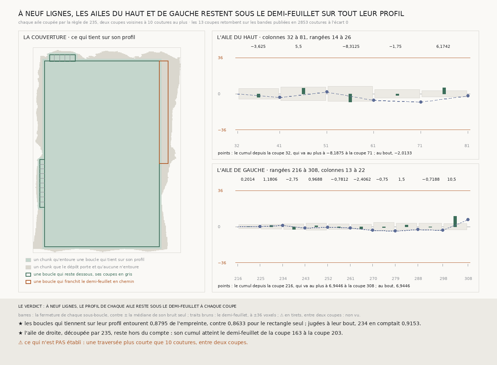

# `240` — Les ailes du haut et de gauche de `234`, jugées sur leur profil et non à leur bout, restent-elles sous le demi-feuillet ? Oui : coupées toutes les dix coutures au plus, leur cumul ne dépasse jamais 8,1875 voxels

*Les ailes qui ferment dans `234`, sauf celle de droite que `235` a découpée, sont coupées par la règle de `235` : 5 sous-boucles pour l'aile du haut, 10 pour celle de gauche, deux coupes voisines à dix coutures au plus. Lues, les 13 coupes retombent sur les bandes publiées, et les sous-boucles de chaque aile somment à la fermeture que `234` publie pour elle. À neuf lignes, le cumul de l'aile du haut va au plus à −8,1875 voxels, celui de l'aile de gauche à 6,9446 : aucun n'approche le demi-feuillet. Avec le rectangle de `239`, les boucles qui tiennent sur leur profil entourent 0,8795 de l'empreinte. Une traversée plus courte que dix coutures n'est pas vue.*

## 0. Pourquoi cette tranche

`234` compte que les boucles qui ferment entourent 0,9153 de l'empreinte, mais en jugeant chaque aile à son bout. Sur son
profil, l'aile de droite franchit le demi-feuillet (`237`), et le rectangle, 0,8633 de l'empreinte, reste dessous (`238`,
`239`). Les ailes du haut et de gauche ferment à −2,0133 et 6,9445 à leur bout ; rien ne disait encore ce que font leurs
boucles partielles. C'est `R4-P85`.

⚠⚠⚠ Le fichier a été écrit avant que la moindre ligne nouvelle ne soit lue, et avant que les coupes ne soient dérivées.
Ce qui était vu avant d'écrire : ce que `234`, `235` et `239` publient, et leurs figures.

## 1. Les ailes jugées, et leurs coupes

Les ailes jugées sont celles qui ferment dans `234`, sauf la plus lâche : c'est l'aile de droite, et c'est bien celle que
`235` a découpée. Restent l'aile du haut, des colonnes 32 à 81 entre les rangées 14 et 26, et l'aile de gauche, des
rangées 216 à 308 entre les colonnes 13 et 22.

Chacune est coupée par la règle de `235` : des bandes de travers de neuf lignes qui tiennent d'un long côté à l'autre, à
neuf lignes au moins l'une de l'autre, le plus de sous-boucles possible. Le découpage est celui qu'une présence sans trou donnerait :

- l'aile du haut, aux coupes 32, 41, 51, 61, 71 et 81 : **5** sous-boucles ;
- l'aile de gauche, aux coupes 216, 225, 234, 243, 252, 261, 270, 279, 288, 298 et 308 : **10** sous-boucles.

Deux coupes voisines sont à dix coutures au plus, bien sous la portée de 40 que `239` tire de `235` : aucun écart n'est
au-delà. ⚠⚠ Les treize coupes intérieures ont coûté 1278 chunks, lus en vingt-deux minutes.

## 2. Ce qui s'est lu, et ce qui le contrôle

Les chunks que la lecture compte absents du dépôt sont ceux que la présence dit absents, sur les **117** lignes lues.
Chaque coupe de l'aile du haut croise la rangée 26 de `233`, la rangée 14 de `234` et la rangée 11 de `232` ; chaque coupe
de l'aile de gauche croise la colonne 22 de `233`, la colonne 13 de `234` et la colonne 21 de `232`. Les pas relus
retombent en **2853** coutures, écart **0**.

Les sous-boucles de chaque aile somment à la fermeture que `234` publie pour elle. L'aile du haut somme à **−2,0133** à neuf lignes contre −2,0133 publiée par `234`, et aussi
à cinq et sept lignes ; à trois lignes, un trou le long d'un long côté empêche de juger. L'aile de gauche somme à **6,9446** à neuf lignes contre 6,9445 publiée par `234`, et
aux quatre largeurs.

## 3. Les sous-boucles, à neuf lignes

L'aile du haut, de colonne en colonne :

| colonnes | fermeture | dispersion du pas | bruit seul : médiane | bruit seul sous la fermeture |
|---|---:|---:|---:|---:|
| 32 à 41 | −3,625 | 1,5789 | 5,125 | 0,3624 |
| 41 à 51 | 5,5 | 1,7001 | 6,5938 | 0,4334 |
| 51 à 61 | −8,3125 | 1,6392 | 7,4062 | 0,5536 |
| 61 à 71 | −1,75 | 1,2103 | 4,0625 | 0,2232 |
| 71 à 81 | 6,1742 | 0,9054 | 3,2321 | 0,8278 |

L'aile de gauche, de rangée en rangée :

| rangées | fermeture | dispersion du pas | bruit seul : médiane | bruit seul sous la fermeture |
|---|---:|---:|---:|---:|
| 216 à 225 | 0,2014 | 0,8116 | 2,0764 | 0,049 |
| 225 à 234 | 1,1806 | 0,6943 | 2,2812 | 0,2853 |
| 234 à 243 | −2,75 | 0,7764 | 2,75 | 0,5015 |
| 243 à 252 | 0,9688 | 0,9715 | 3,4375 | 0,1391 |
| 252 à 261 | −0,7812 | 0,8051 | 2,75 | 0,1592 |
| 261 à 270 | −2,4062 | 0,7783 | 2,2188 | 0,5375 |
| 270 à 279 | −0,75 | 1,4004 | 4,0625 | 0,1121 |
| 279 à 288 | 1,5 | 1,067 | 3,5938 | 0,2252 |
| 288 à 298 | −0,7188 | 0,9856 | 3,5625 | 0,1161 |
| 298 à 308 | 10,5 | 0,8977 | 3,0938 | 0,97 |

⚠ Une sous-boucle sort de ce que son bruit seul produit : la dernière de l'aile de gauche, des rangées 298 à 308, ferme à
10,5 voxels quand le bruit seul ferme plus serré dans 0,97 des tirages. Elle reste à moins du tiers du demi-feuillet, et
sur quinze sous-boucles, qu'une seule tombe dans les trois centièmes du haut n'a rien de rare.

## 4. Les profils

L'aile du haut :

| coupe | 41 | 51 | 61 | 71 | 81 |
|---|---:|---:|---:|---:|---:|
| cumul depuis la colonne 32 | −3,625 | 1,875 | −6,4375 | **−8,1875** | −2,0133 |

L'aile de gauche :

| coupe | 225 | 234 | 243 | 252 | 261 | 270 | 279 | 288 | 298 | 308 |
|---|---:|---:|---:|---:|---:|---:|---:|---:|---:|---:|
| cumul depuis la rangée 216 | 0,2014 | 1,382 | −1,368 | −0,3992 | −1,1804 | −3,5866 | −4,3366 | −2,8366 | −3,5554 | **6,9446** |

Le cumul de l'aile du haut va au plus à **−8,1875** voxels, à la coupe 71. Le cumul de l'aile de gauche va au plus à **6,9446** voxels, à la coupe 308 : son plus grand écart est au bout, porté par la dernière sous-boucle.

## 5. Le verdict

**À NEUF LIGNES, LE PROFIL DE CHAQUE AILE RESTE SOUS LE DEMI-FEUILLET À CHAQUE COUPE.**

⭐⭐⭐⭐ **`R4-P85` est répondue.** Coupées toutes les dix coutures au plus, les ailes du haut et de gauche gardent un cumul
sous 8,1875 voxels : contrairement à l'aile de droite, leur « oui » ne tient pas qu'à l'endroit où elles finissent.

⭐⭐⭐ **Ce qui tient sur son profil.** Avec le rectangle de `239`, les boucles qui restent dessous sur tout leur profil entourent **85993** chunks sur **97771**, **0,8795** de l'empreinte,
contre 0,8633 pour le rectangle seul. Jugées à leur bout, `234` en comptait 0,9153 : la différence est ce que seule
l'aile de droite entoure, et elle franchit le demi-feuillet en chemin.

## 6. Ce que cette tranche ne dit pas

- ⚠⚠⚠ Ce qui relie au rectangle, sur la même spire, les **11778** chunks de l'empreinte qu'aucune boucle qui tient sur son profil n'entoure.
- ⚠⚠ Une traversée plus courte que dix coutures, entre deux coupes.
- ⚠ Pourquoi la dernière sous-boucle de l'aile de gauche s'écarte de son bruit seul.

## 7. Les sondes et les bris

**Vingt-cinq bris** ont été appliqués un par un au code, et **les vingt-cinq rougissent** : la plus lâche qui n'est plus
exclue, les ailes qui ne ferment pas jugées, l'aile de `235` qui n'est plus contrôlée, les bornes d'une sous-boucle prises
dans le mauvais sens, le demi-feuillet franchi seulement au-delà, le demi-feuillet compté avec son signe, le pic pris au
bout, une sous-boucle ouverte qui ne compte plus, une aile sans coupe dite dessous, une aile sans coupe qui prime sur une
aile qui franchit, chaque aile dite dessous quand aucune n'est jugée, le rectangle compté sans `239`, toutes les ailes
jugées comptées dans la couverture, l'emboîtement qui n'est plus exigé, la présence qui n'est plus contrôlée par `234`
ni par la lecture, la reproduction qui n'est plus exigée, la définition des coupes lues qui n'est plus vérifiée, les
bandes de `234` hors des pas de l'aile, la plus courte longueur de `225`, la portée prise au-delà du demi-feuillet, le
premier écart oublié, des écarts nommés vides sans portée, les sous-boucles prises à l'envers, et les coupes d'une aile
du haut prises comme celles d'une aile de côté.

⚠ **Au premier passage, un bris a passé** : les sous-boucles prises à l'envers, parce que le profil renversé atteint les
mêmes extrêmes. Une sonde vérifie désormais que les sous-boucles vont d'un bout de l'aile à l'autre, dans l'ordre des
coupes. La batterie porte aussi une colonne extérieure fabriquée qui s'écarte puis revient : l'aile de gauche ferme au
bout comme sans écart, et son profil franchit le demi-feuillet en chemin. Tout cela avant que la moindre coupe ne soit
lue.

Après la mesure, seule la figure a été écrite. La mesure est déterministe et se rejoue à l'octet près depuis sa lecture
comme depuis le fichier publié, qui porte les treize coupes.

## 8. Ce qui reste

⭐⭐⭐ **Ce qui s'ouvre** (`R4-P86`) : 11778 chunks de l'empreinte ne sont entourés par aucune boucle qui tient sur son
profil. Une part est ce que seule l'aile de droite entoure, dont la colonne 260 dérive (`236`, `237`) ; le reste n'est
entouré par aucune boucle de `234`. Qu'est-ce qui les relie au rectangle sur la même spire ?
