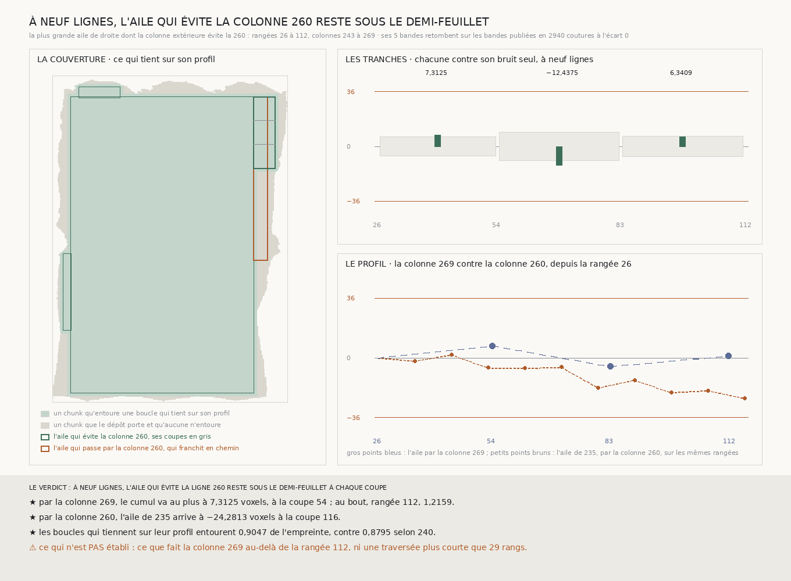

# `241` — Une aile de droite dont la colonne extérieure évite la colonne 260 tient-elle sur son profil ? Oui, des rangées 26 à 112 : par la colonne 269, son cumul ne dépasse jamais 7,3125 voxels, quand celui de la colonne 260 descend vers −20 sur les mêmes rangées

*La plus grande aile de droite dont la colonne extérieure ne partage aucune ligne avec la colonne 260 va des rangées 26 à 112 et des colonnes 243 à 269. Coupée à la portée de `239`, elle donne trois tranches. Ses cinq bandes, lues, retombent sur les bandes publiées, dont 1280 coutures de la colonne 268 de `232`, et ses tranches somment à sa fermeture. À neuf lignes, elle ferme à 1,2159 voxels et son cumul reste entre −5,125 et 7,3125 : sur les mêmes rangées, l'aile de `235`, qui passe par la colonne 260, arrive à −24,2813. Avec elle, les boucles qui tiennent sur leur profil entourent 0,9047 de l'empreinte. Sous la rangée 112, rien n'est vu.*

## 0. Pourquoi cette tranche

Avec le rectangle, les boucles qui tiennent sur leur profil entourent 0,8795 de l'empreinte (`240`) ; 11778 chunks
restent. Une part est ce que seule l'aile de droite entourait : sa colonne extérieure, la 260, dérive (`236`), et son
profil franchit le demi-feuillet en chemin (`237`). Est-ce la colonne 260 qui porte la dérive, ou la matière entre les
colonnes 243 et 260 ? Une aile dont la colonne extérieure évite la 260 le départage. C'est `R4-P86`.

⚠⚠⚠ Le fichier a été écrit avant que la moindre ligne nouvelle ne soit lue, et avant que l'aile ne soit dérivée. Ce qui
était vu avant d'écrire : ce que `234`, `235`, `236` et `240` publient, et leurs figures.

## 1. L'aile, et ses coupes

L'aile est dérivée par la règle de `234`, du côté de l'aile de `235`, parmi les colonnes extérieures qui ne partagent
aucune ligne avec la colonne 260 que `236` désigne. Entre les colonnes 243 et 260, aucune colonne de neuf lignes ne tient
sans partager de ligne avec l'une des deux (`235`) : la colonne extérieure est donc au-delà. La plus grande aile va des
rangées 26 à 112 et des colonnes 243 à 269.

Partagée à la portée de 40 de `239`, elle est coupée aux rangées 54 et 83, qui tiennent de la colonne 243 à la colonne 269 :
**3** tranches, deux coupes voisines à **29** rangs au plus.

⚠⚠ Cinq bandes neuves, 1755 chunks, lus en trente minutes.

## 2. Ce qui s'est lu, et ce qui le contrôle

Les chunks que la lecture compte absents du dépôt sont ceux que la présence dit absents, sur les **45** lignes lues.

La colonne 269 partage huit de ses neuf lignes avec la colonne 268 que `232` a publiée : elle retombe sur elle en 1280
coutures. Les quatre bandes de rangées croisent la colonne 243 de `233`, la colonne 260 de `234`, la colonne 268 de `232`
et la colonne 269 une fois contrôlée ; celle de la rangée 26 relit aussi la bande de `234` qui borne l'aile de droite. En
tout, les pas relus retombent en **2940** coutures, écart **0**.

Les tranches somment à la fermeture de l'aile entière, aux quatre largeurs : **1,2159** à neuf lignes, écart 0.

## 3. L'aile et ses tranches, à neuf lignes

| rangées | fermeture | dispersion du pas | bruit seul : médiane | bruit seul sous la fermeture |
|---|---:|---:|---:|---:|
| 26 à 54 | 7,3125 | 1,0318 | 6,2813 | 0,5616 |
| 54 à 83 | −12,4375 | 1,6189 | 9,375 | 0,6236 |
| 83 à 112 | 6,3409 | 1,0866 | 6,6732 | 0,4795 |
| **26 à 112, l'aile entière** | **1,2159** | 1,4506 | 12,0455 | 0,0591 |

Aucune tranche ne s'écarte de ce que son bruit seul produit, et l'aile entière ferme plus serré que le bruit seul dans
presque tous les tirages.

## 4. Le profil, contre celui de la colonne 260

| coupe | 54 | 83 | 112 |
|---|---:|---:|---:|
| cumul depuis la rangée 26, par la colonne 269 | **7,3125** | −5,125 | 1,2159 |

Sur les mêmes rangées, l'aile de `235`, qui passe par la colonne 260, arrive à −19,6875 à la coupe 107 et à **−24,2813** à la coupe 116.

## 5. Le verdict

**À NEUF LIGNES, L'AILE QUI ÉVITE LA COLONNE 260 RESTE SOUS LE DEMI-FEUILLET À CHAQUE COUPE.**

⭐⭐⭐⭐ **Des rangées 26 à 112, la dérive est celle de la colonne 260, pas celle de la matière.** La boucle qui passe par
la colonne 269 ferme à 1,2159 voxels et ne s'écarte jamais de plus de 7,3125 ; celle qui passe par la colonne 260 descend
vers −20 sur les mêmes rangées. La colonne 269 s'accorde avec la colonne 243 là où la colonne 260 s'en sépare : c'est ce
que `236` disait de la colonne 234, dit ici de l'autre côté.

⭐⭐⭐ **Ce qui tient sur son profil.** Avec l'aile, les boucles qui restent dessous sur tout leur profil entourent **88457** chunks sur **97771**, **0,9047** de l'empreinte,
contre 0,8795 selon `240`. `R4-P86` est répondue en partie.

## 6. Ce que cette tranche ne dit pas

- ⚠⚠⚠ **Ce qui se passe sous la rangée 112.** La plus grande aile qui évite la colonne 260 s'y arrête, et c'est plus bas,
  de la coupe 163 à la coupe 203 de `235`, que la colonne 260 franchit le demi-feuillet.
- ⚠⚠ Une traversée plus courte que 29 rangs, entre deux coupes.
- ⚠ Pourquoi la colonne 260 dérive.

## 7. Les sondes et les bris

**Vingt-sept bris** ont été appliqués un par un au code, et **les vingt-sept rougissent** : la colonne qui dérive qui
n'est plus évitée, une autre ligne évitée, la ligne de `236` qui n'est plus contrôlée comme colonne de l'aile, la mesure
faite sans portée, une rangée de partage qui ne tient pas gardée, une rangée trop proche du bout de fin gardée, la coupe
vérifiée sur la moitié de l'aile, les écarts au-delà de la portée tus, le plus petit écart pris pour le plus grand, une
aile qui dépasse au bout qui n'est plus dite franchir, une aile ouverte puis une tranche ouverte ignorées, une aile sans
coupe dite dessous, une aile sans coupe qui prime sur une aile qui franchit, l'aile comptée dans la couverture même
quand elle franchit, les boucles de `240` oubliées dans la couverture, l'emboîtement qui n'est plus exigé, la présence
qui n'est plus contrôlée par `234` ni par la lecture, la reproduction qui n'est plus exigée, la définition des bandes
lues qui n'est plus vérifiée, la plus courte longueur de `225`, les bornes d'une tranche prises dans le mauvais sens, les
tranches prises à l'envers, l'aile entière analysée sur les coins du rectangle, et les bandes de l'aile puis les coupes
hors des pas.

⚠ **Au premier passage, deux bris ont passé** : une rangée trop proche du bout de fin gardée, faute de sonde où une coupe
tombe loin de la précédente et près du bout ; et une aile sans coupe qui prime sur une aile qui franchit, que le verdict
rend exclusives avant que l'ordre des issues ne joue. Deux sondes les voient désormais. La batterie porte aussi une
matière fabriquée qui s'écarte puis revient entre la colonne 243 et la colonne évitée : l'aile ferme au bout à moins
d'un voxel de ce qu'elle ferme sans écart, et son profil franchit le demi-feuillet en chemin. Tout cela avant que la
moindre bande ne soit lue.

La règle de `234` gagne un paramètre, les bandes à éviter, sans effet quand il est vide : sa batterie le sonde, deux bris
de plus y rougissent, et sa mesure se rejoue à l'octet près.

Après la mesure, seule la figure a été écrite. La mesure est déterministe et se rejoue à l'octet près depuis sa lecture
comme depuis le fichier publié, qui porte les cinq bandes.

## 8. Ce qui reste

⭐⭐⭐ **Ce qui s'ouvre** (`R4-P87`) : sous la rangée 112, où la plus grande aile qui évite la colonne 260 s'arrête, la
colonne 260 franchit le demi-feuillet de la coupe 163 à la coupe 203 de `235`. Qu'est-ce qui relie au rectangle, sur la
même spire, la matière au-delà de la colonne 243 entre les rangées 112 et 223 ?
