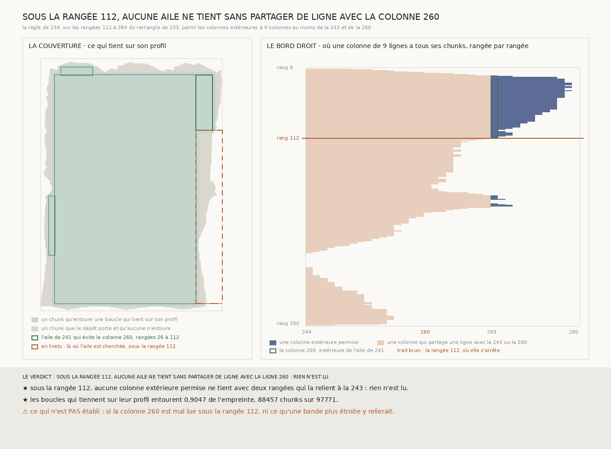

# `242` — Sous la rangée 112, où s'arrête l'aile de `241`, une aile de droite qui évite la colonne 260 tient-elle sur son profil ? Aucune ne tient : à neuf lignes, sous la rangée 112, toute aile de droite partage des lignes avec la colonne 260

*La règle de `234`, appliquée du côté droit sur les rangées 112 à 384 du rectangle de `233`, parmi les colonnes extérieures qui ne partagent aucune ligne ni avec la colonne 243 ni avec la colonne 260, ne trouve aucune aile. Rien n'est lu. Sous la rangée 112, la matière au-delà de la colonne 243 n'est reliée au rectangle, à neuf lignes, que par des colonnes qui partagent des lignes avec la colonne 260, celle qui dérive. Les boucles qui tiennent sur leur profil entourent toujours 0,9047 de l'empreinte.*

## 0. Pourquoi cette tranche

Des rangées 26 à 112, l'aile de droite qui évite la colonne 260 tient sur son profil (`241`), et elle s'arrête là. Plus
bas, de la coupe 163 à la coupe 203 de `235`, la colonne 260 franchit le demi-feuillet, et aucune aile qui l'évite n'a
été jugée. Qu'est-ce qui relie au rectangle la matière au-delà de la colonne 243, sous la rangée 112 ? C'est `R4-P87`.

⚠⚠⚠ Le fichier a été écrit avant que l'aile ne soit dérivée. Ce qui était vu avant d'écrire : ce que `233`, `234`, `235`
et `241` publient, et leurs figures.

## 1. L'aile cherchée

L'aile est dérivée par la règle de `234`, du côté de l'aile de `241`, sur les rangées du rectangle de `233` qui vont de
la dernière rangée de l'aile de `241` à la dernière du rectangle : de la rangée **112** à la rangée **384**. Sa colonne
extérieure ne partage aucune ligne avec la ligne que `241` évite, la **260**, ni avec la bande intérieure, la colonne
243 : elle est à neuf colonnes au moins de l'une et de l'autre.

Les règles de la suite étaient écrites avant : les coupes de `241` à la portée de 40, les deux bouts de l'aile tenant lieu
de coupes, si bien qu'une aile qui ne dépasse pas la portée a pour profil sa fermeture ; un écart entre deux coupes gardées
au-delà de la portée laisse le profil non vu là.

## 2. Ce qui est trouvé

**Aucune aile.** Sous la rangée 112, aucune colonne extérieure permise ne tient avec deux rangées qui la relient à la
colonne 243. Rien n'est lu.

Le panneau de droite de la figure montre, rangée par rangée, les colonnes au-delà de la 243 dont les neuf lignes ont tous
leurs chunks : les colonnes permises, en bleu, tiennent au-dessus de la rangée 112 — c'est la colonne 269 de `241` — et
ne tiennent plus en dessous qu'à quelques coutures isolées. Sous la rangée 112, ce qui tient au-delà de la colonne 243
partage des lignes avec elle ou avec la colonne 260.

## 3. Le verdict

**SOUS LA RANGÉE 112, AUCUNE AILE NE TIENT SANS PARTAGER DE LIGNE AVEC LA LIGNE 260 : RIEN N'EST LU.**

⭐⭐⭐⭐ **Sous la rangée 112, à neuf lignes, la colonne 260 n'a pas de remplaçante.** Au-dessus, la colonne 269 a départagé
la matière de la colonne qui dérive ; en dessous, l'empreinte ne porte pas de colonne de neuf lignes assez loin de la 260
pour le refaire. Toute aile de droite qui relie au rectangle la matière au-delà de la colonne 243 sous la rangée 112 passe
par des lignes de la colonne 260.

⭐⭐ **Ce qui tient sur son profil ne bouge pas.** Les boucles qui tiennent sur leur profil
entourent **88457** chunks sur **97771**, **0,9047** de l'empreinte, comme selon `241`.
`R4-P87` est répondue par la négative, à neuf lignes.

## 4. Ce que cette tranche ne dit pas

- ⚠⚠⚠ **Si la colonne 260 est mal lue sous la rangée 112**, ou si la matière y fait un écart. Aucune colonne qui l'évite
  ne vient le départager.
- ⚠⚠ **Ce qu'une bande plus étroite relierait.** L'échelle de `218` a des largeurs de trois, cinq et sept lignes ; une
  colonne plus étroite s'éloigne moins de la 243 et de la 260 pour ne partager de ligne avec aucune.
- ⚠ Ce qui relie les chunks du bord gauche, du haut et du bas que les boucles n'entourent pas.

## 5. Les sondes et les bris

**Trente et un bris** ont été appliqués un par un au code, et **les trente et un rougissent** : la ligne qui n'est plus
évitée, une autre ligne évitée, les rangées cherchées depuis le haut du rectangle, la rangée de départ prise en haut de
l'aile de `241`, une autre portée que la sienne, une aile d'une seule tranche dite non vue, les écarts au-delà de la
portée ignorés ou perdus par le verdict des tranches, le pic pris au bout, le demi-feuillet doublé, une tranche ouverte
puis une aile ouverte ignorées, une aile qui dépasse au bout qui n'est plus dite franchir, un écart non vu qui prime sur
une aile qui franchit, l'aile comptée dans la couverture même quand elle franchit, les boucles de `241` oubliées dans la
couverture, l'aile de `241` comptée même quand elle ne reste pas dessous, `241` refusé ignoré, une mesure qui continue
sans aile, la rangée perdue par le verdict, l'emboîtement, la présence contre `234` et contre la lecture, la
reproduction et la définition des bandes lues qui ne sont plus exigées, la plus courte longueur de `225`, les tranches à
l'envers, l'aile entière analysée sur les coins de `241`, et les bandes de l'aile, les coupes hors des pas puis les
coupes non lues.

⚠ **Au premier passage, deux bris ont passé** : la ligne qui n'est plus évitée et une autre ligne évitée, parce que sur
l'empreinte fabriquée l'empreinte elle-même s'arrête avant la ligne évitée sous l'aile de `241`. Une sonde les voit
désormais : une ligne évitée qui écarte toutes les colonnes laisse l'aile sans colonne extérieure, une ligne à neuf
colonnes pile de la colonne permise la laisse. La batterie rejoue `234` puis `241` sur une empreinte fabriquée où
l'aile de `241` s'arrête avant le bout, puis mesure l'aile qui la suit : elle reste dessous sur un champ où seule la
colonne évitée dérive, et franchit quand la matière s'écarte puis revient entre la colonne 243 et elle. Tout cela avant
que l'aile réelle ne soit dérivée.

Après la mesure, seule la figure a été écrite. La mesure est déterministe et se rejoue à l'octet près.

## 6. Ce qui reste

⭐⭐⭐ **Ce qui s'ouvre** (`R4-P88`) : sous la rangée 112, une aile plus étroite que neuf lignes, dont la colonne extérieure
ne partage aucune ligne avec la colonne 260, relie-t-elle au rectangle la matière au-delà de la colonne 243 ?
