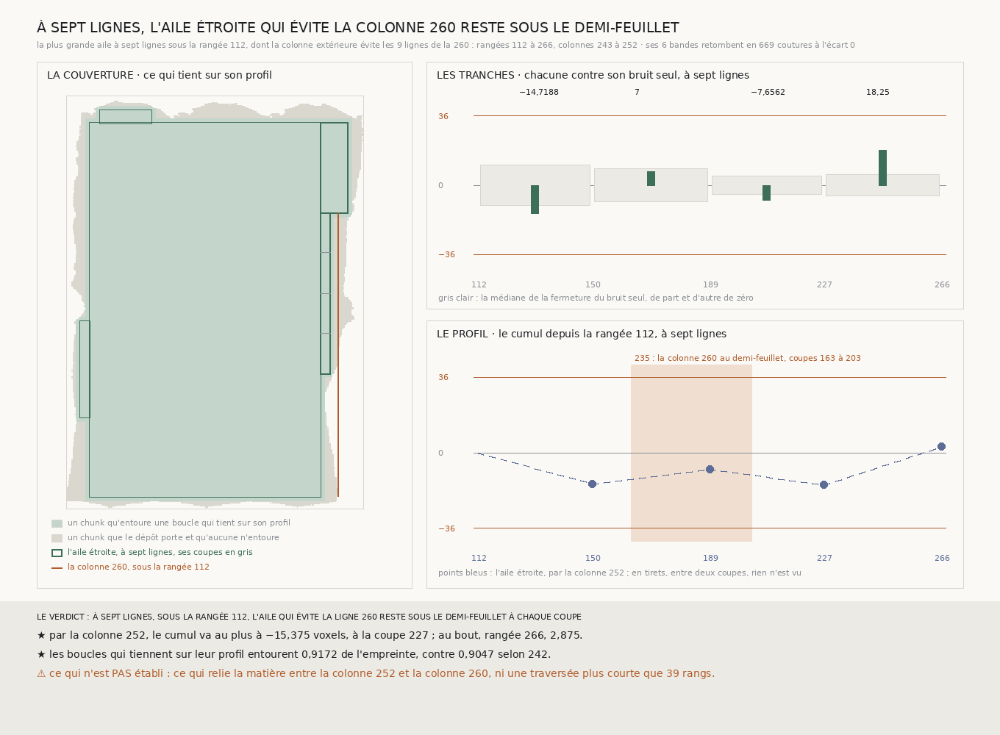

# `243` — Sous la rangée 112, une aile plus étroite que neuf lignes, qui évite la colonne 260, tient-elle sur son profil ? Oui, à sept lignes : par la colonne 252, son cumul ne dépasse jamais 15,375 voxels, y compris là où la colonne 260 franchit le demi-feuillet

*À sept lignes, la plus grande aile de droite sous la rangée 112 dont la colonne extérieure ne partage aucune ligne avec les neuf lignes de la colonne 260 va des rangées 112 à 266 et des colonnes 243 à 252. Coupée à la portée de `241`, elle donne quatre tranches. Ses six bandes, lues, retombent sur les bandes publiées, et ses tranches somment à sa fermeture. À sept lignes, elle ferme à 2,875 voxels et son cumul reste entre −15,375 et 2,875, sur les rangées où la colonne 260 franchit le demi-feuillet selon `235`. Avec elle, les boucles qui tiennent sur leur profil entourent 0,9172 de l'empreinte. La matière entre les colonnes 252 et 260 reste sans boucle.*

## 0. Pourquoi cette tranche

Sous la rangée 112, aucune aile de neuf lignes n'évite la colonne 260 (`242`) : l'empreinte ne porte pas de colonne de
neuf lignes assez loin de la 243 et de la 260. Une bande plus étroite s'en éloigne moins pour ne partager de ligne avec
aucune. C'est `R4-P88`.

⚠⚠⚠ Le fichier a été écrit avant que la moindre ligne nouvelle ne soit lue, et avant que la largeur et l'aile ne soient
dérivées. Ce qui était vu avant d'écrire : ce que `233`, `234`, `241` et `242` publient, et leurs figures.

## 1. La largeur, l'aile, et ses coupes

Les largeurs de l'échelle de `218` plus étroites que neuf lignes sont essayées de la plus large à la plus étroite, sur
les rangées que `242` a cherchées ; la colonne extérieure ne partage aucune ligne avec la bande intérieure à cette
largeur, ni avec les neuf lignes de la colonne 260. La première largeur essayée suffit : à **7** lignes, la plus grande aile va des rangées 112 à 266 et des colonnes 243 à 252.

Partagée à la portée de 40 que `241` publie, elle est coupée aux rangées 150, 189 et 227, qui tiennent de la colonne 243
à la colonne 252 : **4** tranches, deux coupes voisines à **39** rangs au plus.

⚠ La règle de `234` gagne de quoi écarter une bande d'une autre largeur que l'aile : ici, les neuf lignes de la colonne
260 contre une aile de sept lignes.

## 2. Ce qui s'est lu, et ce qui le contrôle

Six bandes neuves de sept lignes. Les chunks que la lecture compte absents du dépôt sont ceux que la présence dit absents,
sur les **42** lignes lues.

Les bandes de rangées croisent la colonne 243 de `233`, la colonne 252 une fois contrôlée, et celle de la rangée 227 la
bande de la rangée 223 que `234` publie pour l'aile de droite ; la colonne 252 croise aussi cette bande et les bandes de
`219`. En tout, les pas relus retombent en **669** coutures, écart **0**.

Les tranches somment à la fermeture de l'aile entière à cinq et à sept lignes : **2,875** à sept lignes, écart 0. À trois
lignes, un trou d'une couture sur la colonne 243 rend l'emboîtement non jugeable.

## 3. L'aile et ses tranches, à sept lignes

| rangées | fermeture | dispersion du pas | bruit seul : médiane | bruit seul sous la fermeture |
|---|---:|---:|---:|---:|
| 112 à 150 | −14,7188 | 1,697 | 10,3125 | 0,6707 |
| 150 à 189 | 7 | 1,3558 | 8,75 | 0,4034 |
| 189 à 227 | −7,6562 | 1,0054 | 4,8125 | 0,7257 |
| 227 à 266 | 18,25 | 1,151 | 5,7188 | 0,969 |
| **112 à 266, l'aile entière** | **2,875** | 1,4255 | 13,8125 | 0,1021 |

⚠⚠ La dernière tranche s'écarte de son bruit seul : elle ferme plus loin que presque tous ses tirages. Elle reste à moitié
du demi-feuillet.

## 4. Le profil

| coupe | 150 | 189 | 227 | 266 |
|---|---:|---:|---:|---:|
| cumul depuis la rangée 112, par la colonne 252 | −14,7188 | −7,7188 | **−15,375** | 2,875 |

Des coupes 150 à 227, le profil couvre les coupes 163 à 203 où, selon `235`, la colonne 260 est au demi-feuillet.

## 5. Le verdict

**À SEPT LIGNES, SOUS LA RANGÉE 112, L'AILE QUI ÉVITE LA LIGNE 260 RESTE SOUS LE DEMI-FEUILLET À CHAQUE COUPE.**

⭐⭐⭐⭐ **Sous la rangée 112, la colonne 252 s'accorde avec la colonne 243.** À sept lignes, la boucle qu'elles ferment ne
s'écarte jamais de plus de 15,375 voxels, y compris sur les rangées où la colonne 260 atteint le demi-feuillet. Ce que
`241` disait de la colonne 269 au-dessus de la rangée 112, la colonne 252 le dit en dessous, de l'autre côté de la 260.

⭐⭐⭐ **Ce qui tient sur son profil.** Avec l'aile, chacune à sa largeur, les boucles qui restent dessous sur tout leur
profil entourent **89678** chunks sur **97771**, **0,9172** de l'empreinte,
contre 0,9047 selon `242`. `R4-P88` est répondue.

## 6. Ce que cette tranche ne dit pas

- ⚠⚠⚠ **Ce qui relie la matière entre la colonne 252 et la colonne 260.** Toute colonne plus proche de la 260 partage des
  lignes avec elle.
- ⚠⚠ Si la colonne 260 est mal lue, ou si la matière s'écarte entre les colonnes 255 et 264.
- ⚠⚠ Une traversée plus courte que 39 rangs, entre deux coupes.
- ⚠ Ce qu'une largeur plus étroite relierait de plus : seule la plus large qui trouve une aile est mesurée.

## 7. Les sondes et les bris

**Trente-sept bris** ont été appliqués un par un au code, et **les trente-sept rougissent** : la plus étroite d'abord, la
largeur de la ligne évitée essayée aussi, la largeur de la ligne évitée ignorée, la ligne qui n'est plus évitée, la
recherche qui ne s'arrête pas à la première largeur qui trouve, l'instrument au-delà de la largeur de l'aile ou à sa seule
largeur, la couverture à une largeur commune, la largeur de l'aile perdue dans la couverture, l'aile comptée même quand
elle franchit, les boucles de `241` oubliées, les tranches jugées et le profil publié à trois lignes, `242` qui trouve une
aile ou qui est refusé ignoré, les rangées cherchées depuis le haut du rectangle, une autre portée, la rangée perdue par
le verdict, la largeur mal nommée, un écart non vu qui prime sur une aile qui franchit, les écarts au-delà de la portée
ignorés, une aile ouverte ignorée, une aile qui dépasse au bout qui n'est plus dite franchir, l'emboîtement, la présence
contre `234` et contre la lecture, la reproduction et la définition des bandes lues qui ne sont plus exigées, la plus
courte longueur de `225`, les tranches à l'envers, l'aile entière analysée sur le rectangle, les bandes de l'aile et les
coupes hors des pas, les coupes non lues, les bandes de l'aile puis les coupes lues à neuf lignes, et la largeur de la
ligne évitée prise ailleurs que dans `242`.

La batterie rejoue `234`, `241` puis `242` sur une empreinte fabriquée où rien ne tient à neuf lignes sous l'aile de
`241`, puis mesure l'aile étroite : elle reste dessous sur un champ où seule la colonne évitée dérive, et franchit quand la
matière de la colonne étroite s'écarte puis revient. Une ligne évitée qui écarte la seule colonne de sept lignes laisse
passer à cinq ; une ligne qui écarte tout, à toutes les largeurs, ne laisse rien lire. Tout cela avant que la moindre
bande ne soit lue.

La règle de `234` gagne sa largeur par bande exclue, sans effet sur les bandes de sa propre largeur : sa batterie la sonde,
deux bris de plus y rougissent, et les mesures de `234`, `241` et `242` se rejouent à l'octet près.

Après la mesure, seule la figure a été écrite. La mesure est déterministe et se rejoue à l'octet près depuis sa lecture
comme depuis le fichier publié, qui porte les six bandes.

## 8. Ce qui reste

⭐⭐⭐ **Ce qui s'ouvre** (`R4-P89`) : sous la rangée 112, qu'est-ce qui relie au rectangle la matière entre la colonne 252
et la colonne 260, là où toute colonne partage des lignes avec la 260 ?
