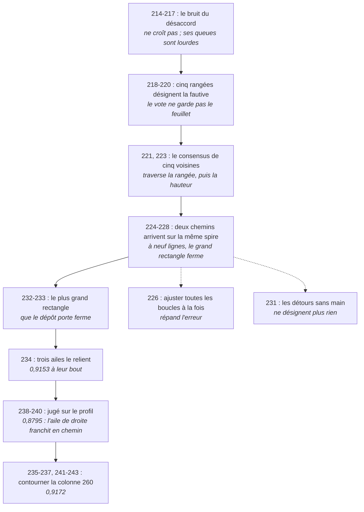

# 244 — Le pipeline, version trois : ce que trente tranches ont changé depuis `213`, et ce qui manque encore au Graal

> ⭐⭐⭐⭐ **LE MAILLON QUE `213` DISAIT OUVERT EST FRANCHI SUR UN SEGMENT.** `213` bloquait à `E6`,
> accorder les rangées (`R4-F341`). Sur le segment `20230702185753`, des boucles de bandes de
> consensus qui restent sous le demi-feuillet sur tout leur profil accordent maintenant les rangées :
> elles entourent **0,9172** de l'empreinte (`R4-F408`). C'est la réponse que le dépôt donne à « qu'est-ce
> qui remplace l'humain qui corrige le transfert de spire à spire » : **une boucle qui se referme sous
> le demi-feuillet dit que ses deux chemins n'ont pas changé de spire.**
>
> ⚠⚠⚠ **MAIS TROIS CHOSES MANQUENT AU GRAAL, ET AUCUNE TRANCHE DEPUIS `213` NE LES TOUCHE.**
> L'enchaînement des boucles a été **piloté à la main**, tranche après tranche. Il tient sur **un seul
> segment**, déjà tracé. Et **aucun livrable** ne l'exécute : le dépôt n'a pas d'image Docker.
>
> ⚠ **CE DOCUMENT NE MESURE RIEN.** Il n'ajoute aucun fait et aucune porte : tout ce qu'il avance est
> cité par son identifiant de registre. C'est un montage, la même règle que `151` et `213` se sont
> donnée.

## 1. Ce qui a changé, en une page

| | `213` | aujourd'hui |
|---|---|---|
| le maillon ouvert | `E6`, accorder les rangées (`R4-F341`) | `E6` **accordé par boucles** sur un segment (`R4-F398` à `R4-F408`) |
| ce qui accorde | rien | le **consensus** de cinq rangées ou colonnes voisines (`R4-F378`, `R4-F385`), puis des **boucles** de bandes de neuf lignes (`R4-F393`, `R4-F398`) |
| ce qui juge une boucle | sa fermeture au bout | son **profil**, coupe après coupe, à la portée de quarante rangées (`R4-F403`, `R4-F404`) |
| ce qui est couvert | rien | **0,9172** de l'empreinte du segment (`R4-F408`) |
| ce qui décide de la suite | la tranche précédente | ⛔ **toujours la tranche précédente** — §4 |

⭐ Des deux portes que `213` §7 mettait en tête, `R4-P59` est répondue par la négative : le désaccord ne
croît pas avec l'écartement (`R4-F346`). ⚠ `R4-P58` reste ouverte dans le registre : son dernier état
demande de savoir compter les plis, et les boucles disent seulement qu'autour d'elles le compte ne
change pas.

## 2. Comment les rangées se sont accordées

| étape | ce qui tient | source |
|---|---|---|
| le désaccord entre rangées | ne croît pas avec leur écartement ; ce sont ses **queues** qui dépassent l'erreur déclarée | `R4-F346`, `R4-F363` |
| la rangée fautive | cinq rangées voisines la désignent ; trois ne suffisent pas | `R4-F369`, `R4-F371` |
| le consensus | celui de cinq voisines traverse une rangée, puis la hauteur du segment, sans quitter le feuillet | `R4-F378`, `R4-F385` |
| deux chemins | arrivent sur la même spire à l'échelle d'un quart de segment ; le trou de majorité se franchit par le maillage | `R4-F387`, `R4-F389` |
| la largeur | à neuf lignes, le grand rectangle ferme sous le demi-feuillet | `R4-F393` |
| le segment | le plus grand rectangle que le dépôt porte ferme ; trois ailes s'y relient | `R4-F398`, `R4-F399` |
| le profil | le rectangle et deux ailes restent dessous à chaque coupe ; l'aile de droite franchit en chemin, par sa colonne 260 | `R4-F400` à `R4-F405` |
| la colonne 260 contournée | par la colonne 269 au-dessus de la rangée 112, par la colonne 252 à sept lignes en dessous | `R4-F406` à `R4-F408` |

⚠⚠ **Les trois dernières tranches ont surtout regagné ce que le jugement sur profil avait retiré.** À
leur bout, les boucles de `234` entouraient déjà **0,9153** de l'empreinte (`R4-F399`) ; jugées sur leur
profil, **0,8795** (`R4-F405`) ; en contournant la colonne 260, **0,9172** (`R4-F408`).

## 3. Ce que le certificat vaut, et ce qu'il ne vaut pas

⭐ **Ce qu'il dit.** Une boucle qui reste sous le demi-feuillet à chaque coupe, coupée à la portée,
n'a pas de traversée d'au moins quarante rangées entre ses deux chemins (`R4-F404`). Les chunks qu'elle
entoure sont sur la spire du rectangle, au sens où aucun écart d'une spire n'y est vu.

⚠⚠⚠ **Ce qu'il ne dit pas.**

- **Ce n'est pas une preuve de même spire.** Les boucles de consensus ne se ferment pas mieux que des
  marches indépendantes : c'est la petitesse du bruit qui fait arriver les chemins ensemble
  (`R4-F388`). Le certificat dit qu'aucun écart n'est détecté.
- **Il ne s'ajuste pas globalement.** Ajuster toutes les boucles à la fois répand l'erreur au lieu de
  la diluer (`R4-F391`). Le certificat est local, boucle par boucle.
- **Il ne départage pas une colonne mal lue d'une matière qui s'écarte** (`R4-F406`, `R4-F407`).
- **La fermeture ne suit pas la largeur** (`R4-F393`) : le jugement à neuf lignes n'est pas monotone
  dans la largeur, et une aile étroite est jugée à la sienne.

## 4. Ce qui manque au Graal

| | ce qui manque | pourquoi c'est le Graal |
|---|---|---|
| ⛔ | **la main** | L'enchaînement de `233` à `243` a été piloté tranche après tranche : quelle aile découper, quelle colonne dérive (`236`), l'éviter (`241`), s'arrêter là où elle s'arrête (`242`), rétrécir (`243`). Chaque pas est une règle dérivée, mais **le choix du pas suivant a été fait en lisant le résultat du précédent** : c'est l'humain que le prix veut retirer. Et la seule procédure lancée sans choix n'a plus rien désigné (`R4-F396`). |
| ⛔ | **un seul segment, déjà tracé** | Tout tient sur `20230702185753`, un segment publié, tracé par d'autres. La nappe accorde et juge une trace ; elle ne produit pas la spire suivante. Dans le transfert de spire à spire de `31` §8, le certificat est un candidat pour **détecter** que le transfert a fauté, pas pour le faire. |
| ⛔ | **le livrable** | Le dépôt n'a pas d'image Docker. `213` §6 décrivait une chaîne qui s'arrête à `E6` ; aucune commande n'exécute aujourd'hui l'enchaînement des boucles de bout en bout. |

## 5. Ce que le livrable ferait aujourd'hui

Les étapes de `213` §6 sont inchangées, sauf la septième :

7. **accorder les rangées** (B4), par des boucles qui restent sous le demi-feuillet sur leur profil,
   sur la part de l'empreinte qu'elles entourent, et **dire non certifié** ailleurs — ⚠ à condition
   que l'enchaînement des boucles soit une procédure, ce qu'il n'est pas encore.

## 6. Ce qui reste, dans l'ordre

1. ⭐⭐⭐⭐ **Enchaîner sans main.** Une procédure qui, depuis la présence d'un segment, dérive le
   rectangle, les ailes, les coupes, la ligne qui dérive, son évitement et la largeur plus étroite, et
   rend un masque par chunk : sur la spire du rectangle, ou non certifié. Rejouée sur
   `20230702185753` depuis les lectures déjà publiées, elle doit retrouver **0,9172**, ou dire où elle
   s'arrête. C'est le seul pas qui transforme `E6` en étage de pipeline.
2. **Un second segment**, pour savoir si le certificat tient ailleurs que là où il a été construit.
3. **L'image Docker**, qui exécute la chaîne de `213` §6 jusqu'à la septième étape.
4. `R4-P89`, la matière entre les colonnes 252 et 260 — ⚠ elle déplace la couverture d'un segment,
   pas le Graal.

---

⚠ **Ce document ne publie aucun nombre qui lui soit propre.** Chaque valeur est celle de son fait,
recalculable par le producteur que `REGISTRE_faits.tsv` nomme.
