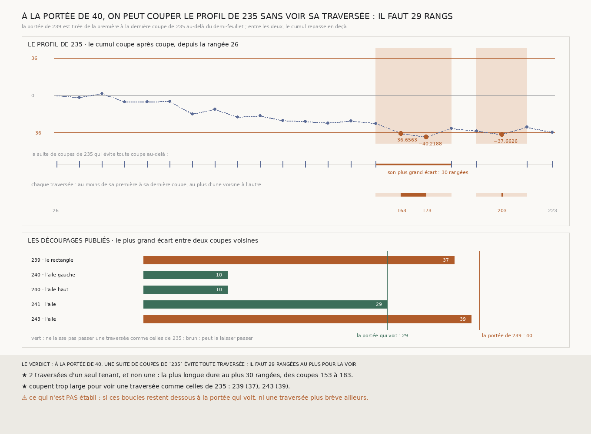

# `245` — La portée de `239` voit-elle la traversée de `235` dont elle est tirée ? Non : ce sont deux traversées, la plus longue dure au plus 30 rangées, et une suite de coupes à 40 les évite toutes

*`239` a fixé le pas des coupes à 40 rangées, de la première à la dernière coupe où le cumul de l'aile de droite atteint le demi-feuillet dans `235`. Mais entre ces deux coupes, le cumul repasse en deçà : ce sont deux traversées d'un seul tenant, et la plus longue dure au plus 30 rangées. Parmi les coupes de `235`, une suite qui les évite toutes n'a jamais plus de 30 rangées entre deux coupes voisines : il faut couper tous les 29 rangs au plus pour être sûr de les voir. Le rectangle de `239` et l'aile étroite de `243` sont coupés plus large ; les ailes de `240` et de `241`, non. Rien n'est lu.*

## 0. Pourquoi cette tranche

`244` pose la suite : enchaîner les boucles sans main. Une procédure doit alors couper chaque boucle à un pas fixé
d'avance, et ce pas est la résolution du certificat : une traversée du demi-feuillet plus courte que lui passe entre
deux coupes. `239` l'a fixé à la « plus longue traversée que `235` publie », 40 rangées, de la coupe 163 à la coupe
203. Entre les deux, le cumul de `235` repasse sous le demi-feuillet aux coupes 183 et 193. La portée voit-elle la
traversée dont elle est tirée ?

⚠⚠⚠ Le fichier a été écrit avant que la mesure ne soit faite. Ce qui était vu avant d'écrire : le profil de `235`, la
portée de `239`, et les découpages que `239`, `240`, `241` et `243` publient.

## 1. Les traversées d'un seul tenant

Sur le profil de `235`, les coupes au-delà du demi-feuillet forment deux suites consécutives :

- la première, des coupes 163 à 173 : entre les coupes 153 et 183, elle dure de **10** à **30** rangées ;
- la seconde, à la seule coupe 203 : entre les coupes 193 et 213, elle dure de **0** à **20** rangées.

⚠ Entre deux coupes, le cumul n'est pas vu : une traversée dure au moins de sa première à sa dernière coupe, au plus
d'une voisine à l'autre.

## 2. Une suite de coupes qui les évite

Toutes les coupes de `235` qui restent en deçà, avec le début de l'aile, forment une suite qui va d'un bout de l'aile à
l'autre sans passer par une traversée : son plus grand écart est de **30** rangées, de la coupe 153 à la coupe 183.
Aucune suite qui évite ne fait mieux, puisqu'elle les prend toutes.

Donc à la portée de 40, et jusqu'à 30, on peut couper l'aile de droite sans voir sa traversée ; à 29 rangées au plus,
toute suite de coupes de `235` en voit une.

## 3. Le verdict

**À LA PORTÉE DE 40, UNE SUITE DE COUPES DE `235` ÉVITE TOUTE TRAVERSÉE : IL FAUT 29 RANGÉES AU PLUS POUR LA VOIR.**

⭐⭐⭐⭐ **La portée de `239` ne voit pas la traversée dont elle est tirée.** La garantie de `239` reste exacte : une
traversée qui dure au moins la portée ne passe pas entre deux coupes. C'est sa prémisse qui tombe : de la coupe 163 à la
coupe 203, il n'y a pas une traversée de 40 rangées, mais deux, dont la plus longue dure au plus 30.

## 4. Ce qui en suit, sans rien lire

| tranche | boucle | plus grand écart entre deux coupes | voit une traversée comme celles de `235` |
|---|---|---:|---|
| `239` | le rectangle | 37 | non |
| `240` | l'aile gauche | 10 | oui |
| `240` | l'aile haut | 10 | oui |
| `241` | l'aile | 29 | oui |
| `243` | l'aile | 39 | non |

⭐⭐⭐ **Deux des verdicts qui font la couverture sont plus faibles qu'ils ne le disaient.** Le rectangle de `239` et
l'aile étroite de `243` restent sous le demi-feuillet à chaque coupe, mais coupés plus large que 29 rangs, ils
laisseraient passer une traversée comme celles de `235`. Les ailes de `240` et de `241` ne la laisseraient pas passer.

⚠⚠ **Et pour la procédure que `244` demande** : une procédure qui coupe à 40 rangs peut accepter l'aile de droite de
`234`, celle dont la colonne 260 dérive, puisqu'une suite de coupes à cette portée ne voit pas sa traversée ; c'est le
découpage fin de `235` qui l'a vue.

## 5. Ce que cette tranche ne dit pas

- ⚠⚠⚠ **Si le rectangle et l'aile étroite restent dessous, coupés à 29 rangs au plus.** Il faudrait lire leurs coupes de
  plus.
- ⚠⚠ Une traversée ailleurs, plus brève que celles de `235` : la portée qui voit est tirée d'une seule aile.
- ⚠ Ce que fait le cumul entre deux coupes de `235`.

## 6. Les sondes et les bris

**Dix-neuf bris** ont été appliqués un par un au code, et **les dix-neuf rougissent** : le demi-feuillet exclu, le signe
compté, une traversée coupée à chaque coupe, le début de l'aile oublié, la fin prise au-delà de la dernière coupe, la
durée au plus mal bornée, l'écart qui évite sans le début de l'aile, une dernière coupe au-delà évitée, l'écart qui évite
pris au plus petit trou, la portée qui voit égale à l'écart, une portée égale à l'écart dite voir, un découpage égal à la
portée qui voit dit aveugle, le plus grand écart d'un découpage pris au plus petit, les ailes de `240` puis `243`
oubliés, la portée de `239` non exigée, un profil qui recule accepté, le début pris au bout de l'aile, et le
demi-feuillet doublé.

⚠ **Avant les bris, une sonde manquait** : aucune ne faisait dépendre l'écart qui évite du premier écart, entre le début
de l'aile et sa première coupe. Elle y est.

La mesure ne lit rien : elle se refait depuis les publications, à l'octet près.

## 7. Ce qui reste

⭐⭐⭐ **Ce qui s'ouvre** (`R4-P90`) : coupés à 29 rangs au plus, le plus grand rectangle de `233` et l'aile étroite de
`243` restent-ils sous le demi-feuillet ?
