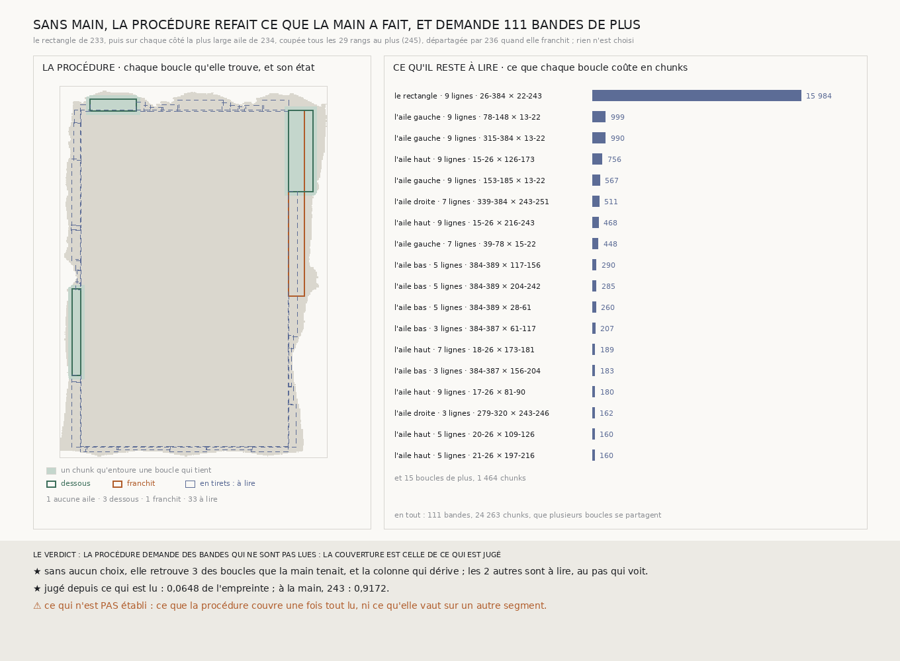

# `246` — La couverture par boucles se déroule-t-elle sans main ? Oui : sans aucun choix, la procédure refait chaque décision que la main avait prise, et demande 111 bandes de plus pour juger ce que la main n'avait pas cherché

*Une procédure enchaîne seule les règles de `233` à `245` : le rectangle, puis sur chaque côté la plus large aile, coupée au pas qui voit, départagée quand elle franchit, et les portions voisines remises en file. Rejouée sur ce que la chaîne a déjà lu, elle retrouve l'aile du haut, l'aile de gauche, l'aile de droite qui franchit, la colonne 260 qui dérive, l'aile qui l'évite, et l'aile étroite à sept lignes. Elle cherche aussi, sur les quatre côtés, des portions que la main n'avait pas cherchées. Pour juger ce qu'elle trouve, elle demande 111 bandes, 24263 chunks, dont 15984 pour recouper le rectangle au pas qui voit.*

## 0. Pourquoi cette tranche

`244` le met en tête : de `233` à `243`, chaque boucle est une règle dérivée, mais le choix de la boucle suivante a été
fait en lisant le résultat de la précédente. C'est l'humain que le prix veut retirer. Et `245` a fixé le pas auquel une
procédure doit couper : 29 rangs au plus. Une procédure qui enchaîne les règles seule refait-elle ce que la main a fait,
et que lui manque-t-il ?

⚠⚠⚠ Le fichier a été écrit avant que la procédure ne soit lancée, sur le segment comme sur l'empreinte fabriquée. Ce
qui était vu avant d'écrire : ce que `233` à `245` publient, et leurs figures.

## 1. La procédure

1. **Le rectangle** : le plus grand de `233`, à neuf lignes.
2. **Les côtés**, dans l'ordre haut, droite, bas, gauche, chacun avec une file de portions, d'abord le côté entier. Pour
   une portion : la plus large largeur de l'échelle de `218` à laquelle la règle de `234` trouve une aile, parmi les
   bandes extérieures qui ne partagent aucune ligne avec ce que le côté exclut.
3. **Chaque boucle** est coupée au pas de `245` : les coupes déjà lues d'abord, puis chaque écart qui dépasse 29 rangs,
   partagé. Elle est jugée à sa largeur.
4. **Une aile dessous** entre dans la couverture, et les portions de part et d'autre rejoignent la file.
5. **Une aile qui franchit** est départagée par la troisième ligne de `236`. Si la ligne désignée est sa bande
   extérieure, le côté l'exclut et la même portion est cherchée à nouveau.
6. **Une boucle dont une bande n'est pas lue** est à lire, avec ce qu'elle coûte.

⚠ Une bande est servie par ce que la chaîne a publié quand des bandes de même sens, de même centre, aux lignes qui
contiennent les siennes, couvrent toutes ses coutures. Une bande à sept lignes peut ainsi être servie par une bande de
neuf lignes déjà lue.

## 2. Ce qu'elle refait, sans aucun choix

| ce que la main a fait | tranche | ce que la procédure fait |
|---|---|---|
| l'aile du haut, jugée sur son profil | `240` | la même aile, dessous |
| l'aile de gauche, jugée sur son profil | `240` | la même aile, dessous |
| l'aile de droite, qui franchit en chemin | `235` | la même aile, qui franchit |
| la colonne qui dérive, départagée par une troisième ligne | `236` | la troisième ligne désigne la colonne **260** |
| l'aile qui évite la colonne 260 | `241` | la même aile, dessous |
| sous elle, rien à neuf lignes, puis une aile à sept | `242`, `243` | la même aile à sept lignes, à lire |

⭐⭐⭐⭐ **Chaque décision que la main avait prise, la procédure la prend seule.** Elle retrouve trois des boucles que la
main tenait, dessous. Les deux autres, le rectangle et l'aile étroite, sont à lire : elles étaient coupées plus large
que le pas qui voit (`245`). L'aile étroite ne demande qu'une coupe de plus : les bandes de neuf lignes que `235` a lues
lui servent de coupes à sept lignes.

## 3. Ce qu'elle cherche de plus

La main s'était arrêtée à `R4-P89`. La procédure remet en file chaque portion que laisse une aile, sur les quatre côtés :
**3** boucles dessous, **1** qui franchit, **33** à lire, et une portion où aucune aile ne tient. Les ailes à lire
longent les bords du rectangle, à neuf, sept, cinq ou trois lignes : de part et d'autre des ailes de gauche et du
haut, sous l'aile étroite de droite, et tout le long du bas, où `234` n'avait trouvé aucune aile de neuf lignes.

Pour juger tout ce qu'elle trouve, elle demande **111** bandes, **24263** chunks. Le rectangle coûte à lui seul **15984**
chunks : huit coupes de plus, sur toute sa largeur, pour que deux coupes voisines soient à 29 rangs au plus.

## 4. Le verdict

**LA PROCÉDURE DEMANDE DES BANDES QUI NE SONT PAS LUES : LA COUVERTURE EST CELLE DE CE QUI EST JUGÉ.**

Jugées sur ce qui est lu, les boucles dessous
entourent **6333** chunks sur **97771**, **0,0648** de l'empreinte,
contre 0,9172 à la main. L'écart n'est pas une perte : c'est le rectangle, que la main jugeait coupé plus large que le
pas qui voit, et que la procédure refuse de juger tant que ses coupes ne sont pas lues.

## 5. Ce que cette tranche ne dit pas

- ⚠⚠⚠ **Ce que la procédure couvre une fois tout lu**, ni si le rectangle reste dessous au pas qui voit (`R4-P90`).
- ⚠⚠ Ce qu'elle vaut sur un autre segment : ses règles viennent toutes de celui-ci.
- ⚠ Une traversée plus courte que le pas qui voit, entre deux coupes.

## 6. Les sondes et les bris

La batterie fait tourner la procédure sur une empreinte fabriquée dont la colonne extérieure de droite dérive assez pour
franchir le demi-feuillet. Sans lecteur, rien n'est lu et tout est à lire. En lisant ce qu'elle demande, elle va au bout :
le rectangle tient, l'aile de droite franchit, la troisième ligne désigne la colonne qui dérive, le côté l'exclut, l'aile
suivante l'évite, et sous elle la procédure descend en largeur jusqu'à trois lignes. Chaque bande est lue une fois ; ce
qui est déjà publié n'est pas relu ; la mesure se rejoue depuis sa lecture sans rien lire.

**Vingt-cinq bris** ont été appliqués un par un au code, et **les vingt-cinq rougissent** : une bande servie par des
lignes qui ne contiennent pas les siennes, une couture manquante entre deux morceaux, une demande servie en partie, le
coût sans son dernier chunk, les coupes déjà lues ignorées, une coupe lue trop proche gardée, une coupe neuve qui ne tient
pas gardée, la plus étroite largeur d'abord, une autre ligne exclue, la ligne exclue sans sa largeur, la portion non
cherchée à nouveau après l'exclusion, les portions d'une aile dessous oubliées, une aile qui franchit non départagée ou
dite dessous, une boucle non contrôlée jugée, une bande qui ne croise rien qui refuse la mesure, la présence et le
désaccord de lecture qui ne sont plus contrôlés, la couverture à une largeur commune, ce qui est publié qui n'est plus
servi, `245` refusé ignoré, le rectangle hors de la couverture, une bande sans couture sans clé, la comparaison à
l'envers, et une seule bande lue par tour.

⚠⚠ **Deux défauts de la procédure, trouvés par la batterie avant la moindre lecture.** Une bande servie dont aucune
couture n'était lue faisait planter l'analyse : elle y voit désormais des trous. Et une bande minuscule qui ne croise
rien de contrôlé refusait la mesure entière : elle laisse désormais sa seule boucle non contrôlée, et seul un désaccord
entre deux lectures refuse. ⚠ Deux bris ont d'abord mal tourné : l'un faisait mourir la batterie au lieu de la faire
échouer, l'autre passait parce que le scénario n'atteignait plus son cas. Une sonde directe les voit.

La mesure ne lit rien : elle se rejoue à l'octet près.

## 7. Ce qui reste

⭐⭐⭐ **Ce qui s'ouvre** (`R4-P91`) : les 111 bandes lues, que couvre la procédure sans main, et le rectangle reste-t-il
dessous au pas qui voit ?
