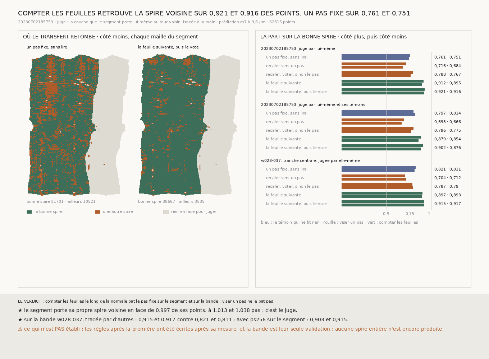

# `247` — Décaler le segment d'un pas puis compter les feuilles retrouve-t-il sa spire voisine ? Oui : sur 0,9214 et 0,9163 des points, contre 0,7613 et 0,7508 pour un pas fixe, et la bande `w028-037` le confirme

*Pour la première fois, la chaîne produit elle-même la spire voisine d'un segment au lieu de juger celle d'un autre. Pour chaque point de `20230702185753`, on suit sa normale d'un côté puis de l'autre, dans une prédiction de surface publiée, on passe la feuille du segment et on prend la suivante ; puis chaque point vote avec ses voisins. Le juge est la couche que le segment porte lui-même au tour voisin, tracée à la main sans rien savoir de cette méthode. La règle retombe sur la bonne spire en 0,9214 et 0,9163 des points ; décaler d'un pas fixe, en 0,7613 et 0,7508. Viser un pas au lieu de compter les feuilles ne bat pas le pas fixe. Sur la tranche centrale de la bande `w028-037`, tracée par d'autres, le même écart revient : 0,915 et 0,9166 contre 0,8208 et 0,8107.*

## 0. Pourquoi cette tranche

Tout ce que la chaîne a construit depuis `198` juge une trace faite par d'autres. Le Grand Prize demande de faire le
passage d'une spire à la suivante, celui qu'un humain corrige aujourd'hui (le concours l'appelle *sheet switch* quand il
rate). Cette tranche le tente, point par point, sur le segment de toute la chaîne.

⚠⚠⚠ L'ordre des règles est dit tel qu'il a été vécu. La première (viser un pas) a été écrite avant toute mesure. Les
suivantes ont été écrites après avoir vu ses échecs, chacune avant sa propre mesure. La bande `w028-037` et sa tranche
centrale ont été choisies après les résultats sur le segment, par une règle posée avant de la lancer : la tranche du
milieu des rangées, qui garde toutes les colonnes, donc tous les tours.

## 1. Le juge : le segment porte sa propre spire voisine

`20230702185753` fait plus d'un tour. En face de **0,997** de ses points, à moins de trois pas et demi le long de la
normale, il y a un autre de ses propres points, loin sur la surface : le tour d'avant ou d'après (`R4-F411`).

| côté | points qui ont une couche en face | écart médian | en pas | part dans la fenêtre de 36 à 108 |
|---|---|---|---|---|
| plus | 0,6346 | 73,0129 voxels | 1,0129 | 0,7613 |
| moins | 0,6722 | 74,8107 voxels | 1,0378 | 0,7508 |

⭐⭐⭐⭐ **C'est le juge le plus propre qui soit pour un transfert** : il vient du même traceur, sur la même feuille, et
il ne sait rien de la méthode jugée. ⚠ Là où le segment n'a pas tracé le tour voisin, sa couche la plus proche est le
tour d'après, et un transfert juste y serait noté faux. Les quatre segments publiés de la même famille (`5753_v14`,
`5753_0`, `5753_-1`, `5753_-2`) servent à combler ces tours : c'est le second juge, noté à côté du premier.

## 2. Les règles

1. **Un pas fixe, sans lire** : le témoin. Il ne regarde pas la matière.
2. **Recaler vers un pas** : dans la fenêtre de 36 à 108 voxels, la plage de feuille dont le centre est le plus proche
   d'un pas.
3. **Recaler, voter, sinon le pas** : la médiane des neuf recalages d'un carré de 3 × 3 mailles, retenue si cinq ont vu une
   feuille (les nombres de `228`), un second recalage vers cette médiane, un second vote, et le pas là où rien ne tient.
4. **Le vote itéré** : chaque point vise la médiane de ses voisins et ne prend une feuille qu'à moins d'un demi-feuillet
   de cette cible ; jusqu'au repos.
5. **La feuille suivante** : le long de la normale, on passe la plage qui couvre la feuille du segment et on prend la
   suivante, sur trois pas de portée. Aucun pas n'y entre. Puis le vote itéré.

La feuille est lue dans les deux prédictions de surface publiées pour PHercParis4, `m7` et `ps256`, au niveau 2 du volume
à 2,4 µm (9,6 µm par voxel). Le facteur 4 entre le maillage et la prédiction est lu dans leurs `.zarray`, et un contrôle
exige que la prédiction voie le segment lui-même : `m7` le voit en **0,8885** de ses points, `ps256` en **0,9399**.

## 3. Ce que chaque règle retrouve, sur le segment

Avec `m7`, jugé par le segment lui-même (`R4-F412`) :

| règle | côté plus | côté moins |
|---|---|---|
| un pas fixe, sans lire | 0,7613 | 0,7508 |
| recaler vers un pas | 0,7159 | 0,6838 |
| recaler, voter, sinon le pas | 0,7881 | 0,7668 |
| le vote itéré | 0,7916 | 0,7762 |
| la feuille suivante | 0,9119 | 0,895 |
| **la feuille suivante, puis le vote** | **0,9214** | **0,9163** |

L'erreur médiane du pas fixe vaut **21,3573** et **21,7211** voxels ; celle de la feuille suivante puis du vote,
**6,7034** et **7,6412** voxels, soit une quinzaine de microns.

⚠⚠ **Viser un pas ne bat pas le pas fixe.** Là où l'écart réel s'éloigne d'un pas de plus d'un demi-feuillet (une
feuille décollée, une zone écrasée), la règle rate par construction, exactement comme le témoin, et elle rate en plus là
où la prédiction ne voit pas la feuille. Compter les feuilles, lui, ne dépend pas du pas.

Jugé par le segment et ses témoins, la feuille suivante puis le vote retrouve **0,9018** et **0,876** des points, contre
**0,7973** et **0,8136** pour le pas fixe. Avec `ps256`, jugé par le segment lui-même : **0,9034** et **0,9151**.

## 4. La validation : la bande `w028-037`

La bande `20260623142658-w028-037` trace dix spires d'un seul tenant. Sa tranche centrale (les rangées de 0,45 à 0,55 de
sa hauteur, toutes ses colonnes) compte **30536** points, jugés par la bande elle-même (`R4-F413`) :

| règle | côté plus | côté moins |
|---|---|---|
| un pas fixe, sans lire | 0,8208 | 0,8107 |
| la feuille suivante, puis le vote (`m7`) | 0,915 | 0,9166 |
| la feuille suivante, puis le vote (`ps256`) | 0,9196 | 0,9265 |

⭐⭐⭐⭐ **Le même écart revient sur une trace faite par d'autres, à un autre endroit du rouleau.**

## 5. Le verdict

**COMPTER LES FEUILLES LE LONG DE LA NORMALE, PUIS FAIRE VOTER LES VOISINS, RETROUVE LA SPIRE VOISINE MIEUX QU'UN PAS FIXE,
SUR LE SEGMENT ET SUR LA BANDE, AVEC LES DEUX PRÉDICTIONS.**

## 6. Ce que cette tranche ne dit pas

- ⚠⚠⚠ **Aucune spire entière n'est produite.** Le transfert est fait point par point, une maille sur huit ; il n'y a pas
  encore de maillage, ni de boucle du treillis pour le juger.
- ⚠⚠ Les règles après la première ont été écrites après sa mesure ; la bande est leur seule validation.
- ⚠⚠ Le vote ne répare que les pannes fines : une tache plus large que le demi-carré garde ce que sa majorité dit.
- ⚠ Le juge est une trace humaine ; là où elle a elle-même sauté une spire, une réussite est notée échec, et l'inverse.
- ⚠ Il reste environ huit points sur cent à rattraper : là où la prédiction manque une feuille (le transfert saute une
  spire) ou en voit une fausse dans l'interstice (il tombe trop près).

## 7. Les sondes et les bris

Trois batteries : la spire voisine (**22** contrôles), le transfert (**28**), la figure (**12**). Chacune tourne sur des
surfaces fabriquées dont on connaît la réponse : deux plans à un pas, une spirale de deux tours et demi, une spirale dont
on retire le tour du milieu, une prédiction à deux feuilles lue à travers des frontières de chunk.

**Neuf bris** ont été appliqués un par un au code, et **les neuf rougissent** : l'écart pris sans son signe, l'écart
latéral non borné, la distance sur la surface ignorée, un témoin à moins d'un demi-feuillet gardé, la règle qui vise
zéro au lieu d'un pas, les axes de la prédiction non permutés, un consensus sans majorité, un vote qui prend une feuille
à plus d'un demi-feuillet, et la feuille du segment non passée.

⚠⚠ **Deux défauts trouvés en chemin.** Le premier bris faisait mourir la batterie de la spire voisine au lieu de la faire
échouer : une valeur absente levait une erreur. Elle lit désormais avec une valeur par défaut et rougit. Et un contrôle
du vote supposait qu'il ramène une bande de trois rangées : c'est faux, une médiane garde ce que sa majorité dit, et le
contrôle affirme désormais la propriété au lieu de l'espérer.

## 8. Ce qui reste

⭐⭐⭐ **Ce qui s'ouvre** (`R4-P92`) : produire la spire voisine en maillage, par la feuille suivante et le vote, la juger
par les boucles du treillis, et mesurer ce qui rattrape les huit points sur cent qui manquent.
