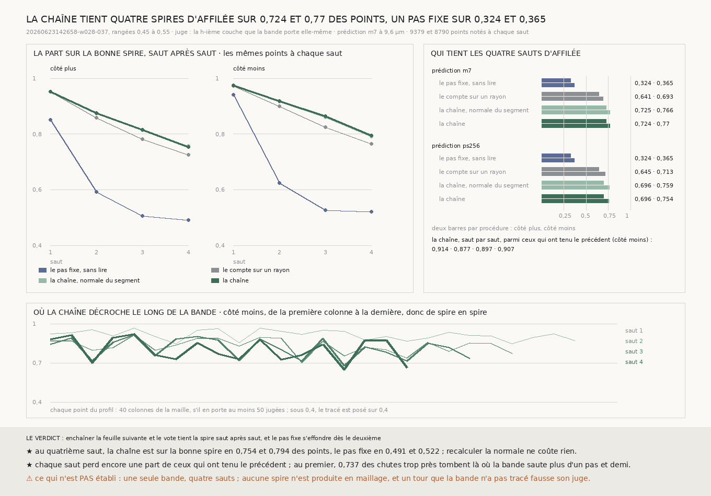

# `248` — Enchaîner le transfert de spire en spire tient-il plusieurs tours ? Sur quatre sauts d'affilée, la chaîne garde la bonne spire sur 0,7236 et 0,7703 des points de la bande, un pas fixe sur 0,3243 et 0,3651 ; mais chaque saut perd encore de 0,09 à 0,14 de ceux qui avaient tenu

*`247` faisait passer d'une spire à la suivante. Cette tranche enchaîne quatre passages, chacun parti de la surface que
le précédent a produite, le long de sa propre normale. Le juge est la bande `w028-037`, qui trace dix spires d'un seul
tenant : en face de chacun de ses points, elle porte elle-même les tours suivants. Sur les points qui ont une couche à
chacun des quatre sauts, la chaîne tient la bonne spire d'affilée sur 0,7236 et 0,7703 d'entre eux, le pas fixe sur
0,3243 et 0,3651. Au quatrième saut, elle est sur la bonne spire en 0,754 et 0,794 des points, le pas fixe en 0,4913 et
0,5217. Recalculer la normale à chaque saut ne coûte rien. Mais chaque saut perd encore 0,09 à 0,14 de ceux qui ont
tenu le précédent, et un saut raté est définitif.*

## 0. Pourquoi cette tranche

Dérouler un rouleau demande des dizaines de passages de spire en spire, et c'est là qu'un humain corrige aujourd'hui.
`247` a réussi un passage sur 0,915 et 0,9166 des points de la bande. Reste à savoir ce qui arrive au suivant : si les
erreurs d'un saut se rattrapent, s'accumulent, ou se multiplient.

⚠⚠⚠ Les quatre procédures, le nombre de sauts, le juge et les deux objets ont été écrits dans le module avant la
première mesure. Après elle, trois lectures ont été ajoutées, qui ne changent aucune procédure : la courbe sur les
mêmes points à chaque saut, le détail des ratés, et la part des sauts qui n'avancent pas.

## 1. Le juge : la bande porte ses propres tours

Sur la tranche de `247` (les rangées de 0,45 à 0,55 de `20260623142658-w028-037`, toutes les colonnes, **30536**
points), la h-ième couche de la bande le long de la normale est le tour situé h spires plus loin. Elle est trouvée
dans une boule d'un demi-pas au-delà du dernier saut, comme les trois pas et demi de `247` pour un seul.

| couche | 1 | 2 | 3 | 4 |
|---|---|---|---|---|
| part des points qui l'ont, côté plus | 0,8794 | 0,7309 | 0,5243 | 0,3071 |
| part des points qui l'ont, côté moins | 0,912 | 0,7517 | 0,526 | 0,2879 |

La part baisse parce qu'un point proche du bout de la bande n'a pas quatre tours devant lui. Les courbes ci-dessous
sont donc prises sur les points qui ont une couche à chacun des quatre sauts : **9379** côté plus, **8790** côté moins.

⚠ Là où la bande n'a pas tracé un tour, la couche suivante prend sa place, et un transfert juste y est noté faux.

## 2. Les procédures

1. **Le pas fixe, sans lire** : h pas le long de la normale du segment.
2. **Le compte sur un rayon** : le long de la normale du segment, on passe la feuille du segment et on prend la h-ième
   feuille suivante, puis le vote itéré de `247`.
3. **La chaîne** : h transferts de `247` (la feuille suivante, puis le vote), chacun parti de la surface produite par le
   précédent, le long de sa normale. C'est la procédure qui déroule.
4. **La chaîne, normale du segment** : la même, sans recalculer la normale. Son écart à la chaîne dit ce que coûte la
   normale estimée.

La normale d'une surface produite est prise sur la maille elle-même, par différences centrées, sinon d'un seul côté.
La feuille est lue dans `m7` et `ps256` à 9,6 µm, comme dans `247`.

## 3. Saut après saut

Avec `m7`, sur les mêmes points à chaque saut (`R4-F414`), côté plus puis côté moins :

| procédure | saut 1 | saut 2 | saut 3 | saut 4 |
|---|---|---|---|---|
| le pas fixe, sans lire | 0,8511 · 0,9414 | 0,5916 · 0,6245 | 0,5062 · 0,5263 | 0,4913 · 0,5217 |
| le compte sur un rayon | 0,9519 · 0,9724 | 0,8586 · 0,8997 | 0,781 · 0,8246 | 0,726 · 0,7639 |
| la chaîne, normale du segment | 0,9519 · 0,9741 | 0,8741 · 0,9172 | 0,8129 · 0,8595 | 0,7564 · 0,7906 |
| **la chaîne** | **0,9519 · 0,9741** | **0,8747 · 0,9181** | **0,8146 · 0,8634** | **0,754 · 0,794** |

⭐⭐⭐⭐ **Le pas fixe s'effondre dès le deuxième saut, la chaîne décroît sans s'effondrer.** Un écart réel qui s'éloigne
d'un pas s'additionne d'un tour à l'autre, et au deuxième saut il suffit d'un écart moyen de 90 voxels au lieu de 72
pour que deux pas tombent hors de la bonne spire. Compter les feuilles n'additionne rien.

⚠⚠ **Recalculer la normale ne coûte rien sur quatre sauts** : sur ces points, la chaîne et la chaîne le long de la
normale du segment diffèrent de moins d'un point sur cent. Au quatrième saut, la chaîne a dérivé latéralement de
**24,6871** et **28,7473** voxels en médiane, et sa normale s'écarte de celle du segment de
**10,4836°** et **12,2577°**.

⚠ Repartir de la surface produite ne perd rien sur un rayon droit : avec `m7` la chaîne fait un peu mieux que le compte
sur un rayon dès le deuxième saut, avec `ps256` les deux restent à un point l'un de l'autre.

## 4. Qui tient les quatre sauts d'affilée

La part des points qui sont sur la bonne spire à chacun des quatre sauts, parmi ceux qui ont une couche à chacun :

| procédure | `m7` plus | `m7` moins | `ps256` plus | `ps256` moins |
|---|---|---|---|---|
| le pas fixe, sans lire | 0,3243 | 0,3651 | 0,3243 | 0,3651 |
| le compte sur un rayon | 0,6412 | 0,6933 | 0,6454 | 0,7133 |
| la chaîne, normale du segment | 0,7251 | 0,7663 | 0,6962 | 0,759 |
| **la chaîne** | **0,7236** | **0,7703** | **0,6958** | **0,7536** |

Saut par saut, parmi ceux qui ont tenu le précédent, la chaîne garde (`m7`) **0,912 · 0,8555 · 0,8845 · 0,9098** côté
plus et **0,9138 · 0,8767 · 0,8969 · 0,9069** côté moins.

⚠⚠⚠ **C'est le chiffre qui dit la distance au rouleau entier.** Chaque saut perd encore de 0,09 à 0,14 de ceux qui
avaient tenu, et un saut raté est définitif : la chaîne reste décalée d'une spire pour tous les sauts suivants. Si
chaque saut gardait 0,9 de ceux qui ont tenu le précédent, dix sauts en garderaient 0,35 et vingt 0,12. Ce n'est pas une
mesure, c'est ce que la mesure donnerait à ce rythme.

## 5. Où la chaîne rate

Les ratés de la chaîne tombent surtout trop près, rarement trop loin (`R4-F415`). Avec `m7`, au premier saut,
**1516** et **1611** points tombent trop près, **848** et **790** trop loin.

- ⚠⚠ **Au premier saut, les chutes trop près sont là où le juge est le moins sûr** : **0,7144** et **0,7368** d'entre
  elles tombent là où la bande elle-même saute plus d'un pas et demi entre le segment et sa couche suivante, ce qu'elle
  ne fait que sur **0,1081** et **0,1209** des points notés. Là, ou bien la bande n'a pas tracé un tour et le juge compte
  le tour d'après, ou bien l'écart réel est grand et la chaîne s'arrête sur une fausse feuille. Cette tranche ne sait pas
  les départager.
- ⚠⚠ **Aux sauts suivants, elles sont une spire de retard** : au quatrième saut, **0,6577** et **0,6567** des chutes trop
  près sont sur la couche d'avant.
- ⚠ **Un saut qui n'avance pas d'un demi-feuillet** est resté sur la feuille d'où il partait. Avec `m7`, c'est
  **0,0652** et **0,0723** des points au premier saut, puis
  **0,0204**, **0,0165**, **0,0158** et **0,0269**, **0,0247**, **0,0227**. Avec `ps256`, c'est environ trois fois
  plus souvent aux sauts suivants : **0,0455** et **0,0635** au quatrième.

## 6. Le second objet : `20230702185753`

Le segment ne porte presque pas de troisième couche : il en a une deuxième en face de **0,2648** et **0,2978** de ses
points, une troisième en face de **0,0047** et **0,0072**. Il ne juge donc que deux sauts (`R4-F416`).

| avec `m7`, sur les points notés à ce saut | saut 1 | saut 2 |
|---|---|---|
| le pas fixe, sans lire | 0,7583 · 0,7473 | 0,5059 · 0,4618 |
| **la chaîne** | **0,9177 · 0,912** | **0,8875 · 0,869** |

Au deuxième saut, **16635** et **18709** points sont notés. Avec `ps256`, la chaîne y tient **0,8268** et **0,8356**.

## 7. Les contrôles

- **Le premier saut est celui de `247`**, à zéro voxel près, avec les deux prédictions et des deux côtés. La part change
  de 0,915 à 0,912 parce que le juge note **26852** points au lieu de 26765, ceux dont la première couche est au-delà du
  rayon de trois pas et demi de `247`, et parce qu'il change la couche de quelques-uns (ci-dessous).
- **La première couche est celle de `247`** partout où les deux en ont une, sauf en **8** et **6** points sur 26765 et
  27763 ; et **8** et **1** points en avaient une dans `247` et n'en ont plus. Là, `247` retenait un point assez proche
  sur la surface pour que le rayon plus grand l'écarte avec le reste de la feuille autour du point.
- **La normale de la maille**, calculée sur la bande elle-même, s'écarte de celle du maillage de **3,1959°** en médiane et
  **12,3473°** au 95ᵉ centile. Aucune normale n'a dû être reprise du saut précédent.

## 8. Le verdict

**ENCHAÎNER LA FEUILLE SUIVANTE ET LE VOTE TIENT LA SPIRE SAUT APRÈS SAUT, AVEC LES DEUX PRÉDICTIONS, ET LE PAS FIXE
S'EFFONDRE DÈS LE DEUXIÈME. MAIS CHAQUE SAUT PERD ENCORE DE 0,09 À 0,14 DE CEUX QUI AVAIENT TENU.**

## 9. Ce que cette tranche ne dit pas

- ⚠⚠⚠ **Aucune spire n'est produite en maillage** : la chaîne avance point par point, une maille sur huit.
- ⚠⚠ Une seule tranche d'une seule bande juge les quatre sauts ; le segment n'en juge que deux.
- ⚠⚠ Là où la bande n'a pas tracé un tour, un transfert juste est noté faux ; la part des ratés qui en vient n'est pas
  connue.
- ⚠ Le juge est une projection sur la normale du segment ; à 25 voxels de dérive latérale, elle néglige l'inclinaison des
  feuilles entre la chaîne et le rayon du segment.

## 10. Les sondes et les bris

Deux batteries : la chaîne (**38** contrôles) et la figure (**15**). La première tourne sur des objets fabriqués dont on
connaît la réponse : une spirale de neuf tours dont la h-ième couche est à h pas, la même privée d'un tour, un cylindre
dont la normale de la maille doit être radiale jusqu'au bord et contre un trou, et une prédiction à cinq feuilles
espacées de 80 et 104 voxels, où la chaîne doit retrouver les quatre sauts et le pas fixe les rater dès le deuxième.
Retirer une de ces feuilles fait sauter une spire à la chaîne, et elle ne la rattrape pas : c'est asserté.

**Neuf bris** ont été appliqués un par un, et **les neuf rougissent** : la h-ième feuille décalée d'un rang, la chaîne qui
repart du segment à chaque saut, la normale de la maille retournée, les couches sans découpe en plages, un témoin qui
n'avance que d'un pas, la tenue sans enchaîner les sauts, la normale sans différence d'un seul côté, sans reprise de la
normale du parent, et le raté trop près comparé à sa propre couche.

## 11. Ce qui reste

⭐⭐⭐ **Ce qui s'ouvre** (`R4-P93`) : là où la bande saute plus d'un pas et demi, est-ce elle qui a manqué un tour, ou la
chaîne qui s'arrête sur une fausse feuille ? La réponse dit si la chaîne perd un point sur dix par saut, ou moins.

⭐⭐⭐ `R4-P92` reste ouverte, et cette tranche la précise : les huit points sur cent que le premier saut manque se
paient à chaque saut, et un saut raté ne se rattrape pas. Ce qui les rattrape doit agir avant le saut suivant.
