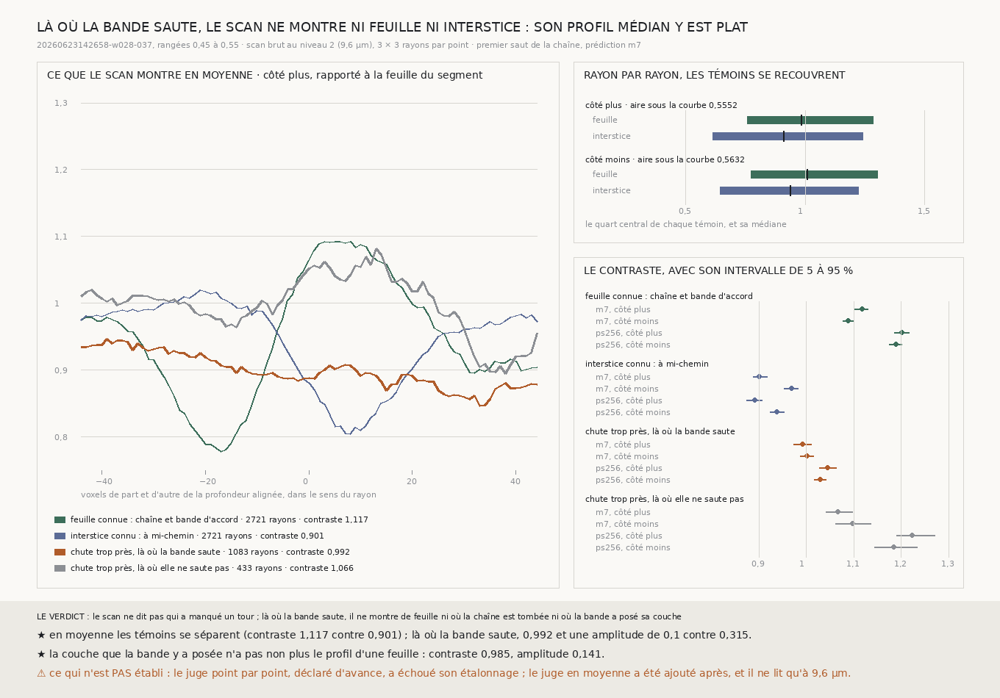

# `249` — Là où la bande saute plus d'un pas et demi, le scan dit-il qui a manqué un tour ? Non : rayon par rayon, il ne sépare pas une feuille d'un interstice ; en moyenne il les sépare, et il ne montre de feuille ni où la chaîne est tombée ni où la bande a posé sa couche

*`248` laissait une question (`R4-P93`) : au premier saut, près des trois quarts des chutes trop près tombent là où la
bande `w028-037` elle-même saute plus d'un pas et demi. Soit la bande a manqué un tour, soit la chaîne s'arrête sur une
fausse feuille. Le juge choisi est le scan brut, lu à 9,6 µm là où chacun est tombé, qui ne dépend ni de la bande ni de
la prédiction. Le juge déclaré d'avance, point par point, échoue son étalonnage : il ne sépare une feuille connue d'un
interstice connu qu'à une aire de 0,5552 et 0,5632. Le juge en moyenne, ajouté après, les sépare nettement. Là où la
bande saute, il rend un profil plat, autour de la chute de la chaîne comme autour de la couche de la bande. Le scan, lu
ainsi, ne tranche pas : ni l'une ni l'autre n'y est posée sur une feuille qu'il résout.*

## 0. Pourquoi cette tranche

`248` mesure que la chaîne perd de 0,09 à 0,14 des points à chaque saut. Si la bande a manqué des tours là où elle
saute, une part de ces pertes est un défaut du juge et non de la chaîne. Il faut un juge qui ne soit ni l'un ni
l'autre : le scan lui-même.

⚠⚠⚠ L'ordre est dit tel qu'il a été vécu. Le juge point par point a été écrit avant la mesure, avec son étalonnage, ses
fenêtres et son seuil. Il a échoué son étalonnage. Le profil médian des témoins et le juge en moyenne ont été ajoutés
après, avec le même étalonnage ; ils ne changent ni les groupes ni les rayons lus.

## 1. Ce qui est lu

La tranche de `247` et `248` (les rangées de 0,45 à 0,55 de `20260623142658-w028-037`). Le premier saut de la chaîne est
celui de `247`, que `248` a vérifié au voxel près ; la couche de la bande est celle de `248`. Trois groupes par côté et
par prédiction :

- **les points d'accord**, où la chaîne tombe à moins d'un demi-feuillet de la couche de la bande : environ trois mille
  par côté, un sur k dans l'ordre de la maille ;
- **les chutes trop près là où la bande saute** : **1083** et **1187** avec `m7`, **1151** et **1246** avec `ps256` ; la
  chaîne y tombe à **1,0821** et **1,0405** pas, la bande y a sa couche à **2,2833** et **2,2924** pas (en médiane,
  `m7`) ;
- **les chutes trop près là où elle ne saute pas** : **433** et **424** avec `m7` ; la chaîne y tombe à
  **0,4578** et **0,4405** pas, la bande à **1,2023** et **1,1611**.

Le scan est lu au niveau 2 du volume à 2,4 µm, soit 9,6 µm, le long de la normale du segment, sur 3 × 3 rayons voisins
espacés d'un voxel brut : **1845** chunks lus, zéro panne. Chaque intensité est rapportée à celle de la feuille du
segment sur le même rayon.

## 2. Le juge point par point, déclaré d'avance : il échoue son étalonnage

Deux témoins dont la réponse est connue, sur les points d'accord : la profondeur où la chaîne et la bande s'accordent
(une feuille) et la mi-chemin entre le segment et elle (un interstice). Le seuil qui les sépare le mieux :

| `m7` | aire sous la courbe | sensibilité | fausses alertes |
|---|---|---|---|
| côté plus | 0,5552 | 0,7233 | 0,6035 |
| côté moins | 0,5632 | 0,7868 | 0,675 |

Avec `ps256`, **0,5478** et **0,5587**. ⚠⚠⚠ **Un rayon seul ne distingue presque pas une feuille d'un interstice** : la
médiane du rapport vaut **0,9842** pour la feuille et **0,9085** pour l'interstice côté plus, et leurs quartiles se
recouvrent presque entièrement. La part de vraies feuilles que ce juge déduirait des chutes n'a donc pas de sens, et elle
n'est pas retenue.

## 3. Le profil médian des témoins : la feuille est là, décalée de sa face

Sur les **416** et **404** points d'accord dont la couche est à un pas, à six voxels près, le profil médian montre la
feuille suivante sans ambiguïté. Côté plus, elle culmine à **83** voxels du segment (**1,0707**) après un creux à **51**
(**0,7672**). Côté moins, elle culmine à **62** voxels (**1,0455**).

⭐⭐⭐ **La bande trace une face de la feuille, et sa matière est du côté plus.** Le pic tombe à une dizaine de voxels
au-delà d'un pas d'un côté, en deçà de l'autre : c'est ce que donne une feuille dont le centre est à une dizaine de voxels
de la surface tracée, toujours du même côté. C'est aussi ce qui rend le juge point par point si faible : ses fenêtres
centrées sur les faces tracées mêlent de la feuille et de l'interstice.

## 4. Le juge en moyenne, ajouté après : il sépare les témoins

Les profils de mille à trois mille rayons sont alignés sur une même profondeur, et leur médiane est lue : le contraste
est le pic, à huit voxels du centre, sur la moyenne à un demi-pas de part et d'autre. Une feuille au centre donne plus
de un, un interstice étroit moins de un, et un profil sans structure un. L'intervalle est celui de 5 à 95 % de deux
cents tirages des rayons avec remise ; l'amplitude est l'écart entre le haut et le bas du profil médian.

| avec `m7` | contraste plus | contraste moins | amplitude plus | amplitude moins |
|---|---|---|---|---|
| feuille connue (alignée sur la chute de la chaîne) | 1,117 [1,1021 ; 1,1302] | 1,0878 [1,0771 ; 1,1003] | 0,315 | 0,3285 |
| interstice connu (à mi-chemin) | 0,9011 [0,8883 ; 0,9176] | 0,9693 [0,9536 ; 0,9824] | 0,2157 | 0,1532 |
| **chute trop près, là où la bande saute** | **0,9924 [0,9736 ; 1,0104]** | **1,0018 [0,9867 ; 1,0147]** | **0,0998** | **0,0377** |
| chute trop près, là où elle ne saute pas | 1,0661 [1,0415 ; 1,0968] | 1,0982 [1,0623 ; 1,1356] | 0,1871 | 0,175 |

⭐⭐⭐⭐ **Là où la bande saute, le profil médian est plat autour de la chute de la chaîne.** Son contraste est entre ceux
des deux témoins, leurs intervalles ne se touchent pas, et son amplitude est la plus petite de toutes. Avec `ps256`, même
chose : **1,0445** et **1,0293**, amplitude **0,112** et **0,0656**, contre **1,202** et **1,1888** pour la feuille et
**0,8912** et **0,9382** pour l'interstice.

⭐⭐⭐ **La couche que la bande y a posée n'a pas non plus le profil d'une feuille.** Alignée sur la bande, contre les
points d'accord alignés de même : **0,985** et **1,03** contre **1,0425** et **1,0793**,
amplitude **0,1412** et **0,0972** contre **0,1732** et **0,1999**.

⚠ Là où la bande ne saute pas, la chaîne tombe à un peu moins d'un demi-pas, sur de la matière : **1,0661** et **1,0982**,
**1,2229** et **1,1841** avec `ps256`. Ce qu'elle y a trouvé, une feuille serrée ou la sienne mal passée, cette tranche
ne le dit pas.

## 5. Le verdict

**LE SCAN BRUT À 9,6 µm NE DIT PAS QUI A MANQUÉ UN TOUR. RAYON PAR RAYON, IL NE SÉPARE PAS UNE FEUILLE D'UN
INTERSTICE ; EN MOYENNE IL LES SÉPARE, ET LÀ OÙ LA BANDE SAUTE IL NE MONTRE DE FEUILLE NI OÙ LA CHAÎNE EST TOMBÉE NI OÙ
LA BANDE A POSÉ SA COUCHE.**

## 6. Ce que cette tranche ne dit pas

- ⚠⚠⚠ `R4-P93` n'est pas tranchée : on sait seulement que ni la chaîne ni la bande n'y sont posées sur une feuille que ce
  scan, à cette résolution et en moyenne, résout.
- ⚠⚠ Le juge en moyenne a été écrit après l'échec du juge point par point. Il est étalonné sur les mêmes témoins, mais
  sa fenêtre et son creux ont été choisis sans mesure préalable.
- ⚠⚠ Un profil médian plat peut venir de rayons sans structure ou de rayons dont les feuilles tombent à des profondeurs
  qui se compensent ; la médiane ne les distingue pas.
- ⚠ Seul le niveau 2 est lu. Les niveaux 0 et 1 (2,4 et 4,8 µm) ne le sont pas.

## 7. Les sondes et les bris

Une batterie de **32** contrôles et une figure de **16**. Les contrôles portent sur des objets fabriqués : deux témoins
bien séparés et deux confondus, un mélange à mi-chemin des deux taux, un scan à trois feuilles lu à travers le vrai chemin
des chunks, une bande qui a sauté un tour, une moitié des témoins six fois plus sombre, et cent rayons bruités autour
d'une feuille.

**Huit bris** ont été appliqués un par un, et **les huit rougissent** : un seuil qui ignore les fausses alertes, une aire
calculée sur l'interstice, un mélange qui ne retire pas les fausses alertes, un saut de la bande compté à un pas, des
rayons voisins hors du plan normal, les axes du scan non permutés, une intensité non rapportée au segment, et un témoin
interstice pris sur la feuille.

⚠ **Un contrôle ne pouvait pas échouer, et un bris l'a montré** : le test des rayons voisins prenait une normale le long
d'un axe, pour laquelle un décalage faux reste dans le plan. Il prend désormais une normale inclinée.

## 8. Ce qui reste

`R4-P93` reste ouverte. Le scan brut à 9,6 µm y est muet en moyenne. Le lire plus finement, là où la bande saute, est
la voie qui n'a pas été essayée.
