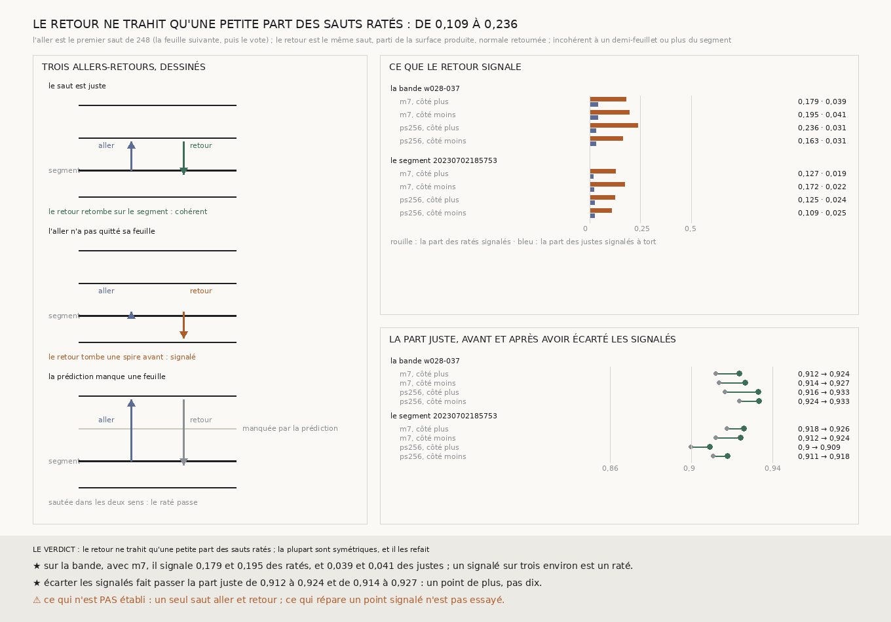

# `250` — Revenir d'où l'on vient trahit-il le saut raté ? Peu : le retour ne signale que 0,1789 et 0,1953 des ratés de la bande, et écarter les points signalés ne fait gagner qu'un point

*Pour qu'une machine remplace l'humain qui corrige le transfert, elle doit savoir seule où elle a raté. Le contrôle le
moins cher qui soit : faire le saut, puis le saut inverse depuis la surface produite, et regarder si l'on revient sur le
segment. Sur la bande `w028-037`, avec `m7`, le retour signale 0,1789 et 0,1953 des sauts ratés, et 0,0392 et 0,0408 des
sauts justes. Écarter les points signalés fait passer la part juste de 0,912 à 0,9238 et de 0,9138 à 0,9267. Le segment
`20230702185753` dit la même chose. La plupart des ratés sont symétriques, et le retour les refait.*

## 0. Pourquoi cette tranche

`248` mesure qu'un saut raté est définitif, et `249` que le scan brut à 9,6 µm ne départage pas la chaîne et la bande
là où elles divergent. Ce qui remplacera l'humain devra donc repérer un raté sans juge extérieur. Le retour est le
premier contrôle de ce genre, et le plus simple : la chaîne se juge elle-même.

⚠⚠⚠ Tout est déclaré avant la mesure, y compris la tache aveugle : une feuille que la prédiction manque est manquée
dans les deux sens, donc un aller qui saute une spire revient sur le segment en la sautant encore. Le retour ne peut
signaler que les ratés qui ne sont pas symétriques.

## 1. Ce qui est fait

L'aller est le premier saut de `248` (la feuille suivante, puis le vote), à zéro voxel près, avec les deux prédictions et
des deux côtés. Le retour est le même saut, parti de la surface produite, le long de sa normale retournée. Un point est
**incohérent** si le retour tombe à un demi-feuillet ou plus du segment, le long de la normale du segment. Le juge de
l'aller est la couche que la bande porte elle-même, celle de `248`.

## 2. Ce que le retour signale

Sur la tranche de la bande (**26852** et **27848** points notés), avec `m7`, côté plus puis côté moins (`R4-F419`) :

| | côté plus | côté moins |
|---|---|---|
| part des ratés signalés | 0,1789 | 0,1953 |
| part des justes signalés à tort | 0,0392 | 0,0408 |
| part ratée parmi les signalés | 0,3059 | 0,3112 |
| part juste à l'aller | 0,912 | 0,9138 |
| **part juste parmi les points gardés** | **0,9238** | **0,9267** |

⚠⚠⚠ **Le retour ne signale qu'un raté sur cinq ou six.** Il en signale un peu plus parmi les chutes trop près
(**0,2051** et **0,221**) que parmi les chutes trop loin (**0,1321** et **0,143**). Un signalé sur trois est un raté,
contre un point sur onze au hasard. Le retour d'un point signalé tombe en médiane à **−0,605** et **0,609** pas du
segment : pas une spire entière d'écart.

Avec `ps256`, **0,2365** et **0,1627** des ratés sont signalés, et la part juste passe
de **0,9165** à **0,9331** et de **0,9237** à **0,9334**.

## 3. Le second objet : `20230702185753`

Avec `m7`, le retour signale **0,1267** et **0,1715** des ratés et **0,0187** et **0,0222** des justes ; la part juste passe
de **0,9177** à **0,9261** et de **0,912** à **0,9245** (`R4-F420`).

## 4. Le verdict

**LE RETOUR NE TRAHIT QU'UNE PETITE PART DES SAUTS RATÉS. LA PLUPART SONT SYMÉTRIQUES : CE QUE LA PRÉDICTION MANQUE OU
INVENTE À L'ALLER, ELLE LE MANQUE OU L'INVENTE AU RETOUR.**

## 5. Ce que cette tranche ne dit pas

- ⚠⚠ Un seul aller et un seul retour ; un retour de plusieurs sauts n'est pas essayé.
- ⚠⚠ Ce qui répare un point signalé n'est pas essayé : les points sont seulement écartés.
- ⚠ Un point juste peut être signalé parce que c'est son retour qui a raté ; la table ne sépare pas les deux.

## 6. Les sondes et les bris

Une batterie de **12** contrôles et une figure de **12**. Sur une prédiction fabriquée à quatre feuilles planes, un
segment posé sur sa feuille fait l'aller et revient ; posé vingt voxels devant elle, il la prend pour la suivante, n'avance
pas, et le retour tombe à la spire d'avant ; sans la deuxième feuille, l'aller saute une spire et le retour la saute aussi,
sans être signalé.

**Cinq bris** rougissent tous : le retour parti du segment, le retour dans le même sens que l'aller, la cohérence lue sur
l'aller, les ratés signalés comptés sur les justes, et le genre du raté lu sans son côté. ⚠ Deux passaient d'abord : la
cohérence était calculée hors de toute fonction testée, et la table de confusion était testée sur une fixture où les deux
parts valaient un demi. Les deux ont été corrigés.

## 7. Ce qui reste

`R4-P92` et `R4-P93` restent ouvertes. Un contrôle qui ne voit que les ratés asymétriques ne remplace pas l'humain ; ce qui
voit les ratés symétriques doit venir d'ailleurs que de la prédiction qui les a faits.
