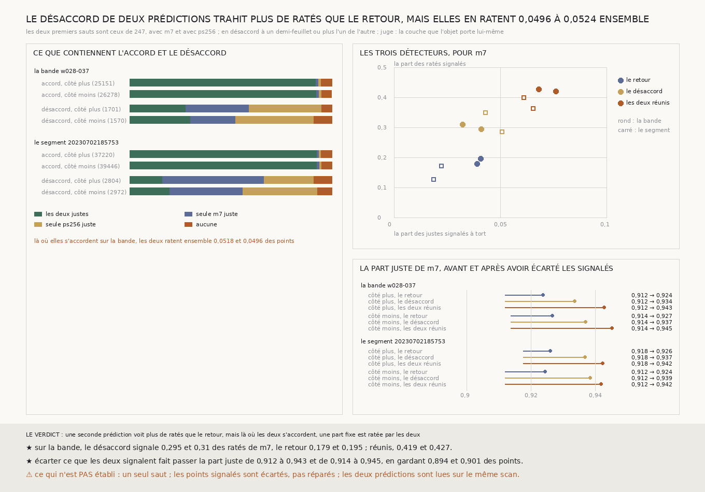

# `251` — Deux prédictions qui ne s'accordent pas trahissent-elles le saut raté ? Mieux que le retour : 0,2948 et 0,3103 des ratés de `m7` ; mais là où elles s'accordent, elles ratent ensemble 0,0518 et 0,0496 des points

*`250` a montré que le retour ne voit pas les ratés symétriques, parce qu'il relit la prédiction qui s'est trompée. Il y a
deux prédictions publiées pour PHercParis4, `m7` et `ps256`. Là où leurs premiers sauts tombent à plus d'un demi-feuillet
l'un de l'autre, au moins l'une a raté. Sur la bande `w028-037`, ce désaccord signale 0,2948 et 0,3103 des ratés de `m7`,
contre 0,1789 et 0,1953 pour le retour. Réunis, les deux en signalent 0,4192 et 0,4269, et écarter ce qu'ils signalent
fait passer la part juste de 0,912 à 0,9428. Mais là où les deux prédictions s'accordent, elles ratent ensemble 0,0518
et 0,0496 des points, et aucun de ces contrôles ne le voit.*

## 0. Pourquoi cette tranche

Un contrôle qui ne relit que la prédiction qui s'est trompée ne voit que ses ratés asymétriques (`250`). Le contrôle
suivant doit venir d'ailleurs. Une seconde prédiction, entraînée à part, est la source indépendante la moins chère :
ses premiers sauts sont déjà écrits.

⚠⚠⚠ Tout est déclaré avant la mesure : le désaccord à un demi-feuillet, les trois détecteurs (le retour de `250` avec
`m7`, le désaccord, leur réunion), le juge de `248`, et la tache aveugle. Deux prédictions lues sur le même scan peuvent
rater ensemble, et `249` a montré que là où la bande saute, le scan brut à 9,6 µm ne résout pas les feuilles.

## 1. Ce que contiennent l'accord et le désaccord

Sur la bande, les deux premiers sauts sont en désaccord sur **0,0638** et **0,0578** des points (`R4-F421`).

| sur la bande | points | les deux justes | seule `m7` juste | seule `ps256` juste | aucune |
|---|---|---|---|---|---|
| accord, côté plus | 25151 | 0,921 | 0,0128 | 0,0145 | 0,0518 |
| accord, côté moins | 26278 | 0,9242 | 0,0127 | 0,0134 | 0,0496 |
| désaccord, côté plus | 1701 | 0,2781 | 0,3122 | 0,3592 | 0,0506 |
| désaccord, côté moins | 1570 | 0,3025 | 0,2229 | 0,3873 | 0,0873 |

⚠⚠⚠ **Là où elles s'accordent, elles ratent ensemble une part fixe**, **0,0518** et **0,0496**, soit la moitié des ratés de
`m7` environ. Aucun contrôle bâti sur ces deux prédictions ne peut la voir. Le segment `20230702185753` donne la même part :
**0,0524** et **0,0509**.

⚠ **Là où elles divergent, aucune n'a raison plus souvent que l'autre.** Choisir l'une ne répare donc pas un désaccord.
Et près de trois fois sur dix, les deux sont justes : à moins d'un demi-feuillet du juge, chacune de son côté.

## 2. Les trois détecteurs

Pour `m7`, sur la bande, côté plus puis côté moins :

| détecteur | ratés signalés | justes signalés à tort | ratés parmi les signalés | part juste gardée | part gardée |
|---|---|---|---|---|---|
| le retour | 0,1789 · 0,1953 | 0,0392 · 0,0408 | 0,3059 · 0,3112 | 0,9238 · 0,9267 | 0,9485 · 0,9459 |
| le désaccord | 0,2948 · 0,3103 | 0,041 · 0,0324 | 0,4098 · 0,4745 | 0,9337 · 0,937 | 0,9367 · 0,9436 |
| **les deux réunis** | **0,4192 · 0,4269** | **0,0762 · 0,0682** | **0,347 · 0,3712** | **0,9428 · 0,9452** | **0,8936 · 0,9009** |

La part juste de `m7` est **0,912** et **0,9138** sans rien écarter. ⭐⭐⭐ **Le désaccord voit une fois et demie plus de
ratés que le retour, et les deux réunis en voient deux sur cinq**, pour un point sur dix écarté. Pour `ps256`, le
désaccord signale **0,2753** et **0,2291** de ses ratés.

Sur le segment, avec `m7`, le désaccord signale **0,2852** et **0,3498** des ratés, les deux réunis **0,3624** et **0,3988**,
et la part juste gardée monte de **0,9177** à **0,9424** et de **0,912** à **0,9418** (`R4-F422`).

## 3. Le verdict

**UNE SECONDE PRÉDICTION VOIT PLUS DE RATÉS QUE LE RETOUR, ET LES DEUX RÉUNIS EN VOIENT DEUX SUR CINQ. MAIS LÀ OÙ LES
DEUX PRÉDICTIONS S'ACCORDENT, ELLES RATENT ENSEMBLE ENVIRON UN POINT SUR VINGT, ET RIEN NE LE VOIT.**

## 4. Ce que cette tranche ne dit pas

- ⚠⚠⚠ Un point sur vingt reste raté sans être vu à chaque saut ; ce qui le voit n'est pas lu dans ces deux prédictions.
- ⚠⚠ Les points signalés sont écartés, pas réparés ; un rouleau entier ne peut pas en écarter un sur dix par spire.
- ⚠ Un seul saut ; le désaccord le long d'une chaîne n'est pas mesuré.

## 5. Les sondes et les bris

Une batterie de **7** contrôles et une figure de **13**. Le désaccord est borné au demi-feuillet et un saut absent n'est pas
un accord ; la table de qui a raison est testée sur une fixture où les quatre cas ne sont pas également représentés ; deux
ratés identiques s'accordent, et c'est asserté.

**Trois bris** rougissent tous : un désaccord strict qui prend un saut absent pour un accord, les deux prédictions échangées
dans la table de qui a raison, et les points sans couche comptés. ⚠ Le deuxième passait d'abord, sur une fixture où les
quatre cas valaient un quart ; elle a été refaite.

## 6. Ce qui reste

`R4-P92` et `R4-P93` restent ouvertes. Deux prédictions lues sur le même scan partagent une part de leurs ratés. Ce qui
voit ce point sur vingt doit porter une information qu'aucune des deux n'a lue : la surface elle-même, d'un bord à l'autre
de la spire, comme le font les boucles du treillis.
