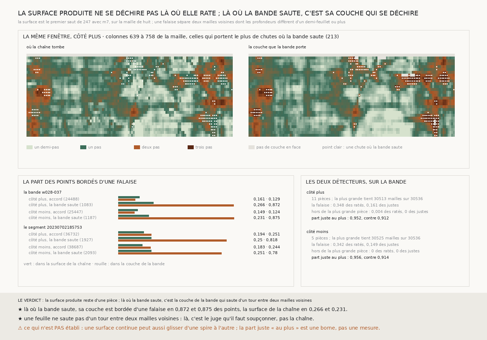

# `252` — La surface produite se déchire-t-elle là où elle rate ? Non : elle tient en une pièce, 30513 mailles sur 30536 ; et là où la bande saute, c'est la couche de la bande qui se déchire, pas la surface de la chaîne

*Là où `m7` et `ps256` s'accordent, elles ratent ensemble un point sur vingt (`251`). La seule information qu'aucune des
deux n'a lue est la surface produite elle-même : la spire voisine est une feuille, et une tache partie sur la spire
d'après devrait en être séparée par une falaise. Mais la surface de la chaîne tient presque entière en une pièce, et ses
ratés ne s'en détachent pas. Lue par la même règle, c'est la couche de la bande qui se déchire : là où la bande saute
plus d'un pas et demi, sa couche est bordée d'une falaise en 0,8717 et 0,8753 des points, la surface de la chaîne en
0,2659 et 0,2308. Une feuille ne saute pas d'un tour entre deux mailles voisines ; là, c'est le juge qu'il faut
soupçonner.*

## 0. Pourquoi cette tranche

`250` et `251` ont essayé deux contrôles sans juge, le retour et une seconde prédiction ; ensemble ils voient deux ratés
sur cinq, et un point sur vingt leur échappe. Ce qui reste à lire est la surface produite : si ses ratés s'en détachent,
la machine peut les voir seule.

⚠⚠⚠ Les deux détecteurs sont déclarés avant la mesure, avec leur tache aveugle : une falaise d'un bord à l'autre sépare
deux pièces et fait signaler la plus petite, juste ou non, et une tache qui a glissé sans falaise reste dans la plus
grande. La lecture de la couche de la bande par la même règle a été ajoutée après la première mesure, et elle est dite
comme telle.

## 1. Ce qui est lu

La surface est le premier saut de `247` avec `m7`, relu tel qu'il a été écrit, sur la maille de huit : **29** rangées et
**1105** colonnes sur la tranche de la bande. Deux mailles voisines, en haut, en bas, à gauche ou à droite, sont continues
si leurs profondeurs diffèrent de moins d'un demi-feuillet ; sinon une falaise les sépare.

- **La falaise** signale un point bordé d'au moins une falaise.
- **Hors de la plus grande pièce** signale tout point qui n'est pas relié à la plus grande pièce par des voisines continues.

## 2. La surface ne se déchire pas là où elle rate

| sur la bande | côté plus | côté moins |
|---|---|---|
| pièces | 11 | 5 |
| mailles de la plus grande, sur 30536 | 30513 | 30525 |
| part bordée d'une falaise | 0,1771 | 0,1676 |

⚠⚠⚠ **Les ratés de la chaîne ne se détachent pas de la surface** (`R4-F423`) : hors de la plus grande pièce, le détecteur
ne signale que **0,0038** et **0,0004** des ratés. La falaise en signale **0,3477** et **0,3415**, mais aussi **0,161** et
**0,1486** des points justes : un signalé sur six est un raté (**0,1725** et **0,1782**), à peine deux fois le hasard.

Sur les ratés communs aux deux prédictions (**1303** et **1304** points, **0,0485** et **0,0468** des points notés), la
falaise en signale **0,2855** et **0,2692**, la plus grande pièce **0,0008** et **0,0008**. Réunir la plus grande pièce au
retour et au désaccord ne change presque rien : **0,4196** et **0,4273** des ratés signalés, contre **0,4192** et **0,4269**.

## 3. Là où la bande saute, c'est sa couche qui se déchire

La même règle de falaise, lue sur la couche que la bande porte, par groupe de `249` (`R4-F424`) :

| sur la bande, bordés d'une falaise | dans la surface de la chaîne | dans la couche de la bande |
|---|---|---|
| accord, côté plus | 0,161 | 0,1286 |
| accord, côté moins | 0,1486 | 0,1237 |
| **la bande saute, côté plus** | **0,2659** | **0,8717** |
| **la bande saute, côté moins** | **0,2308** | **0,8753** |

Sur le segment `20230702185753`, là où il saute : **0,2496** et **0,2513** dans la surface de la chaîne, **0,8184** et
**0,7797** dans sa propre couche.

⭐⭐⭐⭐ **Là où la bande saute, sa couche saute d'un tour entre deux mailles voisines, et la surface de la chaîne ne saute
presque pas plus qu'ailleurs.** Une feuille de papyrus ne saute pas d'un tour sur 160 voxels : là, la couche la plus
proche de la bande a changé d'identité, et la chaîne a suivi une même feuille. C'est la moitié de la réponse que `249`
n'avait pas pu donner : ce n'est pas la chaîne qu'il faut soupçonner d'abord.

⚠ Ce qui est en jeu, et c'est une borne, pas une mesure : si toutes les chutes où la bande saute étaient des défauts du
juge, la part juste du premier saut monterait au plus de **0,912** à **0,9523** et de **0,9138** à **0,9564** ; sur le
segment, à **0,9659** et **0,9614**.

## 4. Le verdict

**LA SURFACE PRODUITE NE SE DÉCHIRE PAS LÀ OÙ ELLE RATE : SES RATÉS S'Y FONDENT. LÀ OÙ LA BANDE SAUTE, C'EST LA COUCHE DE
LA BANDE QUI SE DÉCHIRE, ET LA SURFACE DE LA CHAÎNE RESTE CONTINUE.**

## 5. Ce que cette tranche ne dit pas

- ⚠⚠⚠ Une surface continue peut glisser d'une spire à l'autre par des pentes de moins d'un demi-feuillet ; la continuité
  ne prouve pas que la chaîne est juste là où la bande saute, elle prouve que la couche de la bande n'y est pas une feuille.
- ⚠⚠ La borne suppose toutes les chutes où la bande saute justes ; la part réelle est entre la mesure et la borne.
- ⚠ Un seul saut, et une seule prédiction pour la surface.

## 6. Les sondes et les bris

Une batterie de **11** contrôles et une figure de **12**. Sur des surfaces fabriquées : une tache de trois sur trois à
deux pas au milieu d'une surface à un pas, bordée des deux côtés et seule hors de la plus grande pièce ; une pente douce
sans falaise ; une colonne vide qui coupe sans falaise ; une falaise d'un bord à l'autre qui fait signaler la plus petite
pièce ; deux mailles qui ne se touchent que par un coin ; et la fenêtre de la figure, prise par une règle.

**Cinq bris** rougissent tous : des voisines en diagonale, une falaise marquée d'un seul côté, la plus petite pièce gardée,
les mailles absentes comptées comme pièces, et la part bordée lue sur toute la surface.

## 7. Ce qui reste

⭐⭐⭐ La perte par saut de `248` a été jugée par une couche qui se déchire là où la bande saute. Rejuger la chaîne hors de
ces déchirures dira ce qu'elle perd vraiment à chaque saut. `R4-P92` reste ouverte ; `R4-P93` a sa première moitié.
