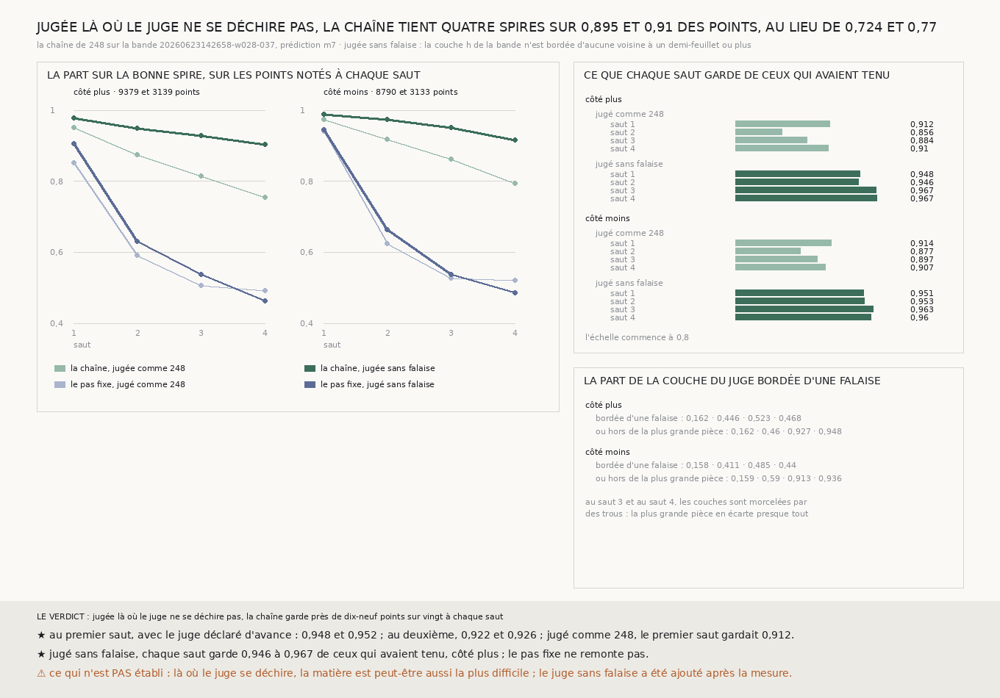

# `253` — Que perd la chaîne à chaque saut, jugée là où le juge ne se déchire pas ? Environ un point sur vingt : 0,948 et 0,9517 au premier saut, et, sans falaise, 0,8949 et 0,9103 des points tiennent quatre spires d'affilée

*`248` a mesuré que la chaîne perd de 0,09 à 0,14 des points à chaque saut, et `252` que là où la bande saute, c'est la
couche de la bande qui se déchire. La chaîne de `248`, refaite à l'identique, est ici jugée là seulement où la couche du
juge est continue. Avec le juge déclaré d'avance, qui écarte aussi les pièces détachées de la couche, elle retombe sur la
bonne spire en 0,948 et 0,9517 des points au premier saut, 0,922 et 0,9257 au deuxième ; les sauts suivants n'ont presque
plus de juge. Avec le juge sans falaise, ajouté après, chaque saut garde de 0,9456 à 0,9673 des points qui avaient tenu,
et la chaîne tient les quatre sauts sur 0,8949 et 0,9103 des points, au lieu de 0,7236 et 0,7703. Le pas fixe ne remonte
pas.*

## 0. Pourquoi cette tranche

La perte par saut est le chiffre qui dit la distance au rouleau entier (`248`). Elle a été mesurée contre une couche qui
se déchire là où la bande saute (`252`). Il faut savoir ce qu'elle vaut contre un juge qui ne se déchire pas.

⚠⚠⚠ Le juge intact est déclaré avant la mesure : au saut h, un point n'est noté que si la h-ième couche de la bande
existe en face de lui, n'est bordée d'aucune falaise et tient à la plus grande pièce de la couche. Le juge sans falaise,
la règle de `252` seule, a été ajouté après la première mesure, parce que la règle de la pièce écarte presque tout aux
sauts 3 et 4. Il est noté à côté, jamais à la place, et le document le dit partout où il sert.

## 1. Ce que le juge écarte

| avec `m7`, part des couches notées écartée | saut 1 | saut 2 | saut 3 | saut 4 |
|---|---|---|---|---|
| bordée d'une falaise, côté plus | 0,1615 | 0,4463 | 0,523 | 0,4681 |
| bordée ou hors de la plus grande pièce, côté plus | 0,1618 | 0,4603 | 0,9272 | 0,9484 |
| bordée d'une falaise, côté moins | 0,1584 | 0,4113 | 0,4855 | 0,4402 |
| bordée ou hors de la plus grande pièce, côté moins | 0,1588 | 0,59 | 0,9133 | 0,9359 |

⚠⚠ **La couche du juge se déchire de plus en plus loin du segment.** Aux sauts 3 et 4, elle est morcelée par des trous,
et la règle de la plus grande pièce ne laisse que **1165** et **484** points côté plus, **1392** et **563** côté moins :
aucun point n'y est noté à chacun des quatre sauts.

## 2. Le juge intact, déclaré d'avance

Avec `m7`, la chaîne retombe sur la bonne spire en **0,948** et **0,9517** des points au premier saut (**22508** et
**23427** notés), et en **0,922** et **0,9257** au deuxième (**12046** et **9411** notés) (`R4-F425`). Parmi ceux qui ont
tenu le premier, le deuxième saut en garde **0,9501** et **0,9506**. Avec `ps256` : **0,9581** et **0,9663**, puis **0,9264**
et **0,9267**.

Jugée comme `248`, dans la même exécution, la chaîne retrouve exactement les chiffres de `248` : **0,912** et **0,9138** au
premier saut.

## 3. Le juge sans falaise, ajouté après

Sur les **3139** et **3133** points notés à chacun des quatre sauts, avec `m7` (`R4-F426`) :

| sur les mêmes points à chaque saut | saut 1 | saut 2 | saut 3 | saut 4 |
|---|---|---|---|---|
| le pas fixe, côté plus | 0,9051 | 0,6308 | 0,5368 | 0,4629 |
| **la chaîne, côté plus** | **0,9783** | **0,9493** | **0,9296** | **0,9028** |
| le pas fixe, côté moins | 0,9454 | 0,6636 | 0,5385 | 0,4855 |
| **la chaîne, côté moins** | **0,9888** | **0,9735** | **0,9508** | **0,917** |

La chaîne tient les quatre sauts d'affilée sur **0,8949** et **0,9103** de ces points, contre **0,3536** et **0,3763** pour le
pas fixe ; avec `ps256`, **0,8694** et **0,8944**. Saut par saut, parmi ceux qui ont tenu le précédent, elle garde
**0,9477 · 0,9456 · 0,9666 · 0,9673** côté plus et **0,9514 · 0,9526 · 0,9633 · 0,9603** côté moins.

⭐⭐⭐⭐ **Jugée là où le juge ne se déchire pas, la chaîne perd environ un point sur vingt à chaque saut, et non un sur
dix.** Les deux juges s'accordent là où tous deux jugent : au premier et au deuxième saut, environ dix-neuf points sur vingt
tiennent.

⚠⚠ À ce rythme, vingt sauts en garderaient environ 0,36 ; c'est un calcul, pas une mesure.

## 4. Le verdict

**JUGÉE LÀ OÙ LA COUCHE DU JUGE EST CONTINUE, LA CHAÎNE GARDE ENVIRON DIX-NEUF POINTS SUR VINGT À CHAQUE SAUT, ET TIENT
QUATRE SPIRES D'AFFILÉE SUR PLUS DE HUIT POINTS SUR DIX ; LE PAS FIXE NE REMONTE PAS.**

## 5. Ce que cette tranche ne dit pas

- ⚠⚠⚠ Là où le juge se déchire, la matière est peut-être aussi la plus difficile : écarter ces points peut écarter de vrais
  ratés de la chaîne. La perte réelle par saut est entre celle de `248` et celle-ci.
- ⚠⚠ Le juge sans falaise a été ajouté après la mesure ; le juge déclaré d'avance ne juge que deux sauts.
- ⚠ Une couche qui glisse d'une spire à l'autre par des pentes douces n'est écartée par aucune des deux règles.

## 6. Les sondes et les bris

Une batterie de **8** contrôles et une figure de **11**. Une plaque de couche qui a sauté d'un tour, avec son intérieur et
son bord, est écartée par le juge intact ; le juge de `248` y compte neuf ratés, le juge intact aucun ; une rampe douce
n'est pas écartée, et la chaîne restée à un pas y est comptée ratée là où la rampe dépasse un demi-feuillet.

**Quatre bris** rougissent tous : le juge intact sans la plus grande pièce, sans la falaise, un juge qui garde les points
écartés, et un pas fixe qui n'avance que d'un pas.

## 7. Ce qui reste

`R4-P92` reste ouverte : produire la spire en maillage et la juger d'un bord à l'autre. `R4-P93` a une réponse : là où la
bande saute, c'est la couche du juge qui se déchire, et, jugée hors de ces déchirures, la chaîne perd deux fois moins à
chaque saut. La part des déchirures qui cache de vrais ratés de la chaîne reste inconnue.
