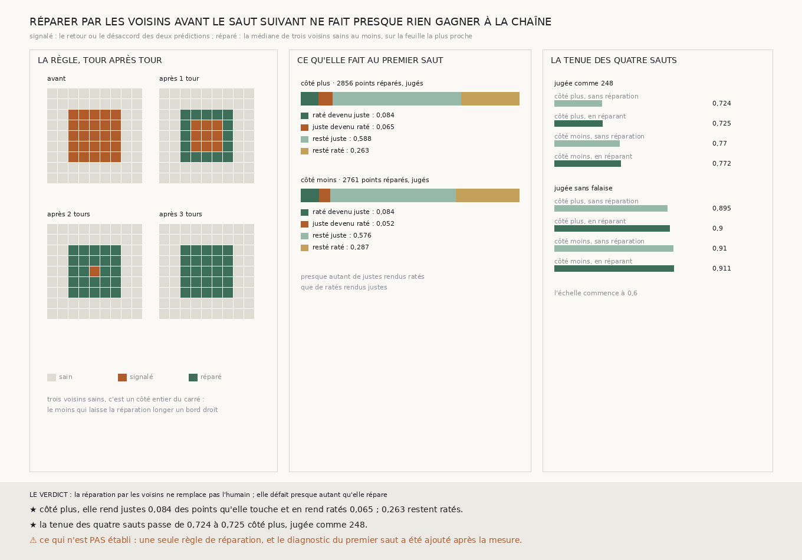

# `254` — Réparer les points signalés avant le saut suivant fait-il tenir la chaîne ? Presque pas : la tenue des quatre sauts passe de 0,7236 à 0,7247, parce que la réparation rend juste 0,0837 des points qu'elle touche et en rend ratés 0,0648

*`250` et `251` ont donné deux contrôles sans juge, le retour et le désaccord de deux prédictions. Une chaîne ne peut pas
écarter un point par spire : elle doit le réparer avant le saut suivant. Chaque point signalé vise ici la médiane de ses
voisins sains et prend la feuille la plus proche, tour après tour, jusqu'à combler la tache depuis son bord. Sur la bande
`w028-037`, la réparation touche un point sur dix à chaque saut. Au premier saut, elle rend justes 0,0837 et 0,0844 des
points qu'elle touche, et en rend ratés 0,0648 et 0,0525 ; plus d'un quart restent ratés. La chaîne tient les quatre sauts
sur 0,7247 et 0,7725 des points au lieu de 0,7236 et 0,7703.*

## 0. Pourquoi cette tranche

C'est la question du concours posée à la lettre : ce qui remplace l'humain qui corrige. Les contrôles de `250` et `251`
voient où la chaîne a probablement raté ; il restait à corriger sans juge, avant que le raté ne se propage (`248`).

⚠⚠⚠ La règle est déclarée avant la mesure, avec une correction faite avant elle aussi et dite ici. La première version
visait la majorité de cinq voisins de `228` ; sur la tache de la batterie, elle ne réparait que les coins et s'arrêtait
au premier bord droit. La règle mesurée exige trois voisins sains, soit un côté entier du carré. Le diagnostic de ce que
la réparation fait aux points du premier saut a été ajouté après la mesure.

## 1. Ce qui est fait

À chaque saut, depuis la surface produite par le précédent :

1. le saut de `248` avec `m7`, et le même avec `ps256` ;
2. le retour de `250` avec `m7`, depuis la surface que ce saut produit ;
3. un point est **signalé** si son retour est incohérent ou si les deux prédictions sont en désaccord (`251`) ;
4. un point signalé est **réparé** : il vise la médiane des pas de ses voisins sains, s'il en a trois au moins, et prend la
   feuille de `m7` la plus proche à moins d'un demi-feuillet, sinon la cible. Un point réparé devient sain au tour suivant,
   et la réparation est répétée jusqu'à ce que plus rien ne change, au plus trente tours.

La même chaîne sans réparation est refaite dans la même exécution : c'est celle de `248`, au voxel près.

## 2. Ce que la réparation fait aux points qu'elle touche

Elle touche, du premier au quatrième saut, **0,1079 · 0,0883 · 0,1159 · 0,123** des points côté plus et **0,1021 · 0,0989 ·
0,1045 · 0,1188** côté moins. Au premier saut, sur les **2856** et **2761** points réparés qui ont une couche en face
(`R4-F427`) :

| | côté plus | côté moins |
|---|---|---|
| raté devenu juste | 0,0837 | 0,0844 |
| juste devenu raté | 0,0648 | 0,0525 |
| resté juste | 0,5882 | 0,5762 |
| resté raté | 0,2633 | 0,2869 |

⚠⚠⚠ **La réparation défait presque autant qu'elle répare.** Plus de la moitié des points qu'elle touche étaient justes, et
elle en rend ratés une part presque égale à celle des ratés qu'elle rend justes. Et parmi les ratés qu'elle touche, près
des trois quarts restent ratés : la médiane des voisins sains ne les ramène pas sur la bonne feuille.

## 3. Ce qu'elle rend à la chaîne

| tient les quatre sauts d'affilée | côté plus | côté moins |
|---|---|---|
| jugée comme `248`, sans réparation | 0,7236 | 0,7703 |
| **jugée comme `248`, en réparant** | **0,7247** | **0,7725** |
| jugée sans falaise, sans réparation | 0,8949 | 0,9103 |
| **jugée sans falaise, en réparant** | **0,9003** | **0,9109** |

Saut par saut, jugée comme `248`, sur les mêmes points à chaque saut, la chaîne passe de **0,9519 · 0,8747 · 0,8146 ·
0,754** à **0,9547 · 0,8779 · 0,8167 · 0,7557** côté plus.

## 4. Le verdict

**RÉPARER PAR LES VOISINS AVANT LE SAUT SUIVANT NE FAIT PRESQUE RIEN GAGNER À LA CHAÎNE : LA RÉPARATION DÉFAIT PRESQUE
AUTANT QU'ELLE RÉPARE, ET ELLE NE RAMÈNE PAS LA PLUPART DES RATÉS QU'ELLE TOUCHE.**

## 5. Ce que cette tranche ne dit pas

- ⚠⚠ Une seule règle de réparation ; une autre source que les voisins (une troisième prédiction, le scan, la surface d'un
  autre tour) n'est pas essayée.
- ⚠⚠ Les points signalés sont réparés sans que le juge sache pourquoi ils ont été signalés.
- ⚠ Le diagnostic du premier saut a été ajouté après la mesure.

## 6. Les sondes et les bris

Une batterie de **13** contrôles et une figure de **12**, qui dessine la règle avec le code du module. Une tache signalée
de cinq sur cinq se comble en trois tours depuis son bord ; un point signalé prend la feuille la plus proche de ses
voisins ; sans voisin sain, rien n'est réparé. Sur deux prédictions fabriquées, dont l'une manque une feuille sur une
plaque de cinq sur cinq, la chaîne sans réparation fait sauter une spire au cœur de la plaque, et la chaîne réparée la
ramène tout entière.

⚠ **Ce que la prédiction fabriquée a montré en chemin.** Une plaque de trois sur trois, le vote de `247` la comble déjà
seul. Et sur la plaque de cinq sur cinq, le retour signale lui aussi la plaque : au bord de la falaise qu'elle fait, les
normales penchent, les rayons du retour manquent la feuille, et le vote répand le pas par défaut jusqu'au cœur.

**Cinq bris** rougissent tous : la médiane qui compte le point lui-même, cinq voisins sains exigés, un point réparé qui ne
redevient pas sain, la réparation sans prendre la feuille, et le signalement sans le désaccord. ⚠ Ce dernier passait
d'abord, parce que le retour signalait déjà la plaque ; la règle de signalement est désormais testée à part.

## 7. Ce qui reste

`R4-P92` reste ouverte. Les deux contrôles sans juge voient deux ratés sur cinq ; ce qui les répare devra venir d'ailleurs
que de la surface voisine, qui ne ramène pas les trois quarts d'entre eux.
