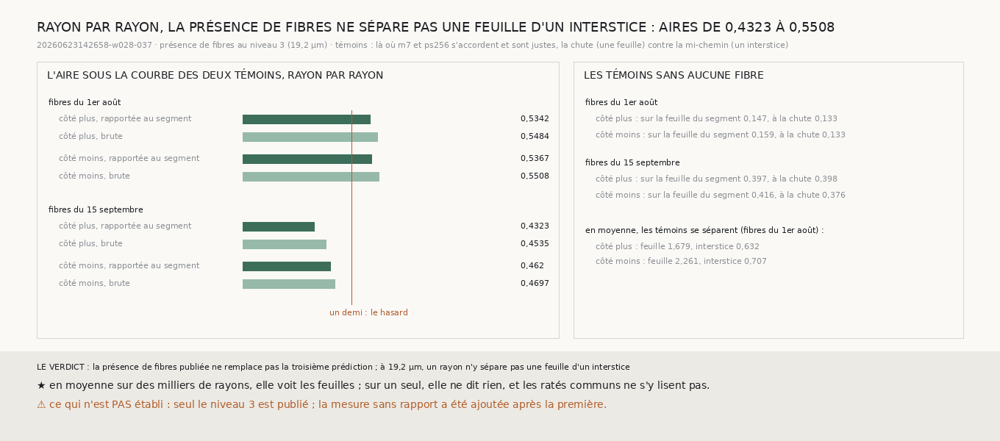

# `255` — Les fibres voient-elles la feuille que les deux prédictions de surface ratent ensemble ? Non : à 19,2 µm, rayon par rayon, la présence de fibres ne sépare pas une feuille d'un interstice (aires de 0,4323 à 0,5508)

*Là où `m7` et `ps256` s'accordent, elles ratent ensemble environ un point sur vingt, et aucun contrôle bâti sur elles ne
le voit (`251`, `254`). PHercParis4 publie deux prédictions de fibres, entraînées pour une autre cible, avec un canal
`presence`. Lues au seul niveau publié, 19,2 µm, le long de la normale du segment, elles ne séparent pas une feuille connue
d'un interstice connu mieux que le hasard : aires de 0,5342 et 0,5367 pour la première, 0,4323 et 0,462 pour la seconde, et
de même sans rapport à la feuille du segment. En moyenne sur des milliers de rayons elles voient les feuilles ; sur un
seul, non, et les ratés communs ne s'y lisent pas.*

## 0. Pourquoi cette tranche

Réparer un raté commun demande une source que les deux prédictions de surface n'ont pas lue. Les fibres de papyrus sont
posées sur les feuilles : là où le modèle de fibres voit des fibres, il y a de la feuille.

⚠⚠⚠ Le protocole est celui de `249`, déclaré avant la mesure, appliqué à la présence de fibres au lieu du scan brut. La
lecture sans rapport à la feuille du segment, et la part des témoins sans aucune fibre, ont été ajoutées après la
première mesure, et c'est dit.

## 1. Ce qui est lu

Sur la tranche de la bande `w028-037`, les points où `m7` et `ps256` s'accordent et sont justes (**23163** et **24287**)
servent de témoins, un sur k pour en garder environ trois mille. Les ratés communs sont **1165** et **1123** trop près,
**138** et **181** trop loin. Les deux prédictions de fibres publiées, du 1er août et du 15 septembre, sont lues au niveau
3 : un pas y fait neuf voxels (`R4-F429`).

## 2. Rayon par rayon, la présence ne sépare rien

| aire sous la courbe des deux témoins | côté plus | côté moins |
|---|---|---|
| fibres du 1er août, rapportées au segment | 0,5342 | 0,5367 |
| fibres du 1er août, brutes | 0,5484 | 0,5508 |
| fibres du 15 septembre, rapportées au segment | 0,4323 | 0,462 |
| fibres du 15 septembre, brutes | 0,4535 | 0,4697 |

⚠⚠⚠ **Aucune ne s'écarte du hasard de plus d'un dixième.** La seconde prédiction ne voit aucune fibre sur la feuille du
segment pour **0,3971** et **0,4165** des témoins, la première pour **0,1471** et **0,1593** : le rapport à la feuille du
segment y devient instable, et la présence brute ne fait pas mieux.

## 3. En moyenne, elle voit les feuilles, sans trancher les ratés communs

Avec les fibres du 1er août, le juge en moyenne de `249` sépare les témoins : **1,679** et **2,2614** pour la feuille, **0,6321**
et **0,7069** pour l'interstice. Mais sur les ratés communs trop près, là où la chaîne est tombée, le contraste vaut
**1,0829** et **1,134**, avec des intervalles de **0,7459** à **1,423** et de **0,873** à **1,5209** : ni une feuille ni un
interstice. Avec la seconde prédiction, les rapports sont trop instables pour être lus.

## 4. Le verdict

**LA PRÉSENCE DE FIBRES PUBLIÉE NE REMPLACE PAS UNE TROISIÈME PRÉDICTION DE SURFACE : À 19,2 µm, UN RAYON N'Y SÉPARE PAS UNE
FEUILLE D'UN INTERSTICE, ET LES RATÉS COMMUNS NE S'Y LISENT PAS.**

## 5. Ce que cette tranche ne dit pas

- ⚠⚠ Seul le niveau 3 est publié ; une présence de fibres plus fine pourrait dire autre chose.
- ⚠ Les directions `nx` et `ny` des fibres ne sont pas lues ; seule la présence l'est.
- ⚠ La lecture sans rapport a été ajoutée après la mesure.

## 6. Les sondes et les bris

Une batterie de **7** contrôles et une figure de **10**. Les groupes (accord et juste, ratés communs trop près et trop loin,
et ce qui n'y est pas) sont testés des deux côtés ; le juge, sur des profils fabriqués où un raté commun sur trois tombe sur
une feuille et deux sur trois ont une feuille là où la bande a sa couche. **Trois bris** rougissent tous : le genre du raté
sans son côté, la couche de la bande lue à la chute, et les témoins échangés.

## 7. Ce qui reste

`R4-P92` reste ouverte. Des sources publiées pour PHercParis4 (le scan brut à 9,6 µm, la phase `lasagna`, la présence de
fibres), aucune ne voit, rayon par rayon, la feuille que les deux prédictions de surface ratent ensemble.
