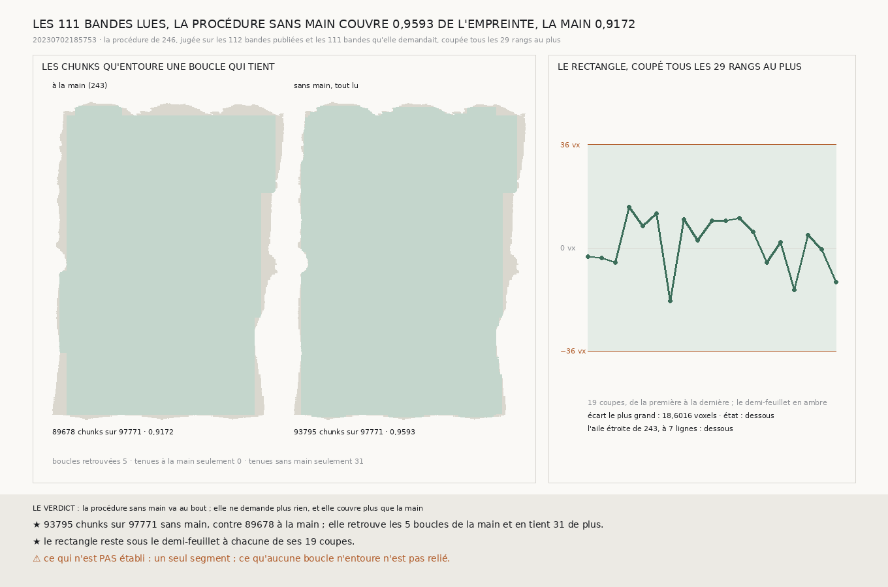

# `256` — Les 111 bandes que la procédure sans main demandait, une fois lues, que couvre-t-elle ? 93795 chunks sur 97771, soit 0,9593 de l'empreinte, contre 0,9172 à la main ; et le rectangle reste sous le demi-feuillet au pas qui voit

*`246` avait rejoué sans aucun choix la procédure de couverture par boucles : elle refaisait chaque décision de la main,
et demandait 111 bandes, 24263 chunks, pour juger ce que la main n'avait pas cherché. Ces bandes sont lues. Relancée
dessus, la procédure ne demande plus rien. Elle retrouve les 5 boucles que la main tenait, en tient 31 de plus, et couvre
93795 chunks sur 97771 de l'empreinte de `20230702185753`, soit 0,9593, contre 89678 à la main, 0,9172. Coupé tous les
29 rangs, le pas qui voit de `245`, le rectangle reste sous le demi-feuillet à chacune de ses 19 coupes, et l'aile étroite
de `243` aussi.*

## 0. Pourquoi cette tranche

C'est la porte que `246` ouvrait (`R4-P91`) : la procédure sans main avait dit ce qu'il lui manquait, sans pouvoir juger
le reste. Et c'est aussi `R4-P90`, pour le rectangle et l'aile étroite : `245` avait montré qu'une portée de 40 rangs ne
voyait pas les traversées, et que le bon pas était 29.

⚠⚠ Rien n'est choisi ici : la procédure est celle de `246`, inchangée, et ce qu'elle lit en plus est exactement ce
qu'elle demandait.

## 1. Ce qui est lu

Les 111 bandes demandées ont été lues par le lecteur de `224`, les moins chères d'abord. Relancée, la procédure demande
**0** bande et **0** chunk de plus : elle va au bout. Les contrôles de `246` tiennent :

- là où une bande neuve croise une bande publiée ou une bande neuve déjà contrôlée, **32297** coutures sont relues, et
  l'écart le plus grand vaut **0** voxel, pour une tolérance de 0,000051 ; aucune bande n'est restée hors contrôle ;
- sur **659** lignes, les chunks que la lecture compte absents sont ceux que la présence dit absents.

## 2. Ce qu'elle couvre

| | chunks entourés | sur | part de l'empreinte |
|---|---|---|---|
| à la main (`243`) | 89678 | 97771 | 0,9172 |
| **sans main, tout lu** | **93795** | **97771** | **0,9593** |

⭐⭐⭐⭐ **La procédure sans main couvre plus que la main** (`R4-F430`). Elle retrouve les **5** boucles que la main tenait,
aucune boucle tenue par la main ne lui échappe, et elle en tient **31** de plus. Son journal compte **36** boucles dessous, **1**
qui franchit (l'aile de droite, départagée par la colonne 260 comme la main l'avait fait) et **1** portion sans aile.

## 3. Le rectangle, au pas qui voit

Coupé tous les **29** rangs au plus, le rectangle `[26, 384, 22, 243]` est jugé sur **19** coupes ; son écart le plus grand
au demi-feuillet vaut **18,6016** voxels : il est **dessous**. L'aile étroite de `243`, à **7** lignes, l'est aussi
(`R4-F431`).

## 4. Le verdict

**LES 111 BANDES LUES, LA PROCÉDURE SANS MAIN VA AU BOUT : ELLE NE DEMANDE PLUS RIEN, COUVRE 0,9593 DE L'EMPREINTE CONTRE
0,9172 À LA MAIN, ET LE RECTANGLE COMME L'AILE ÉTROITE RESTENT SOUS LE DEMI-FEUILLET AU PAS QUI VOIT.**

## 5. Ce que cette tranche ne dit pas

- ⚠⚠⚠ Un seul segment, et celui sur lequel toutes les règles de `233` à `245` ont été écrites.
- ⚠⚠ Ce qu'aucune boucle n'entoure (4 % de l'empreinte) n'est pas relié.
- ⚠ Une traversée plus courte que le pas qui voit n'est pas vue.

## 6. Les sondes

La procédure est celle de `246`, dont la batterie n'a pas changé. La figure a sa batterie propre (**12** contrôles), qui
exige que les chunks teintés soient ceux que la mesure compte, à la main comme sans main. ⚠ **Un contrôle de la figure de
`246` ne pouvait pas passer une fois la procédure finie** : il cherchait « DEMANDE » dans le titre, que le titre de la
procédure finie contient aussi (« ne demande plus rien »). Il cherche désormais « BANDES DE PLUS ».

## 7. Ce qui reste

`R4-P91` et `R4-P90`, pour le rectangle et l'aile étroite, ont leur réponse. `R4-P92` reste ouverte : la procédure couvre un
segment tracé par un humain ; produire la spire voisine et la couvrir de la même façon est ce qui reste à faire.
