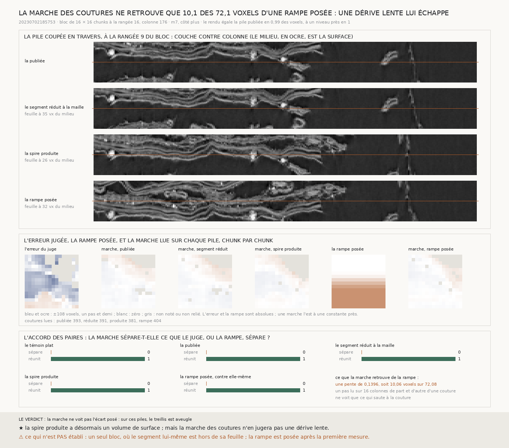

# `257` — La spire voisine que la chaîne produit, rendue comme le segment l'est, se lit-elle dans le treillis ? Elle se rend, mais la marche des coutures ne retrouve que 0,1396 d'une rampe posée d'un pas : une dérive lente lui échappe

*La couverture par boucles juge un segment sans humain, mais elle lit le volume de surface que le segment publie, et la
spire que la chaîne produit n'en a pas. Cette tranche lui en donne un, avec l'outil qui a rendu le volume publié : rendu
depuis le scan brut, le segment lui-même égale sa pile publiée à un niveau de gris près partout. Puis elle lit le treillis
sur un bloc de 16 × 16 chunks, sur la pile publiée, sur le segment réduit à la maille de la chaîne et sur la spire
produite. Aucune des trois marches ne sépare les chunks que le juge sépare. Une rampe posée à la main dit pourquoi : d'un
pas plein posé sur quatre chunks, la marche ne retrouve que 10,0648 voxels. Le pas se lit à la couture, et une dérive qui ne
saute pas à la couture ne s'y voit pas.*

## 0. Pourquoi cette tranche

C'est la porte que `247` désigne (`R4-P92`) : faire de la spire produite une surface, et la juger comme on juge un segment
publié. La chaîne (`248`) produit une surface ; les boucles (`256`) jugent une pile. Il manquait la pile.

⚠⚠⚠ Deux choses étaient vues avant d'écrire le code, et c'est dit : un rendu d'essai de 256 × 256 pixels égalait la pile
publiée à l'ordre des couches près, d'où le retournement des normales ; et un compte des ratés par bloc. La règle du bloc est
celle que le module applique, et c'est elle qui a désigné le bloc.

## 1. Ce qui est rendu

`vc_render_tifxyz`, l'outil qui a rendu la pile publiée, depuis le scan brut à 2,4 µm, 109 couches au pas d'un voxel,
normales retournées. Le contrôle, sur un carré de 2 × 2 chunks : sur **7143424** voxels, **0,99** sont égaux à la pile
publiée et **1** à un niveau de gris près ; l'écart le plus grand vaut **1** (`R4-F432`). La spire produite a donc un volume
de surface, au sens où le segment en a un.

Le bloc, par la règle : parmi les **340** blocs de 16 × 16 chunks où la surface produite existe partout, celui qui porte le
plus de ratés là où les deux juges de `247` s'accordent, à la rangée **16**, colonne **176** : **100** ratés sur **206**
points notés. Trois piles y sont rendues, en 340,5 s, 430,8 s et 430,8 s : le segment réduit à un point sur huit, la spire
produite (`m7`, côté plus, la feuille suivante puis le vote), et la rampe du § 3.

## 2. Ce que la marche lit

| pile | coutures lues | étendue de la marche | sépare, des paires que le juge sépare | corrélation avec l'erreur |
|---|---|---|---|---|
| la publiée | 393 | 36,1437 | 0 | −0,121 |
| le segment réduit | 391 | 36,3919 | 0 | −0,0994 |
| **la spire produite** | **381** | **36,8113** | **0** | **0,3804** |

Le juge sépare **6932** paires de chunks sur la spire produite, et en réunit **10088**. La marche n'en sépare aucune : sur
les trois piles, elle reste dans un demi-feuillet sur tout le bloc. Le résidu des moindres carrés vaut 2,2371, 2,03 et
2,3303 voxels. La marche plate, le témoin, fait exactement pareil.

## 3. La rampe posée : ce que la marche peut voir

⚠⚠⚠ **Ajoutée après la première mesure**, parce qu'une marche plate ne dit rien tant qu'on ne sait pas qu'elle voit un écart.
Le segment réduit, poussé le long de sa normale de zéro au-dessus du milieu du bloc à un pas plein, **72,0833** voxels, quatre
chunks plus bas, puis rendu de même. ⚠ La première rampe courait le long des colonnes et tombait pour moitié dans l'air qui
borde le bloc ; elle a été reposée le long des rangées.

⭐⭐⭐⭐ **La marche ne retrouve que 0,1396 de la rampe** (`R4-F433`) : la pente de la marche de la rampe, moins celle du
segment, contre l'écart posé. Sur **72,0833** voxels posés, elle en rend **10,0648**, et son étendue sur le bloc tombe à
27,8318. Aucune paire que la rampe sépare n'est séparée.

La raison est dans l'instrument, et `199` l'avait écrite : un pas se lit sur les **16** colonnes de part et d'autre d'une
couture, pour ne voir que ce qui **saute** à la couture. Une dérive continue n'y laisse que la part qui tombe dans ces seize
colonnes, soit 16 / 128 de ce qu'elle fait sur un chunk : 0,125 attendu, 0,1396 mesuré. Ce calcul est fait après la mesure.

## 4. Le bloc : le segment y est hors de sa feuille

⚠⚠ Mesuré après avoir regardé les coupes. Dans la pile du segment, la couche la plus claire du profil de chaque chunk est à
**35** voxels du milieu en médiane, et à moins d'un quart de pas du milieu dans **0,2332** des chunks seulement (`R4-F434`) :
sur ce bloc, le segment passe entre deux feuilles. Dans la pile de la spire produite, **26** voxels et **0,396**. La règle a
choisi le bloc le plus raté, et le bloc le plus raté est un bloc où le point de départ est déjà faux.

## 5. Le verdict

**LA SPIRE PRODUITE SE REND COMME LE SEGMENT, À UN NIVEAU DE GRIS PRÈS. MAIS LA MARCHE DES COUTURES NE RETROUVE QUE 0,1396
D'UNE RAMPE POSÉE D'UN PAS : ELLE NE JUGE PAS UNE SURFACE QUI GLISSE D'UNE SPIRE À L'AUTRE EN DOUCEUR.**

⚠⚠ Et cela vaut aussi pour `256` : la couverture certifie qu'aucun saut ne s'accumule aux coutures. Un segment qui change de
spire lentement, à l'intérieur des chunks, y passerait certifié.

## 6. Ce que cette tranche ne dit pas

- ⚠⚠⚠ Un seul bloc, choisi le plus raté, et le segment y est hors de sa feuille.
- ⚠⚠ La rampe, le dessous de la feuille dans la pile et l'issue « aveugle » ont été ajoutés après la première mesure.
- ⚠ Un côté, `m7`, et le juge a ses propres fautes.

## 7. Les sondes

Une batterie de **23** contrôles et une figure de **12**. La marche retrouve une profondeur connue depuis ses seules
différences, une couture qui sort du bloc ne compte pas, un chunk isolé n'a pas de profondeur ; l'accord des paires sépare
tout quand la marche suit l'erreur et rien quand elle est plate ; une marche qui voit tout l'écart posé a une pente de un,
une marche aveugle une pente de zéro. ⚠ Deux tests étaient faux et ont échoué au premier tour : le chunk isolé ne l'était
pas, et une boîte de lissage étalait une couche claire en plateau, lu à son bord.

## 8. Ce qui reste

`R4-P92` reste ouverte. `R4-P94` s'ouvre : un pas lu d'un centre de chunk à l'autre voit la dérive qu'un pas lu à la couture
ne voit pas ; retrouve-t-il la rampe, et que dit-il alors de la spire produite ?
