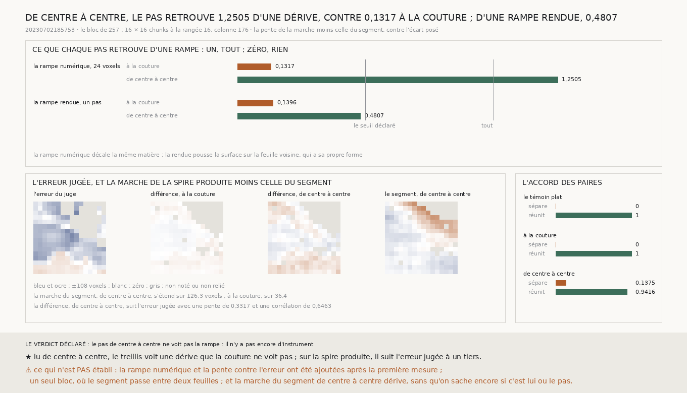

# `258` — Un pas lu d'un centre de chunk à l'autre voit-il la dérive qu'un pas lu à la couture ne voit pas ? D'une rampe qui décale la même matière, il retrouve 1,2505 contre 0,1317 ; d'une rampe rendue, 0,4807, sous le seuil déclaré d'un demi

*`257` a montré que la marche des coutures ne voit pas une surface qui glisse d'une spire à l'autre en douceur : un pas s'y
lit sur les seize colonnes de part et d'autre d'une couture. Cette tranche lit le même pas, avec le même estimateur, mais sur
le chunk entier, donc d'un centre de chunk à l'autre. Sur les piles de `257` : la rampe rendue d'un pas plein n'est
retrouvée qu'à 0,4807, sous le seuil déclaré d'un demi. Une rampe ajoutée après, qui décale la même matière de 24 voxels,
est retrouvée à 1,2505 de centre à centre et à 0,1317 à la couture. Sur la spire produite, la marche de centre à centre moins
celle du segment suit l'erreur jugée avec une pente de 0,3317 et une corrélation de 0,6463, et sépare 0,1375 des paires que
le juge sépare, là où la couture n'en séparait aucune.*

## 0. Pourquoi cette tranche

C'est la porte que `257` ouvre (`R4-P94`). Un pas qui ne voit que ce qui saute à la couture ne peut pas juger une surface
lisse ; un pas lu sur le chunk entier voit la différence de profondeur entre deux centres de chunks, donc toute dérive.

⚠⚠⚠ Le protocole et son seuil sont écrits avant la mesure : le même estimateur que `224`, seize rangées de coupe, la même
plage, le même filtre de chunks, les profils moyennés sur le chunk entier ; le pas voit la rampe si sa pente atteint un
demi. Tout ce qui a été ajouté après la première mesure est dit à sa place.

## 1. La rampe rendue : le seuil n'est pas atteint

Sur la rampe de `257`, rendue en poussant le segment d'un pas plein (**72,08** voxels) sur quatre chunks, la marche de centre à
centre, moins celle du segment, a une pente de **0,4807** : elle rend **34,6464** voxels, là où la marche des coutures en
rendait 10,0648. ⚠⚠ **C'est sous le seuil déclaré** : par la règle écrite avant la mesure, il n'y a pas encore d'instrument.

## 2. La rampe numérique : la même matière, décalée

⚠⚠⚠ **Ajoutée après la première mesure**, parce qu'une rampe rendue pousse la surface sur d'autres feuilles, qui ont leur
propre forme : la marche de la rampe moins celle du segment vaut alors l'écart posé plus la différence de forme entre les deux
feuilles, et rien ne dit laquelle domine. La rampe numérique décale en profondeur la pile même du segment, rangée de pixels par
rangée, de zéro à **24** voxels sur quatre chunks : la matière ne change pas, seule sa profondeur (`R4-F435`).

| sur **215** chunks | pente | voxels retrouvés sur 24 |
|---|---|---|
| le pas à la couture | 0,1317 | 3,1603 |
| **le pas de centre à centre** | **1,2505** | **30,0131** |

⭐⭐⭐⭐ **Lu de centre à centre, le treillis voit une dérive que la couture ne voit pas.** Il la surestime d'un quart, et la
couture en voit ce que ses seize colonnes lui laissent, un huitième.

## 3. Le segment, et la spire produite

⚠ La marche du segment lui-même, lue de centre à centre, s'étend sur **126,2938** voxels sur le bloc, contre 36,3919 lue à la
couture ; son résidu vaut 5,7885 voxels, contre 2,03. Sur ce bloc où le segment passe déjà entre deux feuilles (`257`), cette
tranche ne dit pas si c'est lui qui dérive, ou le pas.

Sur la spire produite, la différence de sa marche et de celle du segment retire ce que le segment fait de lui-même
(`R4-F436`) :

| la différence des marches | sépare, des paires que le juge sépare | réunit, de celles qu'il réunit | corrélation avec l'erreur |
|---|---|---|---|
| le témoin plat | 0 | 1 | — |
| à la couture | 0 | 1 | 0,5124 |
| **de centre à centre** | **0,1375** | **0,9416** | **0,6463** |

Le juge sépare **6526** paires de chunks et en réunit **9227**. ⚠ Ajoutée après, pour décrire et non pour juger : la
différence de centre à centre suit l'erreur jugée avec une pente de **0,3317**.

## 4. Le verdict

**PAR LA RÈGLE DÉCLARÉE, LE PAS DE CENTRE À CENTRE NE VOIT PAS LA RAMPE RENDUE (0,4807). MAIS IL VOIT UNE DÉRIVE DE LA MÊME
MATIÈRE (1,2505, CONTRE 0,1317 À LA COUTURE), ET SUR LA SPIRE PRODUITE IL SUIT L'ERREUR JUGÉE, À UN TIERS.**

## 5. Ce que cette tranche ne dit pas

- ⚠⚠⚠ Un seul bloc, celui de `257`, où le segment passe entre deux feuilles.
- ⚠⚠ La rampe numérique, la pente contre l'erreur et la comparaison à la couture sont postérieures à la première mesure.
- ⚠ Si le pas de centre à centre garde un bruit assez bas pour marcher cent coutures : son résidu est près de trois fois
  celui de la couture.

## 6. Les sondes

Une batterie de **9** contrôles et une figure de **11**. Sur une pile fabriquée où la surface dérive de trois couches par
chunk sans aucun saut à la couture, le pas de centre à centre lit trois couches le long des rangées et rien entre elles ; le pas
à la couture de `199`, sur la même pile, n'en voit presque rien. Un chunk vide est refusé par le filtre du dépôt. ⚠ La
première pile fabriquée portait des feuilles tous les 24 couches, sous la plage d'un demi-feuillet de l'estimateur : ses pas
s'aliasaient, et la sonde a échoué. Elle porte désormais un pas de 72 couches.

## 7. Ce qui reste

`R4-P94` reste ouverte : le pas de centre à centre voit la dérive d'une même matière, mais la surestime d'un quart, ne rend
que la moitié d'une rampe rendue, et son résidu triple. Le lire sur un bloc où le segment tient sa feuille est ce qui dira si
le bruit ou la forme des feuilles voisines en est la cause.
