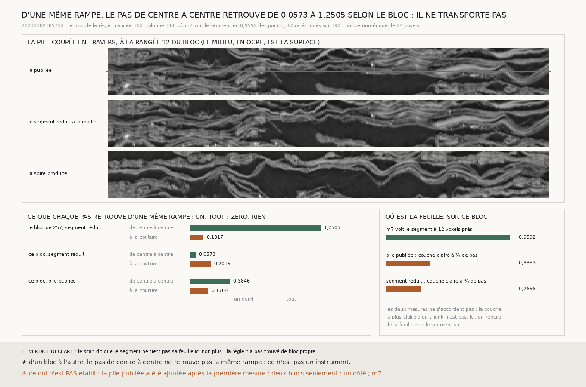

# `259` — Là où `m7` voit le segment sur sa feuille, le pas de centre à centre marche-t-il calme ? La règle s'arrête à sa première issue, et la même rampe n'y est retrouvée qu'à 0,0573 : le pas de centre à centre ne se transporte pas d'un bloc à l'autre

*`258` laissait une question : sur le bloc de `257`, la marche du segment lui-même, lue de centre à centre, s'étend sur 126
voxels, et rien ne disait si c'est le segment qui dérive ou le pas. Cette tranche choisit, par une règle écrite d'avance, un
bloc où la prédiction `m7` voit le segment sur sa feuille : **166** blocs sont propres, et le plus raté est à la rangée 160,
colonne 144. La première issue déclarée s'y déclenche : la couche la plus claire de chaque chunk n'y est à moins d'un quart de
pas du milieu que dans 0,2656 des chunks. Mais c'est la rampe numérique qui dit l'essentiel : la même dérive de 24 voxels, qui
était retrouvée à 1,2505 de centre à centre sur le bloc de `257`, n'y est retrouvée qu'à 0,0573, et à 0,3846 sur la pile
publiée du même bloc. Le pas de centre à centre n'est pas un instrument.*

## 0. Pourquoi cette tranche

C'est `R4-P94`, et la question que `258` laissait : le bruit du pas, ou la forme d'un segment qui passe entre deux
feuilles ? Un bloc où le segment tient sa feuille sépare les deux.

⚠⚠⚠ La règle du bloc, les issues et leur ordre sont écrits avant de choisir le bloc et avant de lire un pas. La pile publiée
du bloc a été ajoutée après la première mesure, et c'est dit à sa place.

## 1. Le bloc

`m7` voit le segment, à moins de douze voxels le long de sa normale, en **0,8885** des points de la maille sur tout le segment.
Parmi les blocs de `257`, **166** portent au moins **0,95** de ces points ; le plus raté est à la rangée **160**, colonne
**144** : `m7` y voit le segment en **0,9592** des points, et il porte **60** ratés jugés sur **190** points notés. Le segment
réduit et la spire produite y sont rendus en 150,2 s et 230,4 s.

## 2. La première issue déclarée

Dans la pile du segment réduit, la couche la plus claire de chaque chunk est à **33** voxels du milieu en médiane, et à moins
d'un quart de pas du milieu dans **0,2656** des chunks seulement : par la règle, le scan dit que le segment ne tient pas sa
feuille ici non plus, et la règle n'a pas trouvé de bloc propre.

⚠⚠ **Ajoutée après, la pile publiée, rendue sur le segment plein, ne dit pas autre chose** : **29,5** voxels et **0,3359**
(`R4-F438`). Là où `m7` voit le segment sur sa feuille en 0,9592 des points, la couche la plus claire d'un chunk n'est donc
pas un repère de la feuille que le segment suit. Les coupes montrent des feuilles qui ondulent sur moins d'un chunk : c'est
l'explication la plus simple, pas une mesure. ⚠ `R4-F434` reposait sur ce même repère, et sur la coupe de `257`.

## 3. La rampe numérique : le pas de centre à centre ne se transporte pas

La même rampe que `258` : la pile décalée en profondeur de zéro à **24** voxels sur quatre chunks, la même matière.

| la pente retrouvée | de centre à centre | à la couture |
|---|---|---|
| le bloc de `257`, segment réduit (`258`) | 1,2505 | 0,1317 |
| ce bloc, segment réduit | **0,0573** | **0,2015** |
| ce bloc, pile publiée | **0,3846** | **0,1764** |

⭐⭐⭐⭐ **D'un bloc à l'autre, le pas de centre à centre ne retrouve pas la même rampe** (`R4-F437`) : de 1,2505 à 0,0573,
sur la même matière décalée de la même façon. Le pas à la couture reste où il était, entre 0,1317 et 0,2015, un huitième à
peine. ⚠ Les coupes suggèrent pourquoi, sans le mesurer : sur le bloc de `257` les feuilles sont presque planes ; ici elles
ondulent, et moyenner un chunk entier peut ne plus rien laisser à aligner.

## 4. Ce qui reste descriptif

Les issues suivantes ne sont pas atteintes, mais leurs nombres sont publiés. La marche du segment s'étend sur **53,4163**
voxels de centre à centre, sur 18,7638 à la couture. La différence des marches de la spire produite et du segment sépare
0,2305 des paires que le juge sépare de centre à centre, aucune à la couture ; le juge en sépare **13389** et en réunit 13872.

## 5. Le verdict

**LA RÈGLE S'ARRÊTE À SA PREMIÈRE ISSUE. ET LA MÊME RAMPE, RETROUVÉE À 1,2505 DE CENTRE À CENTRE SUR LE BLOC DE `257`, NE
L'EST ICI QU'À 0,0573, ET À 0,3846 SUR LA PILE PUBLIÉE : LE PAS DE CENTRE À CENTRE N'EST PAS UN INSTRUMENT.**

## 6. Ce que cette tranche ne dit pas

- ⚠⚠ Deux blocs seulement, et un côté, avec `m7`.
- ⚠⚠ La pile publiée a été ajoutée après la première mesure.
- ⚠ Pourquoi la couche la plus claire manque la feuille : les ondulations sont vues sur les coupes, pas mesurées.

## 7. Les sondes

Une batterie de **8** contrôles et une figure de **11**. La règle du bloc écarte un bloc plus raté où la prédiction ne voit
pas le segment, et un bloc qui passe sous le seuil de 0,95 ; sans bloc propre, elle est indécidable par sa raison. Le verdict
suit l'ordre déclaré, chaque issue arrêtant les suivantes. ⚠ Une attente était fausse : la part du bloc propre n'y valait pas
un, parce que sa fenêtre de maille déborde d'un point sur le bloc voisin.

## 8. Ce qui reste

`R4-P94` reste ouverte. Le pas à la couture est stable et ne voit qu'un huitième d'une dérive ; le pas de centre à centre la
voit parfois, et parfois pas. Ce qui reste à essayer est entre les deux : des pas de fenêtre en fenêtre à travers le chunk,
chacun assez court pour suivre une feuille qui ondule, et dont la somme voit toute la dérive.
