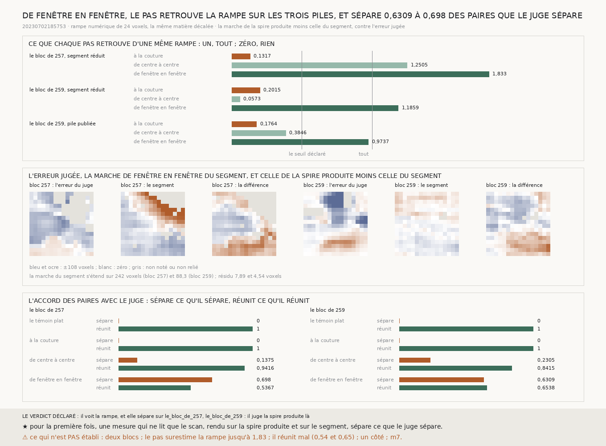

# `260` — Des pas courts, enchaînés de fenêtre en fenêtre à travers le chunk, voient-ils la dérive partout ? Oui, sur les trois piles, et sur la spire produite ils séparent 0,698 et 0,6309 des paires que le juge sépare, là où la couture n'en séparait aucune

*La couture ne voit qu'un huitième d'une dérive (`257`) ; le pas de centre à centre la voit sur un bloc et presque pas sur
l'autre (`258`, `259`). Cette tranche garde la fenêtre de seize colonnes de la couture, mais la compare à sa voisine à chaque
fenêtre du chunk, et additionne les huit pas d'un centre de chunk au suivant, affinés au dixième de voxel. La même rampe
numérique est retrouvée à 1,833, 1,1859 et 0,9737 sur les trois piles, toutes au-dessus du seuil déclaré. Et sur la spire
produite, la marche de fenêtre en fenêtre moins celle du segment sépare 0,698 et 0,6309 des paires de chunks que le juge
sépare, avec une corrélation de 0,6611 et 0,6888 à son erreur. C'est la première mesure, faite du seul scan rendu le long des
deux surfaces, qui voit où la spire produite glisse. Elle est bruitée : elle réunit mal ce que le juge réunit.*

## 0. Pourquoi cette tranche

C'est la fin que `259` désignait pour `R4-P94` : entre un pas qui ne voit que ce qui saute à la couture et un pas qui moyenne
un chunk entier, des pas aussi courts que celui de la couture, mais partout.

⚠⚠⚠ Le pas, les piles, le seuil et les issues sont écrits avant la mesure. Aucune pile n'est rendue ici : ce sont celles que
`257` et `259` ont lues, et la pile publiée du bloc de `259`, relue.

## 1. Le pas

La corrélation de `199`, sur des fenêtres de **16** colonnes, entre chaque fenêtre d'une coupe et la suivante, et la somme des
huit pas de la fenêtre centrale d'un chunk à celle du suivant, couture comprise ; puis la moyenne sur les seize rangées de
coupe de `224`. ⚠⚠ Le seul écart à `199` : le sommet de la corrélation est affiné par la parabole de ses trois points. Un pas de
fenêtre en fenêtre vaut une fraction de voxel quand la dérive est lente, et huit arrondis additionnés font souvent zéro.
Arrondi, le pas fin rend celui de `199` ; la batterie le vérifie sur deux cents profils.

## 2. La rampe numérique, sur les trois piles

| la pente retrouvée | à la couture | de centre à centre | **de fenêtre en fenêtre** |
|---|---|---|---|
| le bloc de `257`, segment réduit | 0,1317 | 1,2505 | **1,833** |
| le bloc de `259`, segment réduit | 0,2015 | 0,0573 | **1,1859** |
| le bloc de `259`, pile publiée | 0,1764 | 0,3846 | **0,9737** |

⭐⭐⭐⭐ **De fenêtre en fenêtre, le pas voit la rampe sur les trois piles** (`R4-F439`), toutes au-dessus du seuil déclaré d'un
demi : il en rend **43,991**, **28,4623** et **23,3682** voxels sur 24. ⚠ Il la surestime sur le bloc de `257`, de trois quarts.

## 3. La spire produite

La marche de la spire produite moins celle du segment, contre l'erreur que le juge donne au transfert (`R4-F440`) :

| | le bloc de `257` | le bloc de `259` |
|---|---|---|
| le juge sépare / réunit | 6454 / 9122 paires | 13389 / 13872 paires |
| **sépare**, de ce que le juge sépare | **0,698** | **0,6309** |
| réunit, de ce que le juge réunit | 0,5367 | 0,6538 |
| corrélation avec l'erreur | 0,6611 | 0,6888 |
| pente contre l'erreur | 0,9514 | 0,4931 |

Le témoin plat et la couture ne séparent rien sur les deux blocs ; le pas de centre à centre séparait 0,1375 et 0,2305.

⚠⚠ **La marche est bruitée.** Elle réunit mal ce que le juge réunit (0,5367 et 0,6538), et le résidu de ses moindres carrés
vaut **7,894** et **4,5357** voxels sur le segment, contre 2,03 et 1,6539 à la couture. La marche du segment lui-même s'étend
sur **242,0244** voxels sur le bloc de `257`, et **88,3405** sur celui de `259` (74,2326 sur sa pile publiée). ⚠ Sur le bloc de
`257`, la montée du segment vers le coin haut droit est aussi celle que lisait le pas de centre à centre (`258`) : deux
lectures différentes s'y accordent, ce qui ne dit pas encore si c'est le segment ou la lecture qui dérive.

## 4. Le verdict

**DE FENÊTRE EN FENÊTRE, LE PAS VOIT LA RAMPE SUR LES TROIS PILES, ET SUR LA SPIRE PRODUITE IL SÉPARE 0,698 ET 0,6309 DES
PAIRES QUE LE JUGE SÉPARE : LE TREILLIS, LU AINSI, VOIT OÙ LA SPIRE PRODUITE GLISSE. MAIS IL EST BRUITÉ.**

## 5. Ce que cette tranche ne dit pas

- ⚠⚠⚠ Deux blocs, un côté, `m7` ; le premier choisi le plus raté, le second là où `m7` voit le segment.
- ⚠⚠ Si la marche tient sur une boucle : son bruit est trois fois celui de la couture, et une boucle en fait cent coutures.
- ⚠ Pourquoi le pas surestime la rampe sur le bloc de `257`.

## 6. Les sondes

Une batterie de **8** contrôles et une figure de **12**. Le pas fin rend, arrondi, celui de `199` sur deux cents profils, et
retrouve une fraction de voxel ; sur une pile fabriquée dont la feuille ondule de quinze couches sur soixante-quatre colonnes
et dérive de six par chunk, les pas de fenêtre en fenêtre additionnent la dérive, et rien entre rangées. ⚠ **Une sonde a
échoué et a été réécrite** : elle affirmait que, sur cette même pile, le pas de centre à centre se tromperait. Il ne se trompe
pas : une ondulation régulière ne suffit pas, et la cause de ce que `259` a vu n'est pas reproduite.

## 7. Ce qui reste

`R4-P94` a sa réponse, par le pas de fenêtre en fenêtre et non par celui de centre à centre. `R4-P95` s'ouvre : sans le juge,
cette marche désigne-t-elle les chunks où la chaîne a raté, et tient-elle sur une boucle ?
