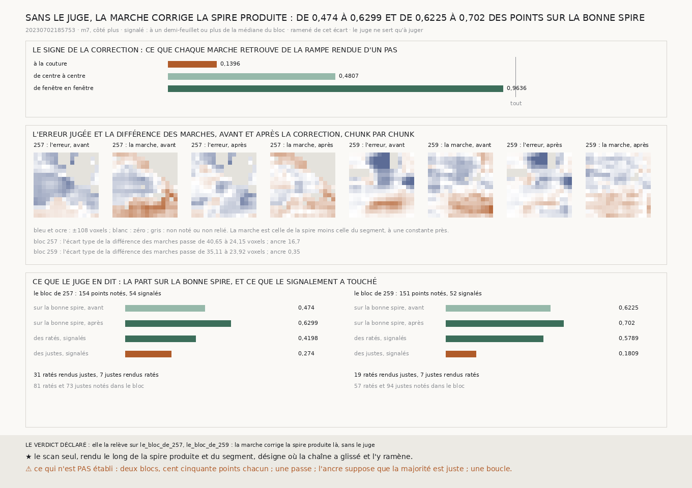

# `261` — Sans le juge, la marche de fenêtre en fenêtre désigne-t-elle où la spire produite a glissé, et la corrige-t-elle ? Oui, sur les deux blocs : de 0,474 à 0,6299 et de 0,6225 à 0,702 des points sur la bonne spire, en une passe

*`260` a trouvé une mesure faite du seul scan qui voit où la spire produite glisse, mais il l'a évaluée avec le juge. Cette
tranche s'en passe. Le sens de la correction vient de la rampe rendue de `257`, que la marche de fenêtre en fenêtre retrouve à
0,9636 ; l'ancre est la médiane du bloc. Chaque point de la maille dont la différence des marches s'écarte d'un demi-feuillet
de l'ancre est ramené de cet écart le long de la normale du segment, puis la spire corrigée est rendue et relue. Le juge ne
sert qu'à juger : sur le bloc de `257`, la part des points sur la bonne spire passe de 0,474 à 0,6299, et sur celui de `259` de
0,6225 à 0,702 ; 31 et 19 ratés sont rendus justes, 7 et 7 justes rendus ratés. La réparation par les voisins de `254`, sans
humain elle aussi, ne déplaçait la tenue que de 0,7236 à 0,7247 : celle-ci est la première qui corrige nettement.*

## 0. Pourquoi cette tranche

C'est `R4-P95`, et c'est la question du prix : ce qui remplace l'humain qui corrige le transfert doit se passer du juge,
désigner les chunks qui ont glissé, et les remettre en place.

⚠⚠⚠ La règle est écrite avant qu'une seule correction ne soit faite ni jugée, et elle n'a aucun réglage : le signe vient
d'une rampe, l'ancre est une médiane, le seuil est le demi-feuillet de toute la chaîne, et la correction est l'écart lui-même.

## 1. Le signe, fixé sans le juge

La rampe rendue de `257` pousse la surface le long de sa normale d'un pas plein sur quatre chunks. De fenêtre en fenêtre, la
marche de cette pile moins celle du segment en retrouve **0,9636** : **69,458** voxels sur 72,08, sur **213** chunks
(`R4-F441`). De centre à centre elle en retrouvait 0,4807, à la couture 0,1396. Le signe est positif : pousser la surface
élève la marche, donc un chunk dont la différence est au-dessus de l'ancre a été poussé trop loin.

## 2. La correction, et ce que le juge en dit

| | le bloc de `257` | le bloc de `259` |
|---|---|---|
| l'ancre, la médiane de la différence | 16,705 voxels | 0,35 voxel |
| points du bloc, signalés | 169, **54** | 156, **52** |
| ratés et justes notés | 81 et 73 | 57 et 94 |
| des ratés, signalés | **0,4198** | **0,5789** |
| des justes, signalés | 0,274 | 0,1809 |
| **sur la bonne spire, avant → après** | **0,474 → 0,6299** | **0,6225 → 0,702** |
| ratés rendus justes | 31 | 19 |
| justes rendus ratés | 7 | 7 |

⭐⭐⭐⭐ **La marche corrige la spire produite sans le juge** (`R4-F442`), sur les deux blocs, en une passe. Sur le bloc de
`257`, où le juge ne tient pour justes que 0,474 des points avant la correction, l'ancre médiane a quand même assez de
majorité pour tirer dans le bon sens.

## 3. Relue après la correction

Rendue et relue de même, la spire corrigée a une différence des marches moins dispersée : son écart type passe de **40,6496** à
**24,1468** voxels sur le bloc de `257`, et de **35,1148** à **23,9168** sur celui de `259`. ⚠ Ce qui reste d'erreur se voit
encore : la marche relue sépare **0,4056** et **0,3808** des paires que le juge sépare encore. Une seconde passe aurait de quoi
travailler ; elle n'est pas faite ici.

## 4. Le verdict

**SANS LE JUGE, LA MARCHE DE FENÊTRE EN FENÊTRE DÉSIGNE LES CHUNKS OÙ LA SPIRE PRODUITE A GLISSÉ ET LES Y RAMÈNE : LA PART SUR
LA BONNE SPIRE PASSE DE 0,474 À 0,6299 ET DE 0,6225 À 0,702.**

## 5. Ce que cette tranche ne dit pas

- ⚠⚠⚠ Deux blocs de 16 × 16 chunks, environ cent cinquante points notés chacun, un côté, `m7`.
- ⚠⚠ Une passe. Et l'ancre suppose que la majorité du bloc est sur la bonne spire : un bloc où elle ne l'est pas serait
  corrigé dans le mauvais sens, et rien ici ne le détecte.
- ⚠ Si la correction tient sur une boucle de la couverture, et sur le segment entier : chaque bloc demande deux rendus.

## 6. Les sondes

Une batterie de **9** contrôles et une figure de **11**. Une carte donnée aux centres des chunks se retrouve, interpolée, aux
points de la maille du bloc, et rien hors de lui ; seuls les points à un demi-feuillet ou plus sont ramenés, de leur écart ;
quand la différence suit l'erreur et que la majorité est juste, la correction relève la part juste, et une différence qui ne
la suit pas peut la ruiner ; un signalement qui accuse plus de justes que de ratés arrête le verdict, même si la part monte.

## 7. Ce qui reste

`R4-P95` a sa première réponse : désigner et corriger, sans le juge, sur deux blocs. Reste sa seconde moitié, tenir sur une
boucle, et ce qui la rend possible : une seconde passe, puis le segment entier.
