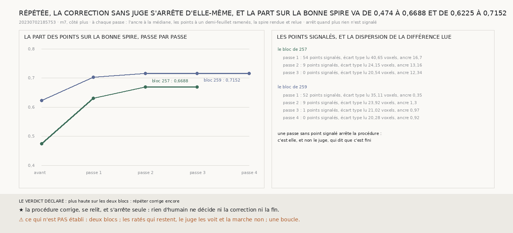

# `262` — La correction sans juge, répétée, continue-t-elle de ramener la spire produite sur la bonne spire ? Oui, puis elle s'arrête d'elle-même : de 0,474 à 0,6688 et de 0,6225 à 0,7152, quand plus aucun point n'est signalé

*`261` corrige la spire produite sans le juge, en une passe, et la relit : la différence des marches y montre encore des
écarts. Cette tranche répète la même règle, sans rien y changer, jusqu'à ce qu'aucun point ne soit plus signalé. Sur le bloc
de `257`, la deuxième passe signale 9 points et porte la part sur la bonne spire de 0,6299 à 0,6688, la troisième n'en signale
plus aucun. Sur celui de `259`, la deuxième passe signale 9 points et porte la part de 0,702 à 0,7152, la troisième en
signale 1 sans rien changer, la quatrième aucun. La procédure corrige, se relit, et s'arrête seule.*

## 0. Pourquoi cette tranche

C'est `R4-P95`, du côté de la procédure : ce qui remplace l'humain doit savoir quand c'est fini. Une seconde passe peut
continuer de corriger, ne rien faire, ou défaire la première.

⚠⚠⚠ La règle est celle de `261`, sans aucun changement ; l'arrêt, les issues et leur comparaison sont écrits avant la seconde
passe. La première passe est refaite à l'identique : elle rend **0,6299** et **0,702**, ce que `261` publie.

## 1. Passe par passe

| passe | bloc de `257` : signalés | part après | bloc de `259` : signalés | part après |
|---|---|---|---|---|
| avant | | 0,474 | | 0,6225 |
| 1 | 54 | 0,6299 | 52 | 0,702 |
| 2 | 9 | **0,6688** | 9 | **0,7152** |
| 3 | **0** | | 1 | 0,7152 |
| 4 | | | **0** | |

L'écart type de la différence des marches, lue au départ de chaque passe, tombe de **40,6496** à 24,1468 puis **20,5447**
voxels sur le bloc de `257`, et de **35,1148** à 23,9168, 21,0157 puis **20,2775** sur celui de `259`. L'ancre bouge peu :
de 16,705 à 12,3382 voxels, et de 0,35 à 0,9156.

⭐⭐⭐⭐ **Répétée, la correction continue de corriger, puis s'arrête d'elle-même** (`R4-F443`) : la part finit à **0,6688** et
**0,7152**, et la procédure finit quand la marche ne signale plus rien. Aucune passe n'a défait la précédente.

## 2. Le verdict

**RÉPÉTER CORRIGE ENCORE, SUR LES DEUX BLOCS, ET LA PROCÉDURE S'ARRÊTE SEULE : RIEN D'HUMAIN NE DÉCIDE NI LA CORRECTION NI LA
FIN.**

## 3. Ce que cette tranche ne dit pas

- ⚠⚠⚠ Deux blocs, un côté, `m7`.
- ⚠⚠ Ce qui reste raté, le juge le voit et la marche non : un tiers des points notés sur un bloc, plus d'un quart sur
  l'autre, que plus aucune passe ne signale. C'est du bruit que la marche ne dépasse pas, ou des ratés qu'elle ne peut pas voir, ou des fautes du juge ; rien ici
  ne les départage.
- ⚠ Une boucle de la couverture, et le segment entier.

## 4. Les sondes

Une batterie de **6** contrôles et une figure de **11**. Une passe ramène de leur écart les points du bloc qui s'écartent d'un
demi-feuillet de la médiane, et rien hors du bloc ; une différence plate ne signale rien ; l'issue compare la dernière passe
à la première ; une baisse sur un bloc l'emporte sur une hausse sur l'autre.

## 5. Ce qui reste

`R4-P95` reste ouverte pour sa seconde moitié : tenir sur une boucle, ce qui veut dire rendre et corriger bien plus que deux
blocs.
