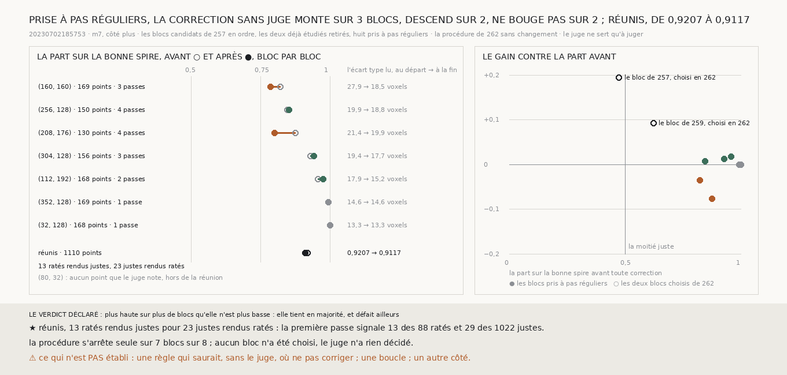

# `263` — La correction sans juge, répétée jusqu'à l'arrêt, tient-elle sur des blocs pris à pas réguliers ? En majorité selon la règle déclarée, trois blocs contre deux ; mais réunis, elle défait plus qu'elle ne corrige : de 0,9207 à 0,9117

*`262` corrige la spire produite et s'arrête seul, sur deux blocs choisis : celui de `257` pour ses ratés, celui de `259`
parce que `m7` y voit le segment. Cette tranche ne choisit rien : huit blocs pris à pas réguliers parmi les candidats de
`257`, la procédure de `262` sans changement. Le juge note des points sur sept d'entre eux. La part sur la bonne spire monte
sur trois, descend sur deux, ne bouge pas sur deux ; réunis, elle passe de 0,9207 à 0,9117 : 13 ratés rendus justes pour 23
justes rendus ratés. Sur ces blocs la spire produite est déjà presque juste, et ce que la marche y signale est surtout du
bruit.*

## 0. Pourquoi cette tranche

C'est `R4-P95` : ce qui remplace l'humain doit corriger n'importe où, pas seulement là où on l'a regardé travailler.

⚠⚠⚠ La règle des blocs, la procédure et les issues sont écrites avant le premier rendu. Les candidats de `257`, dans
l'ordre de la rangée puis de la colonne ; les deux blocs déjà étudiés retirés ; **8** pris à l'indice `⌊(k + ½) · M / 8⌋`.
La procédure est celle de `262`, et le signe celui que `261` a fixé sur la rampe rendue.

## 1. Les blocs

La règle de `257` admet **340** blocs ; refaite sur ces candidats, elle rend son bloc, `(16, 176)`. Les huit pris :
`(32, 128)`, `(80, 32)`, `(112, 192)`, `(160, 160)`, `(208, 176)`, `(256, 128)`, `(304, 128)`, `(352, 128)`. Sur
`(80, 32)` le juge ne note aucun point : il est rendu et relu, la marche n'y signale rien, et il reste hors de la réunion.

## 2. Bloc par bloc

| bloc | points notés | part avant → après | signalés, passe par passe | écart type lu, départ → fin | ratés rendus justes | justes rendus ratés |
|---|---|---|---|---|---|---|
| (32, 128) | 168 | 1 → 1 | 0 | 13,2526 | 0 | 0 |
| (112, 192) | 168 | 0,9583 → 0,9762 | 4, 0 | 17,9079 → 15,1912 | 3 | 0 |
| (160, 160) | 169 | 0,8225 → 0,787 | 24, 9, 0 | 27,899 → 18,545 | 6 | 12 |
| (208, 176) | 130 | 0,8769 → 0,8 | 13, 3, 4, 8 | 21,3539 → 19,9292 | 0 | 10 |
| (256, 128) | 150 | 0,8467 → 0,8533 | 3, 4, 2, 0 | 19,8993 → 18,8357 | 1 | 0 |
| (304, 128) | 156 | 0,9295 → 0,9423 | 3, 1, 0 | 19,3696 → 17,6542 | 3 | 1 |
| (352, 128) | 169 | 0,9941 → 0,9941 | 0 | 14,5965 | 0 | 0 |

La procédure s'arrête seule sur **7** blocs sur 8. Sur `(208, 176)` elle signale 13, 3, 4 puis 8 points et atteint les
quatre passes sans s'arrêter ; elle n'y rend aucun raté juste et y rend 10 justes ratés.

## 3. Réunis

Sur les **1110** points notés, la part sur la bonne spire passe de **0,9207** à **0,9117** : **13** ratés rendus justes,
**23** justes rendus ratés. La première passe signale **13** des 88 ratés (**0,1477**) et **29** des 1022 justes
(**0,0284**) ; sur les blocs de `261`, elle signalait 0,4198 et 0,5789 des ratés, 0,274 et 0,1809 des justes. La part des
justes signalés est plus basse ici, mais il y a 1022 justes pour 88 ratés.

⭐⭐⭐⭐ **Sur des blocs pris à pas réguliers, la correction sans juge défait plus qu'elle ne corrige** (`R4-F444`). La
spire produite y est déjà juste à 0,9207, là où les blocs choisis de `262` partaient de 0,474 et 0,6225. Où il reste peu à
corriger, la marche signale plus de justes que de ratés, et la règle les déplace.

⚠ Vu après coup, non déclaré : au départ, l'écart type de la différence lue valait 40,6496 et 35,1148 sur les deux blocs de
`262`, au plus 27,899 ici ; mais parmi les huit, le bloc qui descend le plus part de 21,3539, comme ceux qui montent partent
de 19,8993 et 19,3696. Rien ici ne dit que cet écart type sache dire où ne pas corriger.

## 4. Le verdict

**PLUS HAUTE SUR PLUS DE BLOCS QU'ELLE N'EST PLUS BASSE : ELLE TIENT EN MAJORITÉ, ET DÉFAIT AILLEURS.**

⚠⚠ Le compte des blocs cache la taille des mouvements : les trois hausses valent +0,0179, +0,0128 et +0,0066, les deux
baisses −0,0355 et −0,0769. Réunie, la part baisse.

## 5. Ce que cette tranche ne dit pas

- ⚠⚠⚠ Huit blocs sur 340, un côté, `m7`.
- ⚠⚠ Un juste rendu raté l'est au regard du juge, qui ne note que là où ses deux moitiés s'accordent à un demi-feuillet ;
  rien ici ne dit qu'il ne se trompe jamais.
- ⚠ Une règle qui saurait, sans le juge, où ne pas corriger ; une boucle ; le segment entier.

## 6. Les sondes

Une batterie de **13** contrôles et une figure de **11**. La règle prend huit blocs distincts à pas réguliers, sans les
exclus ; la boucle s'arrête quand rien n'est signalé, après quatre passes sinon, et dit quand une spire ne se rend pas ; la
réunion pèse chaque bloc par ses points notés et laisse de côté un bloc indécidable ; un bloc égal ne compte ni pour ni
contre. Trois contrôles ont été cassés exprès, un par un, et chacun a échoué : l'indice du pas régulier, l'arrêt sur une
passe sans signalement, la majorité stricte du verdict.

## 7. Ce qui reste

`R4-P95` reste ouverte, et sa seconde moitié a une condition de plus : avant de tenir sur une boucle, la procédure doit
savoir, sans le juge, où ne pas corriger.
