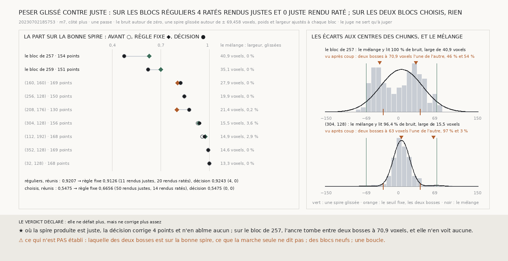

# `264` — Une décision faite de la seule marche, qui pèse glissé contre juste, sait-elle où ne pas corriger ? Là où la spire produite est juste, oui : 4 ratés rendus justes, aucun juste abîmé ; mais sur les deux blocs qui ont glissé, elle ne corrige rien

*`263` montre que la règle fixe de `261` défait plus qu'elle ne corrige là où la spire produite est déjà juste : son seuil,
un demi-feuillet, est franchi par le bruit de la marche. Cette tranche garde tout de la règle sauf la décision : dans chaque
bloc, les écarts à l'ancre sont lus comme un mélange de bruit et de spires glissées d'un pas, ajusté au bloc, et un point
n'est corrigé que s'il est plus probablement glissé que juste. Sur les sept blocs réguliers notés, elle corrige 4 points, en
rend 4 justes et n'en abîme aucun : la part passe de 0,9207 à 0,9243, là où la règle fixe la faisait tomber à 0,9126. Sur
les deux blocs choisis de `262`, elle ne corrige rien. Vu après coup, sur le bloc de `257`, les écarts forment deux bosses à
70,9 voxels l'une de l'autre, presque moitié-moitié, et l'ancre tombe entre les deux.*

## 0. Pourquoi cette tranche

C'est `R4-P95`, du côté que `263` a ouvert : avant de tenir sur une boucle, ce qui remplace l'humain doit savoir, sans le
juge, où ne pas corriger. Un seuil fixe ne sait pas combien de chunks ont glissé dans un bloc.

⚠⚠⚠ La décision et les issues sont écrites avant d'être appliquées. Trois gaussiennes de même largeur : le bruit autour de
zéro, une spire glissée autour de `± 69,458` voxels, ce que la marche retrouve d'un pas plein (`261`, `R4-F441`). Les poids
et la largeur sont ajustés au bloc ; les centres ne bougent pas. C'est le seul changement : l'ancre à la médiane, la carte
aux points et le déplacement sont ceux de `261`. Une passe, sans rendu : le juge note la carte du transfert elle-même.

## 1. Le contrôle

La règle fixe, refaite sur les mêmes différences, rend exactement les parts de la première passe que `261` et `263`
publient, sur les neuf blocs que le juge note. Les différences des deux blocs de `262` sont celles que `260` publie ; celles
des huit blocs de `263` sont relues sur leurs piles.

## 2. Ce que chaque règle fait

| | avant | la règle fixe | la décision |
|---|---|---|---|
| **blocs réguliers**, 7 blocs notés | 0,9207 | 0,9126 : 47 points corrigés, 11 ratés rendus justes, 20 justes rendus ratés | **0,9243** : 4 points corrigés, **4** ratés rendus justes, **0** juste rendu raté |
| **les deux blocs de `262`** | 0,5475 | 0,6656 : 106 points corrigés, 50 ratés rendus justes, 14 justes rendus ratés | 0,5475 : **aucun** point corrigé |

Sur les blocs réguliers, le mélange ne retient de spires glissées que sur trois : `(112, 192)`, `(304, 128)` et, à peine,
`(208, 176)`. Sur `(160, 160)` et `(208, 176)`, où la règle fixe rendait 9 et 10 justes ratés, la décision ne touche à rien.
Sur les deux blocs de `262`, il ne retient aucune spire glissée : il y lit un bruit large de **40,892** et **35,1169**
voxels.

⭐⭐⭐⭐ **Peser glissé contre juste, bloc par bloc, ne défait rien là où la spire produite est juste, et ne corrige rien là
où elle a glissé** (`R4-F445`).

## 3. Vu après coup : deux bosses, et l'ancre entre les deux

⚠ Écrit après avoir vu l'histogramme, hors du verdict : deux gaussiennes à centres libres, ajustées aux mêmes écarts.

| | les deux centres, voxels | leurs poids | l'écart entre eux |
|---|---|---|---|
| le bloc de `257` | −42,5357 et 28,4078 | 0,4631 et 0,5369 | **70,9434** |
| le bloc de `259` | −21,8113 et 29,0371 | 0,5785 et 0,4215 | 50,8484 |
| `(304, 128)` | −0,1906 et 62,8234 | 0,9743 et 0,0257 | 63,014 |

Sur le bloc de `257`, les écarts forment deux populations à une glissade l'une de l'autre, presque moitié-moitié. L'ancre, la
médiane, tombe entre les deux, et la décision, centrée sur l'ancre, cherche les spires glissées à 69,458 voxels de là : elle
n'en trouve aucune et lit l'ensemble comme un bruit large. Sur `(304, 128)`, où presque tout est juste, l'ancre est sur la
grande bosse et la petite est à une glissade : c'est là, et sur `(112, 192)`, que la décision corrige.

⚠⚠ Ce que la marche ne dit pas : laquelle des deux bosses est sur la bonne spire. Elle est de moyenne nulle dans chaque bloc,
et ne lit que des écarts entre chunks ; un bloc à moitié glissé a deux niveaux, et rien, dans le bloc, ne dit lequel est le
bon.

## 4. Le verdict

**ELLE NE DÉFAIT PLUS, MAIS NE CORRIGE PLUS ASSEZ.**

## 5. Ce que cette tranche ne dit pas

- ⚠⚠⚠ Dix blocs déjà vus, une passe, un côté, `m7`.
- ⚠⚠ Si les deux bosses du bloc de `257` sont deux spires : c'est ce que leur écart suggère, rien ici ne le prouve.
- ⚠ La décision répétée, des blocs neufs, une boucle.

## 6. Les sondes

Une batterie de **10** contrôles et une figure de **12**. Sur du bruit seul, le mélange ne voit presque aucune spire glissée
et ne corrige aucun écart de moins de cinquante voxels, là où le seuil fixe en corrige ; quand un chunk sur trois a glissé,
il en retrouve le poids et corrige du bon côté ; le contrôle exige l'égalité sur chaque bloc publié. Deux contrôles cassés
exprès, un par un, ont échoué : une décision remplacée par le seuil fixe, des poids que l'EM ne met plus à jour.

## 7. Ce qui reste

`R4-P95` reste ouverte. La décision sait où ne pas corriger ; pour corriger là où un bloc a glissé à moitié, il lui faut
savoir, hors du bloc, quel niveau est le bon.
