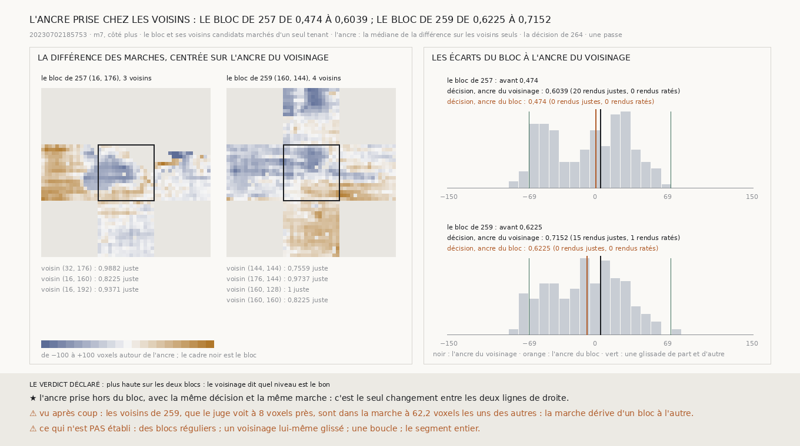

# `265` — Les blocs voisins, marchés avec lui, disent-ils quel niveau d'un bloc à moitié glissé est la bonne spire ? Oui sur les deux blocs : avec l'ancre prise chez les voisins, la décision de 264 rend 35 ratés justes pour 1 juste abîmé, là où l'ancre du bloc ne lui faisait rien corriger

*`264` sait où ne pas corriger, mais sur les deux blocs qui ont glissé il ne corrige rien : un bloc à moitié glissé a deux
niveaux, et la marche, de moyenne nulle dans le bloc, ne dit pas lequel est le bon. Cette tranche rend les blocs voisins,
marche le bloc et ses voisins d'un seul tenant, et prend l'ancre sur les voisins seuls. Avec cette ancre, la même décision
corrige : de 0,474 à 0,6039 sur le bloc de `257`, de 0,6225 à 0,7152 sur celui de `259`, 35 ratés rendus justes et 1 juste
rendu raté. Avec l'ancre du bloc, sur la même marche, elle ne corrige rien. Vu après coup, la marche dérive d'un bloc à
l'autre : les voisins de `259`, que le juge voit à 8 voxels près, y sont à 62,2 voxels les uns des autres.*

## 0. Pourquoi cette tranche

C'est `R4-P95` : ce qui remplace l'humain doit savoir, hors du bloc, quel niveau est le bon. Un humain regarde à côté.

⚠⚠⚠ Le voisinage, l'ancre et les issues sont écrits avant qu'un seul voisin ne soit rendu. Les voisins au nord, au sud, à
l'ouest et à l'est, sur le pas du bloc, gardés s'ils sont candidats de la règle de `257`. La marche de fenêtre en fenêtre de
`260` sur tous leurs chunks à la fois, coutures entre blocs comprises. L'ancre : la médiane de la différence sur les voisins
seuls. La décision de `264` sans changement, une passe ; la même décision est faite avec l'ancre du bloc, sur la même marche,
pour isoler l'ancre.

## 1. Le voisinage

| | les voisins | leur part sur la bonne spire, selon le juge |
|---|---|---|
| le bloc de `257` | `(32, 176)`, `(16, 160)`, `(16, 192)` | 0,9882, 0,8225, 0,9371 |
| le bloc de `259` | `(144, 144)`, `(176, 144)`, `(160, 128)`, `(160, 160)` | 0,7559, 0,9737, 1, 0,8225 |

`(0, 176)`, au nord du premier, n'est pas candidat. Les marches du voisinage relient 928 et 1260 chunks du segment, avec un
résidu de 7,5649 et 5,0249 voxels.

## 2. Ce que l'ancre change

| | l'ancre du voisinage | l'ancre du bloc |
|---|---|---|
| **le bloc de `257`**, avant 0,474 | ancre 0,8001 ; glissées 0,2029 ; décision **0,6039** : 22 corrigés, 20 ratés rendus justes, 0 juste rendu raté | ancre −3,8071 ; glissées 0 ; décision 0,474 : aucun corrigé |
| **le bloc de `259`**, avant 0,6225 | ancre 4,2479 ; glissées 0,2174 ; décision **0,7152** : 29 corrigés, 15 ratés rendus justes, 1 juste rendu raté | ancre −8,5484 ; glissées 0 ; décision 0,6225 : aucun corrigé |

« Glissées » est le poids que le mélange de `264` donne aux spires glissées. La règle fixe de `261`, sur la même marche, rend
0,6623 et 0,6887 avec l'ancre du voisinage, 0,6623 et 0,7417 avec celle du bloc ; sur les deux blocs réunis, elle abîme 14
justes avec la première ancre et 7 avec la seconde, là où la décision n'en abîme qu'un.

⭐⭐⭐⭐ **L'ancre prise chez les voisins fait corriger la décision là où l'ancre du bloc ne lui faisait rien corriger : 35
ratés rendus justes pour 1 juste rendu raté** (`R4-F446`). Sur le bloc de `259`, une passe rend la part que les passes
répétées de `262` atteignaient, 0,7152 ; sur celui de `257`, moins que la règle fixe.

⚠⚠ Les deux ancres ne sont qu'à **4,6072** et **12,7963** voxels l'une de l'autre, et c'est assez pour que le mélange passe
d'aucune spire glissée à un cinquième. La décision est sensible à son ancre.

## 3. Vu après coup : la marche dérive d'un bloc à l'autre

⚠ Écrit après avoir vu la carte, hors du verdict. Le niveau de chaque voisin dans la marche, la médiane de la différence sur
lui moins l'ancre du voisinage, contre l'erreur médiane que le juge y voit :

| | niveaux dans la marche, voxels | erreurs médianes jugées, voxels |
|---|---|---|
| voisins de `257` | −6,7651, 37,1699, −5,7501 | 14,4697, 15,4725, −3,404 |
| voisins de `259` | −14,7379, 34,0371, −28,1479, 10,3621 | −0,7253, 3,3617, −1,1325, 6,8899 |

Les voisins de `259`, que le juge voit à **8,0224** voxels près, sont dans la marche à **62,185** voxels les uns des autres.
Sur deux blocs de distance, la marche dérive de près d'un pas. L'ancre du voisinage tombe au bon endroit parce qu'elle est la
médiane de voisins qui dérivent dans les deux sens, pas parce que chacun porte le bon niveau.

## 4. Le verdict

**PLUS HAUTE SUR LES DEUX BLOCS : LE VOISINAGE DIT QUEL NIVEAU EST LE BON.**

## 5. Ce que cette tranche ne dit pas

- ⚠⚠⚠ Deux blocs, ceux-là mêmes qui ont été choisis pour avoir glissé ; une passe ; un côté, `m7`.
- ⚠⚠ Un voisinage lui-même glissé, et ce que la dérive de la marche fait sur une plus grande distance.
- ⚠ Des blocs réguliers, une boucle, le segment entier.

## 6. Les sondes

Une batterie de **10** contrôles et une figure de **11**. Le lecteur de plusieurs piles sert chaque chunk de sa pile, à sa
place, et rien hors d'elles ; l'ancre du voisinage ignore le bloc, même quand le bloc glissé pèse plus que ses voisins ; avec
elle, la décision ramène la partie glissée d'un bloc glissé en majorité, et avec l'ancre du bloc elle prend la majorité
glissée pour la bonne spire. Deux contrôles cassés exprès ont échoué : le bloc laissé dans l'ancre, un chunk lu au mauvais
endroit de sa pile ; il a fallu rendre ces deux contrôles plus stricts pour qu'ils échouent.

## 7. Ce qui reste

`R4-P95` reste ouverte. Hors du bloc, le niveau se prend chez les voisins ; ce qui empêche de le prendre plus loin est la
dérive de la marche elle-même, près d'un pas sur deux blocs.
