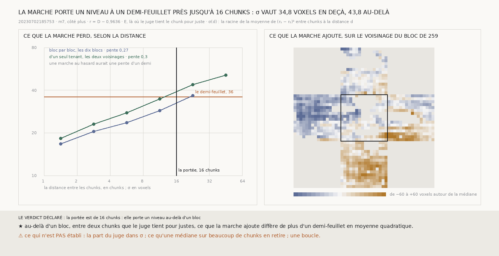

# `266` — Jusqu'où la marche porte-t-elle un niveau ? À un demi-feuillet près jusqu'à seize chunks, un bloc : σ vaut 34,8 voxels entre huit et seize chunks, 43,8 entre seize et trente-deux

*`265` prend le niveau d'un bloc chez ses voisins, et voit après coup la marche dériver d'un bloc à l'autre. Cette tranche
mesure cette dérive. En chaque chunk que le juge tient pour juste, la différence des marches moins ce qu'elle retrouve de
l'erreur jugée est ce que la marche ajoute ; entre deux chunks, l'écart de ce reste dit ce qu'elle perd en allant de l'un à
l'autre. Il croît avec la distance, moins vite qu'une marche au hasard : sur les marches d'un seul tenant de `265`, de 18,2
voxels entre chunks voisins à 34,8 entre huit et seize chunks, puis 43,8 au-delà. La marche porte un niveau à un
demi-feuillet près sur un bloc, pas plus.*

## 0. Pourquoi cette tranche

C'est `R4-P95` : tenir sur une boucle, c'est porter un niveau loin. Il faut savoir à quelle distance la marche cesse de le
porter à un demi-feuillet près.

⚠⚠⚠ La mesure, les classes de distance et les issues sont écrites avant le premier calcul. `r = D − 0,9636 · E` : `D` la
différence des marches, `E` l'erreur jugée au centre du chunk, 0,9636 ce que la marche retrouve d'une rampe (`261`,
`R4-F441`). Seuls les chunks que le juge tient pour justes comptent. `σ(d)` est la racine de la moyenne de `(r₁ − r₂)²` entre
chunks d'une même marche à la distance `d`. La portée est le bas de la première classe où `σ` atteint 36 voxels, sur les
marches d'un seul tenant.

## 1. σ selon la distance

| distance, chunks | bloc par bloc, dix blocs | d'un seul tenant, deux voisinages | voisinage de `257` | voisinage de `259` |
|---|---|---|---|---|
| 1 à 2 | 16,7488 | 18,2497 | 19,212 | 17,5205 |
| 2 à 4 | 20,4821 | 22,9849 | 24,6093 | 21,7105 |
| 4 à 8 | 23,5563 | 27,7818 | 30,4543 | 25,7063 |
| 8 à 16 | 28,757 | **34,7587** | 38,336 | 32,5543 |
| 16 à 32 | 36,5522 | **43,8298** | 45,5197 | 43,0008 |
| 32 à 64 | | 51,0054 | 56,2486 | 48,1202 |

Les marches d'un seul tenant portent 723 et 992 chunks que le juge tient pour justes, et 375145 paires entre seize et
trente-deux chunks. En échelles logarithmiques, `σ` croît avec une pente de **0,3009** d'un seul tenant et 0,2741 bloc par
bloc ; une marche au hasard aurait un demi.

⭐⭐⭐⭐ **La marche porte un niveau à un demi-feuillet près sur un bloc, pas au-delà** (`R4-F447`) : la portée est de **16**
chunks. En deçà, deux chunks que le juge tient pour justes diffèrent dans la marche de 34,7587 voxels en moyenne quadratique ;
entre seize et trente-deux chunks, de 43,8298.

## 2. Le verdict

**LA PORTÉE EST DE 16 CHUNKS : ELLE PORTE UN NIVEAU AU-DELÀ D'UN BLOC.**

⚠⚠ C'est l'issue déclarée, et c'est sa frontière exacte : seize chunks, c'est un bloc. Sur le seul voisinage de `257`, `σ`
atteint le demi-feuillet dès la classe de huit à seize chunks.

## 3. Ce que cette tranche ne dit pas

- ⚠⚠⚠ Deux voisinages et dix blocs, tous déjà vus ; un côté, `m7`.
- ⚠⚠ La part du juge dans `σ` : son erreur entre dans `r`, et rien ici ne l'en sépare. Entre chunks voisins, `σ` vaut déjà
  18,2497 voxels.
- ⚠⚠ Ce qu'une médiane sur des centaines de chunks en retire : `σ` est l'écart entre deux chunks, et l'ancre de `265` est une
  médiane ; elle en retire ce qui ne se ressemble pas d'un chunk à l'autre, pas ce qui dérive ensemble.
- ⚠ Une boucle.

## 4. Les sondes

Une batterie de **7** contrôles et une figure de **10**. Le reste retire ce que la marche retrouve de l'erreur jugée, et
seulement là où le juge tient le chunk pour juste ; un reste partout égal ne perd rien à aucune distance ; les paires tombent
dans leur classe ; sur une marche au hasard, `σ` croît ; la pente en log vaut un demi pour `σ` en racine de la distance. Deux
contrôles cassés exprès ont échoué : le reste qui ne retire rien, après qu'il a fallu rendre le contrôle plus strict pour
qu'il échoue, et des classes aux bornes déplacées.

## 5. Ce qui reste

`R4-P95` reste ouverte. Au-delà d'un bloc, la marche seule ne porte pas un niveau ; ce qui le portera plus loin doit s'appuyer
sur autre chose que la seule somme des pas.
