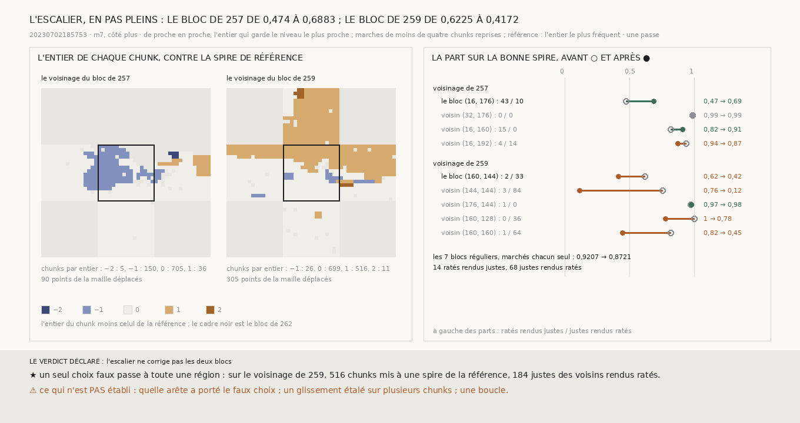

# `267` — Porter un choix de spire de chunk en chunk, plutôt qu'un niveau : l'escalier des marches corrige-t-il ? Non : sur un voisinage il porte le bloc central de 0,474 à 0,6883, sur l'autre un seul choix faux met 516 chunks à une spire et fait tomber le bloc de 0,6225 à 0,4172

*`266` montre que la marche ne porte pas un niveau au-delà d'un bloc, mais qu'entre chunks qui se touchent elle ne perd que 18
voxels, là où une spire glissée en fait 69. Cette tranche porte donc un choix entier plutôt qu'un niveau : de proche en
proche, chaque chunk reçoit l'entier qui garde son niveau le plus près de celui du chunk qui le touche, comme on déplie une
phase, et la correction ramène chaque point de la maille d'un pas plein par entier d'écart à la référence. Sur le voisinage du
bloc de `257`, le bloc central passe de 0,474 à 0,6883, la meilleure part obtenue sur lui. Sur celui de `259`, une seule
frontière fausse met une grande région à une spire de la référence : le bloc central tombe à 0,4172, et 184 justes de ses
voisins sont rendus ratés.*

## 0. Pourquoi cette tranche

C'est `R4-P95`. Une dérive lente passe dans le niveau sans changer le choix ; un glissement franc change le choix sans toucher
au niveau. Si la marche se trompe peu de proche en proche, un choix entier devrait se porter aussi loin qu'on veut.

⚠⚠⚠ L'escalier, la référence, la correction et les issues sont écrits avant d'être appliqués aux marches. Le premier chunk est
celui dont les voisins s'écartent le moins de lui ; l'arête la plus douce passe la première ; l'entier de référence est le plus
fréquent ; la correction est d'un pas plein, 72,0833 voxels, par entier d'écart. ⚠ Une marche de l'escalier de moins de quatre
chunks prend l'entier de ce qui l'entoure : un point de la maille est à 1,25 chunk du suivant, et une spire glissée couvre au
moins deux chunks sur deux. Cette règle est ajoutée avant la première mesure, après qu'un contrôle sur du bruit a fait des
marches d'un seul chunk.

## 1. Les deux voisinages

| | les chunks par entier | points déplacés | le bloc central | ses voisins réunis |
|---|---|---|---|---|
| le voisinage de `257` | −2 : 5, −1 : 150, 0 : 705, 1 : 36 | 90 | 0,474 → **0,6883**, 43 ratés rendus justes, 10 justes rendus ratés | 0,9155 → 0,9255, 19 et 14 |
| le voisinage de `259` | −1 : 26, 0 : 699, 1 : 516, 2 : 11 | 305 | 0,6225 → **0,4172**, 2 et 33 | 0,8936 → **0,6006**, 5 et **184** |

Sur le voisinage de `259`, les blocs au nord, à l'ouest et à l'est, et la moitié haute du bloc central, sont mis à une spire
de la référence, que porte le bloc au sud : le nord tombe de 0,7559 à 0,1181, l'ouest de 1 à 0,7791, l'est de 0,8225 à
0,4497, le sud reste à 0,9737 et 0,9803. Le juge tient pour justes les deux côtés de la frontière : elle est fausse.

⭐⭐⭐⭐ **Porter un choix entier de proche en proche ne tient pas : une seule frontière fausse met toute une région à une
spire** (`R4-F448`). Là où il n'y en a pas, l'escalier corrige mieux que tout ce qui a été essayé sur le bloc de `257` ; là où il
y en a une, il défait plus que tout.

## 2. Les blocs marchés seuls

Sur les sept blocs réguliers notés, marchés chacun seul, la part réunie passe de 0,9207 à **0,8721** : 14 ratés rendus justes,
68 justes rendus ratés. Le bloc de `257`, marché seul, tombe de 0,474 à 0,2532 : l'entier le plus fréquent y est celui de la
mauvaise spire, ce que `265` avait déjà vu d'une ancre prise dans le bloc.

## 3. Le verdict

**L'ESCALIER NE CORRIGE PAS LES DEUX BLOCS.**

## 4. Ce que cette tranche ne dit pas

- ⚠⚠⚠ Deux voisinages et dix blocs, tous déjà vus, une passe, un côté, `m7`.
- ⚠⚠ Quelle arête a porté le faux choix sur le voisinage de `259` : la carte montre où est la frontière, pas ce qui l'a faite.
- ⚠ Un glissement étalé sur plusieurs chunks, que l'escalier prend pour de la dérive ; une boucle.

## 5. Les sondes

Une batterie de **8** contrôles et une figure de **10**. Une dérive lente, soixante-neuf voxels sur la marche, reste sur une
seule spire ; un glissement franc en travers d'elle change l'entier d'un et d'un seul ; un bruit de douze voxels ne fait pas
d'escalier une fois les marches d'un chunk reprises, et la règle des quatre ne touche pas à un vrai glissement ; la correction
ramène d'un pas plein les seuls points de la partie glissée. Trois contrôles cassés exprès ont échoué : l'entier pris contre le
premier chunk au lieu du voisin, la correction dans le mauvais sens, la règle des quatre retirée.

## 6. Ce qui reste

`R4-P95` reste ouverte. Le choix entier se porte bien là où chaque frontière est juste ; il faut savoir, sans le juge, qu'une
frontière est fausse avant d'y faire passer toute une région.
