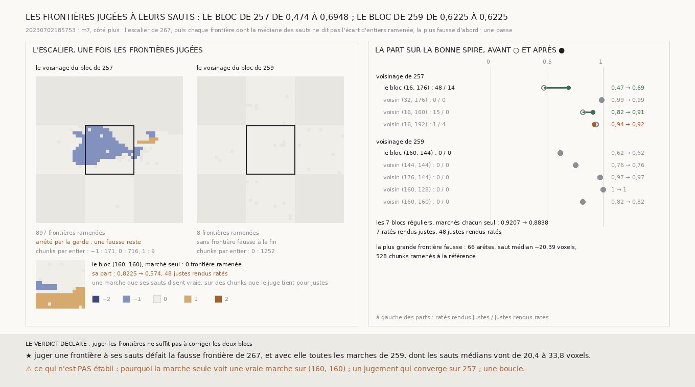

# `268` — Une frontière de l'escalier se juge-t-elle à ses sauts ? La fausse frontière de 267 oui : 66 arêtes, un saut médian de −20,39 voxels, 528 chunks ramenés ; mais avec elle toutes les marches du voisinage de 259, et le bloc n'est plus corrigé du tout

*`267` porte un choix entier de proche en proche, et une seule arête qui franchit le demi-glissement par la dérive met toute une
région à une spire. Une frontière a pourtant bien plus d'une arête. Cette tranche juge chaque frontière de l'escalier à la
médiane de tous ses sauts : si l'entier qu'elle dit n'est pas l'écart des deux marches, la plus petite des deux est ramenée.
Sur le voisinage de `259`, la fausse frontière de `267` est trouvée et défaite : ses voisins ne sont plus abîmés. Mais toutes
les autres marches de ce voisinage sautent de 20 à 34 voxels et sont défaites aussi : le bloc n'est plus corrigé. Sur le
voisinage de `257`, le bloc central passe de 0,474 à 0,6948, mais le jugement ne s'arrête pas de lui-même.*

## 0. Pourquoi cette tranche

C'est `R4-P95`. `267` montre qu'un choix entier se porte bien là où chaque frontière est juste ; il faut savoir, sans le juge,
qu'une frontière est fausse. Sur une vraie frontière, la différence des marches saute d'une glissade sur chaque arête ; sur une
fausse, elle ne saute que là où la dérive a franchi le demi-glissement.

⚠⚠⚠ Le jugement et les issues sont écrits avant d'être appliqués. L'escalier est celui de `267`, règle des quatre chunks
comprise. L'entier qu'une frontière dit est l'arrondi de la médiane de ses sauts divisée par 69,458 voxels ; s'il n'est pas
l'écart d'entiers, la plus petite marche est décalée d'autant ; la plus fausse d'abord, jusqu'à ce qu'aucune ne le soit, sous
une garde d'autant de tours que de chunks. Les mêmes marches que `267`, pour les comparer.

## 1. Les deux voisinages

| | frontières ramenées | à la fin | le bloc central | ses voisins réunis |
|---|---|---|---|---|
| le voisinage de `257` | 897 | **arrêté par la garde**, une fausse reste | 0,474 → **0,6948**, 48 ratés rendus justes, 14 justes rendus ratés | 0,9155 → 0,9396, 16 et 4 |
| le voisinage de `259` | 8 | aucune fausse | 0,6225 → 0,6225, rien | 0,8936 → 0,8936, rien |

Sur le voisinage de `259`, la frontière qui mettait 516 chunks à une spire en `267` a **66** arêtes et un saut médian de
**−20,39** voxels : elle dit zéro, et **528** chunks sont ramenés à la référence. Les sept autres frontières ramenées sautent de
23,11 à 33,755 voxels en médiane, en valeur absolue, moins que le demi-glissement : à la fin, tout le voisinage est sur un seul entier.

Sur le voisinage de `257`, le jugement ne s'arrête pas : une marche de cinq chunks, bordée de deux frontières de deux arêtes
chacune, est renvoyée de l'une à l'autre, 181,97 voxels d'un côté et 56,015 de l'autre. La part publiée est celle où la garde
l'a arrêtée.

⭐⭐⭐⭐ **Juger une frontière à la médiane de ses sauts défait la fausse frontière de `267`, et avec elle toutes les marches du
voisinage de `259`** (`R4-F449`) : ce que le juge y tient pour raté ne fait pas, dans la marche, de frontière qui saute d'une
glissade.

## 2. Les blocs marchés seuls

Sur les sept blocs réguliers notés, la part réunie passe de 0,9207 à **0,8838** : 7 ratés rendus justes, 48 justes rendus ratés,
les 48 sur le bloc `(160, 160)`. Là, marché seul, l'escalier met 85 chunks à une spire de la référence et 16 à l'autre, et leurs
frontières disent vrai : la marche y saute d'une glissade là où le juge tient les chunks pour justes. Sa part passe de 0,8225 à
0,574. Sur le voisinage de `259`, dont il est le voisin à l'est, le même bloc n'est pas touché.

## 3. Le verdict

**JUGER LES FRONTIÈRES NE SUFFIT PAS À CORRIGER LES DEUX BLOCS.**

## 4. Ce que cette tranche ne dit pas

- ⚠⚠⚠ Deux voisinages et dix blocs, tous déjà vus, une passe, un côté, `m7`.
- ⚠⚠ Pourquoi la marche du bloc `(160, 160)`, seul, saute d'une glissade là où le juge ne voit rien, et pourquoi celle du
  voisinage ne le fait pas.
- ⚠ Un jugement qui s'arrête de lui-même sur le voisinage de `257` ; une boucle.

## 5. Les sondes

Une batterie de **7** contrôles et une figure de **11**. Une vraie frontière saute d'une glissade sur chacune de ses arêtes, dit
vrai et n'est pas touchée ; une fausse, où la marche ne saute presque nulle part, dit zéro, et jugée, disparaît en déplaçant la
plus petite marche ; de trois marches, seule la fausse frontière est défaite. Deux contrôles cassés exprès ont échoué : la
médiane remplacée par le plus grand saut, la plus grande marche déplacée au lieu de la plus petite.

## 6. Ce qui reste

`R4-P95` reste ouverte. Une frontière qui saute d'une glissade se voit, une qui n'en saute qu'un demi se confond avec la dérive ;
les ratés du bloc de `259` sont de la seconde sorte.
