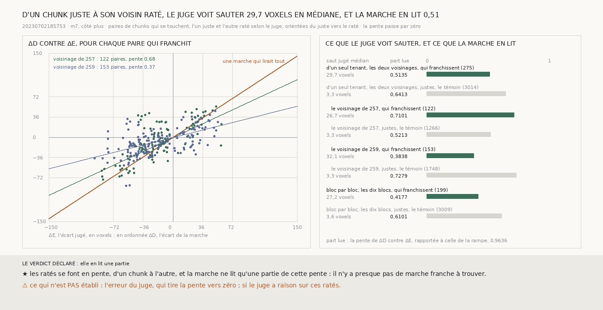

# `269` — La marche lit-elle ce que le juge voit sauter ? D'un chunk juste à son voisin raté, le juge ne voit sauter que 29,7 voxels en médiane, et la marche en lit la moitié, 0,5135 ; sur le voisinage de 259, 0,3838

*`268` défait toutes les marches du voisinage de `259`, parce que leurs frontières ne sautent que de 20 à 34 voxels. Deux causes
le feraient : le juge voit ces ratés se faire en pente, d'un chunk à l'autre, ou il les voit sauter d'un coup et la marche n'en
lit qu'une partie. Cette tranche regarde les paires de chunks qui se touchent, l'un juste et l'autre raté selon le juge. Les
deux causes y sont. Le juge ne voit sauter que 29,7 voxels en médiane, moins d'un demi-feuillet : les ratés se font en pente.
Et la marche lit la moitié de ce que le juge voit, 0,5135, près des trois quarts sur le voisinage de `257`, un peu plus d'un
tiers sur celui de `259`.*

## 0. Pourquoi cette tranche

C'est `R4-P95`. La première cause est la surface, la seconde l'instrument, et elles ne demandent pas la même suite.

⚠⚠⚠ La mesure et les issues sont écrites avant le calcul. Pour chaque paire de chunks qui se touchent, dont l'un est juste et
l'autre raté, orientée du juste vers le raté : `ΔE`, l'écart des erreurs jugées, et `ΔD`, celui de la différence des marches.
Ce que le juge voit sauter : la médiane de `|ΔE|`. Ce que la marche en lit : la pente de `ΔD` contre `ΔE`, passant par zéro,
rapportée à celle de la rampe, 0,9636 (`261`). Le témoin : les paires dont les deux chunks sont justes.

## 1. Ce que le juge voit sauter, et ce que la marche en lit

| | paires qui franchissent | saut jugé médian | part lue | témoin, paires justes : part lue |
|---|---|---|---|---|
| **d'un seul tenant**, les deux voisinages | 275 | **29,7492** voxels | **0,5135** | 0,6413 |
| le voisinage de `257` | 122 | 26,6513 | 0,7101 | 0,5213 |
| le voisinage de `259` | 153 | 32,133 | **0,3838** | 0,7279 |
| bloc par bloc, les dix blocs | 199 | 27,1598 | 0,4177 | 0,6101 |

Des paires qui franchissent, **0,1855** seulement ont un `ΔD` d'un demi-glissement ou plus, là où l'escalier de `267` mettrait
une marche.

⭐⭐⭐⭐ **D'un chunk juste à son voisin raté, le juge ne voit sauter que 29,7492 voxels en médiane, et la marche en lit la
moitié** (`R4-F450`). Les ratés se font en pente sur plusieurs chunks, et la marche ne lit qu'une partie de cette pente : sur le
voisinage de `259`, un peu plus d'un tiers, et presque rien ne franchit le demi-glissement.

## 2. Le verdict

**ELLE EN LIT UNE PARTIE.**

## 3. Ce que cette tranche ne dit pas

- ⚠⚠ L'erreur du juge tire la pente vers zéro : un écart jugé bruité dilue la régression. Le témoin le montre, qui ne rend que
  0,6413 sur des paires où le juge ne voit que 3,3 voxels d'écart ; la part lue des paires qui franchissent n'en est pas
  corrigée.
- ⚠⚠ Si le juge a raison sur ces ratés.
- ⚠ Pourquoi la marche lit moins sur le voisinage de `259` que sur celui de `257`.

## 4. Les sondes

Une batterie de **8** contrôles et une figure de **10**. Les paires qui franchissent sont orientées du juste vers le raté, des
deux côtés de la frontière, et comptées une fois ; une marche qui lit la moitié du saut a une part lue d'un demi ; la pente est
celle des moindres carrés passant par zéro ; un chunk sans juge n'entre dans aucune paire. Deux contrôles cassés exprès ont
échoué, après qu'il a fallu les rendre plus stricts pour qu'ils le fassent : l'orientation laissée à l'ordre de lecture, et la
pente remplacée par un rapport de médianes.

## 5. Ce qui reste

`R4-P95` reste ouverte. Ce qui reste à corriger ne fait pas de marche franche à l'échelle du chunk : une frontière ne s'y voit
pas, un niveau ne se porte pas au-delà d'un bloc, et la marche n'en lit qu'une partie.
