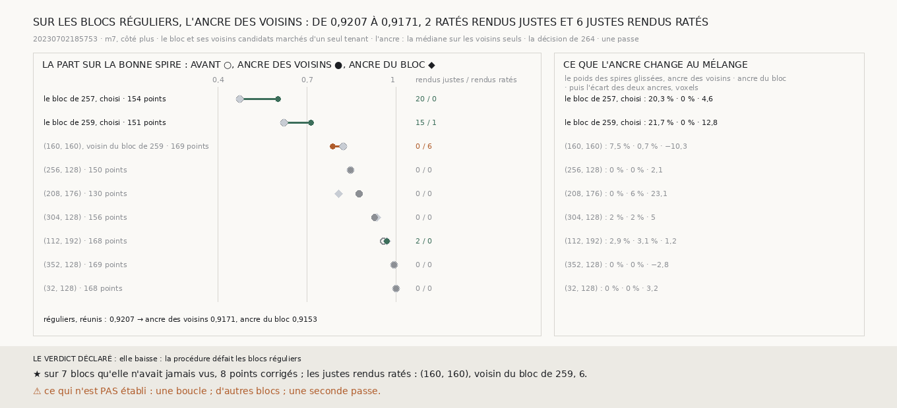

# `270` — L'ancre des voisins tient-elle sur des blocs réguliers ? Non : la part réunie des sept blocs réguliers notés passe de 0,9207 à 0,9171, 2 ratés rendus justes pour 6 justes rendus ratés, tous sur `(160, 160)`, qui touche le bloc de `259`

*De tout ce qui a été essayé, une seule procédure corrige les deux blocs choisis sans rien abîmer autour : la décision de `264`,
avec l'ancre prise chez les voisins (`265`). Elle n'avait jamais tourné sur les blocs pris à pas réguliers de `263`, et la leçon
de `263` est qu'une procédure peut défaire là où on ne l'a pas regardée travailler. Sur ces blocs, elle défait un peu : six
points justes rendus ratés, deux ratés rendus justes. Les six sont sur un seul bloc, `(160, 160)`, qui touche le bloc de `259`,
à moitié glissé.*

## 0. Pourquoi cette tranche

C'est `R4-P95`. La procédure et les issues sont écrites avant qu'un seul voisin d'un bloc régulier ne soit rendu. Pour chacun
des blocs de `263` que le juge note, ses voisins au nord, au sud, à l'ouest et à l'est, gardés s'ils sont candidats de `257` ; la
marche d'un seul tenant sur le bloc et eux ; l'ancre, la médiane sur les voisins seuls ; la décision de `264` ; une passe. Rien
n'est changé à la procédure de `265`. `(80, 32)`, où le juge ne note rien, n'est pas rendu.

Les issues, sur la part réunie des blocs notés : elle ne baisse pas, la procédure ne défait pas les blocs réguliers ; elle
baisse, elle les défait. À côté, la même décision avec l'ancre du bloc, sur la même marche.

**70** rendus, dont **54** refaits pour cette tranche et aucun raté ; chaque marche relie tous les chunks qu'elle lit.

## 1. Bloc par bloc

| bloc | points notés | avant | ancre des voisins, voxels | après | justes / ratés | ancre du bloc, voxels | après | justes / ratés |
|---|---|---|---|---|---|---|---|---|
| `(160, 160)`, voisin du bloc de `259` | 169 | 0,8225 | 0,2022 | 0,787 | 0 / 6 | 10,5086 | 0,8225 | 0 / 0 |
| `(256, 128)` | 150 | 0,8467 | −1,8066 | 0,8467 | 0 / 0 | −3,8695 | 0,8467 | 0 / 0 |
| `(208, 176)` | 130 | 0,8769 | −1,0493 | 0,8769 | 0 / 0 | −24,1761 | 0,8077 | 0 / 9 |
| `(304, 128)` | 156 | 0,9295 | −1,7151 | 0,9295 | 0 / 0 | −6,7627 | 0,9359 | 1 / 0 |
| `(112, 192)` | 168 | 0,9583 | −1,2381 | 0,9702 | 2 / 0 | −2,4634 | 0,9702 | 2 / 0 |
| `(352, 128)` | 169 | 0,9941 | −0,6677 | 0,9941 | 0 / 0 | 2,0928 | 0,9941 | 0 / 0 |
| `(32, 128)` | 168 | 1 | 2,1742 | 1 | 0 / 0 | −1,0452 | 1 | 0 / 0 |
| **réunis** | | **0,9207** | | **0,9171** | **2** / **6** | | 0,9153 | 3 / 9 |

« justes / ratés » : les ratés rendus justes, puis les justes rendus ratés.

⭐⭐⭐⭐ **Sur les blocs réguliers, l'ancre des voisins fait baisser la part réunie de 0,9207 à 0,9171 : 2 ratés rendus justes,
6 justes rendus ratés, tous sur `(160, 160)`, qui touche le bloc de `259`** (`R4-F451`). Sur cinq des sept blocs elle ne corrige
rien. L'ancre du bloc, sur la même marche, fait pire, 0,9153, et abîme un autre bloc, `(208, 176)`, où la médiane du bloc tombe à
−24,1761 voxels, celle de ses voisins à −1,0493.

## 2. Où la procédure défait

Sur `(160, 160)`, le mélange tenu à l'ancre des voisins donne **0,0747** aux spires glissées au-dessus ; tenu à l'ancre du bloc,
0,0074. Les deux bosses du bloc, lues après coup, sont à 7,4151 et 47,114 voxels, avec des poids 0,9171 et 0,0829.

Des quatre voisins de `(160, 160)`, le juge en voit trois presque entièrement sur la bonne spire, 0,9872, 0,9935 et 0,981.
Le quatrième, `(160, 144)`, est le bloc de `259`, à **0,6225**.

`(160, 160)` est aussi le bloc où `268`, la marche prise sur lui seul, rendait ses 48 justes ratés (`R4-F449`).

## 3. Le verdict

**ELLE BAISSE : LA PROCÉDURE DÉFAIT LES BLOCS RÉGULIERS.**

## 4. Ce que cette tranche ne dit pas

- ⚠⚠ Qui a raison sur `(160, 160)`, de la marche qui y voit une glissade ou du juge qui n'en voit pas. `268` avait déjà trouvé
  ce désaccord, la marche prise sur ce bloc seul.
- ⚠⚠ Si toucher un bloc à moitié glissé est la cause. Un seul bloc abîmé ne le dit pas.
- ⚠ Pourquoi l'ancre du bloc tient ici moins bien que dans `264`, où, la marche prise bloc par bloc, elle menait de 0,9207 à
  0,9243 sans rien abîmer (`R4-F445`). La marche d'un seul tenant n'est pas celle de `264`.
- ⚠ Une boucle, d'autres blocs, une seconde passe.

## 5. Les sondes

Une batterie de **3** contrôles et une figure de **12**. Chaque surface de chaque bloc et de ses voisins n'est rendue qu'une
fois ; la réunion pèse les blocs par leurs points et laisse de côté un bloc indécidable ; les deux issues s'excluent. Deux
contrôles cassés exprès ont échoué : le dédoublonnage des rendus retiré, et un bloc indécidable réuni avec les autres. La figure
recompte par les coordonnées quel bloc régulier touche un bloc choisi : retirer la lecture des voisins dans la figure fait échouer
ce contrôle.

## 6. Ce qui reste

`R4-P95` reste ouverte. La procédure la plus sûre essayée jusqu'ici corrige les deux blocs choisis et abîme un bloc régulier, là
où la marche et le juge ne s'accordent pas.
