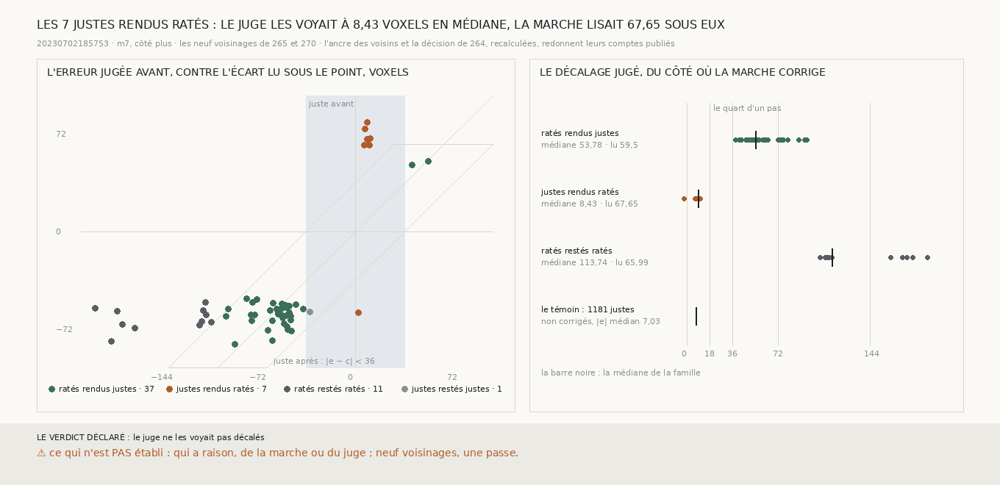

# `271` — Les points que la décision corrige, le juge les voyait-il déjà décalés ? Pas ceux qu'elle abîme : le juge voyait les 7 justes rendus ratés à 8,43 voxels en médiane, et la marche lisait 67,65 voxels sous eux, un pas presque plein

*`270` laissait ouverte une question : sur `(160, 160)`, qui a raison, de la marche qui y voit une glissade ou du juge qui n'en
voit pas. Un point corrigé l'est de l'écart que la marche lit sous lui. Si le juge voyait ces points déjà décalés vers la spire
voisine, sans l'être d'un demi-feuillet, les deux voyaient la même chose et la correction poussait seulement trop loin. Ce n'est
pas le cas. Le juge voyait les justes que la décision abîme comme il voit les justes qu'elle laisse, à quelques voxels. La
marche lisait sous eux presque un pas entier. L'un des deux se trompe d'une spire.*

## 0. Pourquoi cette tranche

C'est `R4-P95`. La mesure et les issues sont écrites avant qu'un seul écart ne soit lu point par point. Sur chacun des neuf
voisinages de `265` et `270`, la décision est recalculée depuis la différence publiée, et elle doit redonner les comptes publiés.
Pour chaque point noté qu'elle corrige : `e`, l'erreur jugée avant, et `c`, l'écart que la marche lit sous lui. Le point est
ramené de `c`, donc son erreur après est `e − c`. Le décalage jugé est `e` compté du côté où la marche corrige.

Les issues portent sur les justes rendus ratés réunis. Si la médiane de leur décalage jugé atteint le quart d'un pas, 18 voxels,
le juge les voyait décalés du côté où la marche corrige. Sinon, il ne les voyait pas décalés. Le témoin : les justes que la
décision ne corrige pas, sur les mêmes blocs.

Les neuf voisinages redonnent leurs comptes publiés.

## 1. Famille par famille

| points corrigés | points | décalage jugé médian, voxels | écart lu médian, voxels |
|---|---|---|---|
| ratés rendus justes | 37 | 53,78 | 59,5 |
| **justes rendus ratés** | **7** | **8,43** | **67,65** |
| ratés restés ratés | 11 | 113,74 | 65,99 |
| justes restés justes | 1 | 33,37 | 59,04 |

Le témoin : **1181** justes que la décision ne corrige pas, à **7,03** voxels du juge en médiane, en valeur absolue.

⭐⭐⭐⭐ **Les justes que la décision rend ratés, le juge ne les voyait pas décalés : 8,43 voxels en médiane, là où la marche
lisait 67,65 sous eux** (`R4-F452`). Ce n'est pas un décalage que les deux voient et que la correction pousse trop loin. Le juge
les voit comme il voit les justes qu'on laisse. La marche lit sous eux presque un pas plein.

## 2. Point par point

| bloc | `e`, voxels | `c`, voxels |
|---|---|---|
| `(160, 160)` | 8,82 | 80,17 |
| `(160, 160)` | 7,29 | 75,14 |
| `(160, 160)` | 8,43 | 67,65 |
| `(160, 160)` | 6,31 | 63,5 |
| `(160, 160)` | 10,04 | 63,77 |
| `(160, 160)` | 10,63 | 68,25 |
| le bloc de `259` | 2,46 | −59,96 |

Les six de `(160, 160)` sont à 6,31 à 10,63 voxels du juge, et la marche lit sous eux de 63,5 à 80,17 voxels.

Les ratés que la décision rend justes, le juge les voit décalés de 53,78 voxels en médiane, et la marche en lit 59,5. Là, les
deux voient la même chose. Onze ratés restent ratés : le juge les voit à 113,74 voxels en médiane, plus d'un pas et demi, et la
marche n'en lit que 65,99.

## 3. Le verdict

**LE JUGE NE LES VOYAIT PAS DÉCALÉS.**

## 4. Ce que cette tranche ne dit pas

- ⚠⚠ Qui a raison. L'un des deux se trompe d'une spire sous ces six points, et cette tranche ne dit pas lequel. `266` a mesuré
  que la marche ne porte un niveau qu'à un bloc de distance, et la marche de `270` en traverse trois.
- ⚠ Sept points, dont six sur un seul bloc : la médiane réunie tient à `(160, 160)`.
- ⚠ Ce que valent les onze ratés restés ratés, à plus d'un pas et demi : cette tranche ne les regarde pas.

## 5. Les sondes

Une batterie de **5** contrôles et une figure de **11**. La classe d'un point suit son erreur avant et après ; le décalage jugé
se compte du côté où la marche corrige ; sur un voisinage fabriqué, la décision corrige la bosse posée et rend ses ratés justes
et ses justes ratés ; le témoin ne compte que les justes non corrigés ; les issues s'excluent. Trois contrôles cassés exprès ont
échoué : le décalage compté sans son côté, le témoin compté avec les points corrigés, la classe lue sur l'erreur avant seule. La
figure refuse une échelle qui écraserait un point contre son bord.

## 6. Ce qui reste

`R4-P95` reste ouverte. Là où la procédure abîme, la marche et le juge ne diffèrent pas de degré : ils diffèrent d'une spire.
