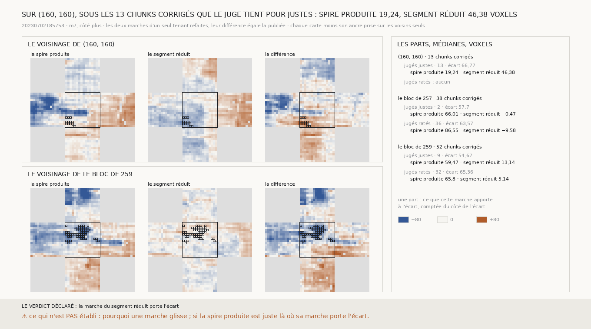

# `272` — Sous les chunks que la décision corrige, laquelle des deux marches porte l'écart ? Sur `(160, 160)`, celle du segment réduit : 46,38 voxels des 66,77 que la décision corrige, là où, sous les ratés qu'elle corrige juste, elle ne bouge que de −9,58 à 5,14

*`271` a montré que, sous les points que la décision abîme sur `(160, 160)`, la marche et le juge diffèrent d'une spire.
L'écart que la décision corrige est une différence : la marche de la spire produite moins celle du segment réduit. Le segment
réduit est le segment tracé à la main, un point sur huit : il est sur une seule feuille, et sa marche ne devrait pas bouger d'un
pas. Sur `(160, 160)`, c'est pourtant elle qui porte la plus grande part de l'écart. Sous les ratés que la décision corrige
juste, sur les blocs de `257` et `259`, c'est la marche de la spire produite qui le porte, et celle du segment réduit reste à
quelques voxels.*

## 0. Pourquoi cette tranche

C'est `R4-P95`. La mesure et les issues sont écrites avant que les deux marches ne soient regardées séparément. Sur trois
voisinages, celui de `(160, 160)` et ceux des deux blocs choisis, les deux marches d'un seul tenant sont refaites. Leur différence
doit redonner celle que `265` et `270` publient : elle la redonne à 0,005 voxel près sur les trois. Chaque marche est ancrée comme
la différence, à la médiane sur les voisins seuls. Sur les chunks du bloc que la décision de `264` dit glissés, la part de la
spire produite est `p − ancre`, celle du segment réduit `−(r − ancre)`, toutes deux comptées du côté de l'écart. L'erreur jugée
au centre du chunk dit s'il est juste ou raté.

Les issues portent sur les chunks corrigés de `(160, 160)` que le juge tient pour justes. Si la médiane de la part du segment
réduit dépasse celle de la spire produite, la marche du segment réduit porte l'écart. Sinon, c'est celle de la spire produite. Le
témoin : les chunks corrigés des deux blocs choisis que le juge tient pour ratés.

## 1. Les parts

| chunks corrigés | chunks | erreur jugée médiane | écart médian | part de la spire produite | part du segment réduit |
|---|---|---|---|---|---|
| **`(160, 160)`, jugés justes** | **13** | 12,4026 | **66,766** | **19,244** | **46,3791** |
| le bloc de `257`, jugés ratés | 36 | 53,7908 | 63,5676 | 86,5501 | −9,5808 |
| le bloc de `259`, jugés ratés | 32 | 76,5677 | 65,3566 | 65,8016 | 5,1406 |
| le bloc de `257`, jugés justes | 2 | 17,3909 | 57,704 | 66,0109 | −0,4737 |
| le bloc de `259`, jugés justes | 9 | 20,5492 | 54,6734 | 59,4747 | 13,1361 |

Les colonnes sont en voxels, médianes, en valeur absolue pour l'erreur jugée et l'écart. Les 13 chunks que la décision corrige
sur `(160, 160)` sont tous tenus pour justes par le juge.

⭐⭐⭐⭐ **Sur `(160, 160)`, l'écart que la décision corrige est surtout dans la marche du segment réduit : 46,3791 voxels des
66,766, contre 19,244 pour la spire produite** (`R4-F453`). Sous les ratés qu'elle corrige juste, c'est l'inverse : la marche de
la spire produite porte 86,5501 et 65,8016 voxels, celle du segment réduit de −9,5808 à 5,1406. Le segment réduit est sur une
seule feuille : sa marche n'a pas à bouger d'un pas.

Sur la figure, les chunks corrigés de `(160, 160)` sont au bout d'une bande orangée qui longe le bas du bloc et entre dans son
voisin de l'ouest, `(160, 144)`, le bloc de `259`.

## 2. Le verdict

**LA MARCHE DU SEGMENT RÉDUIT PORTE L'ÉCART.**

## 3. Ce que cette tranche ne dit pas

- ⚠⚠ Si c'est la marche du segment réduit qui lit mal, ou le segment réduit qui quitte la feuille du segment. Un point sur huit,
  relié en ligne droite, peut couper un pli.
- ⚠ Si la spire produite est juste là où sa propre marche porte l'écart : sur les chunks jugés justes du bloc de `259`, sa marche
  porte 59,4747 voxels.
- ⚠ Trois voisinages, treize chunks sur `(160, 160)`.

## 4. Les sondes

Une batterie de **5** contrôles et une figure de **11**. Quand la spire produite glisse, sa marche porte l'écart et chaque ancre
est lue sur sa propre marche ; quand c'est la marche du segment réduit, c'est elle ; une glissade vers le bas se compte aussi du
côté de l'écart ; le juge partage les chunks corrigés en justes et en ratés ; les issues s'excluent. Trois contrôles cassés exprès
ont échoué : l'écart compté sans son côté, une seule ancre pour les trois cartes, la part du segment réduit sans son signe. La
figure vérifie que sa carte de la différence est celle des deux marches, aux ancres près.

## 5. Ce qui reste

`R4-P95` reste ouverte. Sur `(160, 160)`, ce que la procédure abîme vient d'un écart que la spire produite ne porte qu'en partie :
il reste à voir si le segment réduit y est encore sur la feuille du segment.
