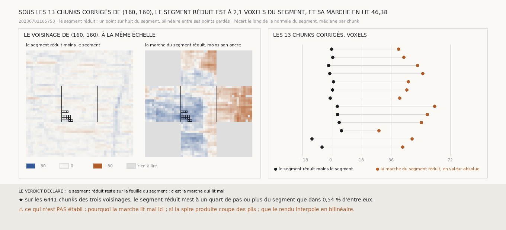

# `273` — Sous les chunks que la décision corrige sur `(160, 160)`, le segment réduit quitte-t-il la feuille du segment ? Non : il est à 2,0976 voxels du segment en médiane, et sa marche en lit 46,3791. C'est la marche qui lit mal

*`272` a trouvé que, sur `(160, 160)`, l'écart que la décision corrige est surtout dans la marche du segment réduit. Deux
lectures restaient : la marche lit mal, ou le segment réduit, un point sur huit du segment relié en ligne droite, coupe un pli et
quitte la feuille que le segment tracé suit. La seconde est une question de géométrie pure, et elle se tranche sans le rendu,
sans la marche et sans le juge. Le segment réduit reste à deux voxels du segment sous ces chunks, et presque partout ailleurs.
C'est donc la marche qui lit, sur une surface continue, un saut de 46 voxels qui n'y est pas.*

## 0. Pourquoi cette tranche

C'est `R4-P95`. La mesure et les issues sont écrites avant qu'un seul écart entre les deux maillages ne soit calculé. En chaque
point du segment tracé, le segment réduit est interpolé en bilinéaire entre ses quatre points gardés, et l'écart des deux est lu
le long de la normale du segment. Chunk par chunk, la médiane de cet écart. Sur les trois voisinages de `272`.

⚠ `259` a montré que la couche la plus claire d'un chunk n'est pas un repère de la feuille que le segment suit. Cette tranche ne
la lit donc pas : elle compare les deux maillages.

Les issues portent sur les 13 chunks que la décision corrige sur `(160, 160)`. Si la médiane de l'écart absolu atteint le quart
d'un pas, 18 voxels, le segment réduit quitte la feuille du segment. Sinon, il reste sur la feuille, et c'est la marche qui lit
mal.

## 1. L'écart des deux maillages

| chunks | chunks | écart absolu médian, voxels | écart médian, voxels | part à un quart de pas ou plus |
|---|---|---|---|---|
| **`(160, 160)`, corrigés** | **13** | **2,0976** | 0,2652 | 0 |
| le bloc de `257`, corrigés et jugés ratés | 36 | 1,3127 | −0,6288 | 0 |
| le bloc de `259`, corrigés et jugés ratés | 32 | 2,1121 | 1,0909 | 0,0312 |
| les trois voisinages, tous les chunks | 6441 | 2,7874 | −1,209 | 0,0054 |

Sur chaque voisinage, la corrélation de cet écart avec la marche du segment réduit de `272` vaut 0,0905 sur `(160, 160)`, 0,0632
sur le bloc de `257` et 0,4265 sur celui de `259`.

⭐⭐⭐⭐ **Sous les chunks que la décision corrige sur `(160, 160)`, le segment réduit est à 2,0976 voxels du segment en médiane,
et sa marche en lit 46,3791** (`R4-F454`). Le segment réduit ne quitte pas la feuille. La marche lit, sur une surface qui suit
une seule feuille, un écart qui n'y est pas.

## 2. Le verdict

**LE SEGMENT RÉDUIT RESTE SUR LA FEUILLE DU SEGMENT : C'EST LA MARCHE QUI LIT MAL.**

## 3. Ce que cette tranche ne dit pas

- ⚠⚠ Pourquoi la marche lit mal ici. Elle se porte de couture en couture, et deux feuilles voisines se ressemblent ; `266` a
  mesuré qu'elle ne porte un niveau qu'à un bloc de distance.
- ⚠ Que le rendu interpole en bilinéaire entre les points de la grille : cette tranche le suppose.
- ⚠ Si la spire produite, faite des mêmes points gardés, coupe des plis.

## 4. Les sondes

Une batterie de **6** contrôles et une figure de **11**. Sur un plan, le segment réduit ne s'écarte pas du segment ; sur un
cylindre, il est la corde, interpolée et non recopiée d'un coin ; sur une bosse entre deux points gardés, il passe dessous de
toute sa hauteur ; la médiane d'un chunk n'est prise que sur ses points ; les issues s'excluent. Trois contrôles cassés exprès
ont échoué : le coin le plus proche au lieu du bilinéaire, les chunks bornés au plancher, l'écart pris sur un seul axe. La
première de ces sondes a d'abord passé : sur un plan, recopier un coin ne s'écarte pas de la normale ; c'est ce qui a fait
ajouter le cylindre.

## 5. Ce qui reste

`R4-P95` reste ouverte. Ce que la procédure de `265` abîme sur les blocs réguliers vient de la marche elle-même, qui lit un saut
là où la surface n'en a pas.
