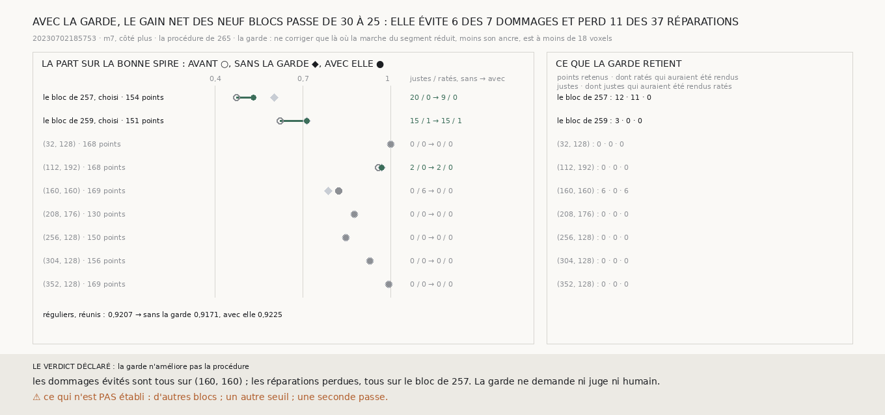

# `274` — La marche du segment réduit dit-elle où ne pas corriger ? Non : garder la procédure là où elle reste plate évite 6 des 7 dommages et perd 11 des 37 réparations, et le gain net des neuf blocs passe de 30 à 25

*`273` a montré que ce que la procédure de `265` abîme sur `(160, 160)` vient de la marche : elle lit 46 voxels sous un segment
réduit qui reste à deux voxels de sa feuille. Le segment réduit suit une seule feuille partout, donc sa marche devrait rester
plate partout. Cette tranche en tire une garde qui ne demande ni juge ni humain : ne corriger un point que là où la marche du
segment réduit reste plate. La garde fait ce pour quoi elle a été écrite sur les blocs réguliers. Elle retire aussi plus de la
moitié des réparations du bloc de `257`, et c'est là que la procédure gagne le plus.*

## 0. Pourquoi cette tranche

C'est `R4-P95`. La garde et les issues sont écrites avant que la garde ne soit appliquée à un seul point. La procédure est celle
de `265`, sans rien y changer, sur les neuf voisinages de `265` et `270`, marches refaites. La garde s'y ajoute : un point que
la décision corrige ne l'est que si la marche du segment réduit, moins son ancre prise sur les voisins seuls, y est à moins d'un
quart de pas, 18 voxels. Sans la garde, la procédure doit redonner les comptes publiés, sinon la mesure est indécidable.

Les issues portent sur les neuf voisinages réunis et sur le gain net, les ratés rendus justes moins les justes rendus ratés. Si
ce gain est plus grand avec la garde que sans elle, la garde améliore la procédure. Sinon, non.

## 1. Bloc par bloc

Les neuf voisinages redonnent, sans la garde, leurs comptes publiés.

| voisinage | points notés | avant | sans la garde | avec la garde | ratés rendus justes, sans → avec | justes rendus ratés, sans → avec |
|---|---|---|---|---|---|---|
| le bloc de `257`, choisi | 154 | 0,474 | 0,6039 | 0,5325 | 20 → 9 | 0 → 0 |
| le bloc de `259`, choisi | 151 | 0,6225 | 0,7152 | 0,7152 | 15 → 15 | 1 → 1 |
| `(32, 128)` | 168 | 1 | 1 | 1 | 0 → 0 | 0 → 0 |
| `(112, 192)` | 168 | 0,9583 | 0,9702 | 0,9702 | 2 → 2 | 0 → 0 |
| `(160, 160)` | 169 | 0,8225 | 0,787 | 0,8225 | 0 → 0 | 6 → 0 |
| `(208, 176)` | 130 | 0,8769 | 0,8769 | 0,8769 | 0 → 0 | 0 → 0 |
| `(256, 128)` | 150 | 0,8467 | 0,8467 | 0,8467 | 0 → 0 | 0 → 0 |
| `(304, 128)` | 156 | 0,9295 | 0,9295 | 0,9295 | 0 → 0 | 0 → 0 |
| `(352, 128)` | 169 | 0,9941 | 0,9941 | 0,9941 | 0 → 0 | 0 → 0 |

Les trois colonnes du milieu sont la part des points notés sur la bonne spire. Les points que la garde retient sont tous sur
trois blocs : 12 sur le bloc de `257`, dont 11 que la procédure rend justes ; 6 sur `(160, 160)`, les 6 qu'elle rend ratés ;
3 sur le bloc de `259`, qu'elle ne change pas de spire.

## 2. Réunis

| réunis | blocs | avant | sans la garde | avec la garde | gain net, sans → avec |
|---|---|---|---|---|---|
| **les neuf** | **9** | 0,8403 | 0,8615 | 0,858 | **30 → 25** |
| les deux choisis | 2 | 0,5475 | 0,659 | 0,623 | 34 → 23 |
| les sept réguliers | 7 | 0,9207 | 0,9171 | 0,9225 | −4 → 2 |

⭐⭐⭐⭐ **Sans juge, la garde de la marche du segment réduit évite 6 des 7 justes que la procédure rend ratés et perd 11 des 37
ratés qu'elle rend justes : le gain net des neuf blocs passe de 30 à 25** (`R4-F455`). Sur les blocs réguliers, la procédure
n'abîme plus rien. Sur le bloc de `257`, la marche du segment réduit s'écarte de son ancre d'un quart de pas ou plus sous 12
des 22 points corrigés, et la procédure en rend 11 justes. La marche du segment réduit n'est donc pas plate partout où la
correction est juste.

## 3. Le verdict

**LA GARDE N'AMÉLIORE PAS LA PROCÉDURE.**

## 4. Ce que cette tranche ne dit pas

- ⚠⚠ Pourquoi la marche du segment réduit s'écarte de son ancre sous des points que la procédure corrige juste, sur le bloc de
  `257`.
- ⚠ D'autres blocs, un autre seuil, une seconde passe.

## 5. Les sondes

Une batterie de **5** contrôles et une figure de **13**. Sans la garde, la décision corrige deux bosses fabriquées ; avec elle,
celle que porte la marche du segment réduit n'est plus corrigée et l'autre l'est toujours ; l'ancre du segment réduit est prise
sur ses voisins, pas sur le bloc ; la réunion additionne les comptes et le gain net ; les issues s'excluent. Trois contrôles
cassés exprès ont échoué : la garde retirée, la garde lue sur la différence des deux marches au lieu du segment réduit, le gain
net pris comme une somme. La figure a d'abord été rendue avec les noms des blocs réguliers coupés à leur virgule ; un contrôle
qui exige chaque nom entier a été ajouté, et il échoue quand on remet la coupure.

## 6. Ce qui reste

`R4-P95` reste ouverte. La garde retire les dommages de la procédure sur les blocs réguliers, mais elle coûte davantage en
réparations sur le bloc de `257`.
