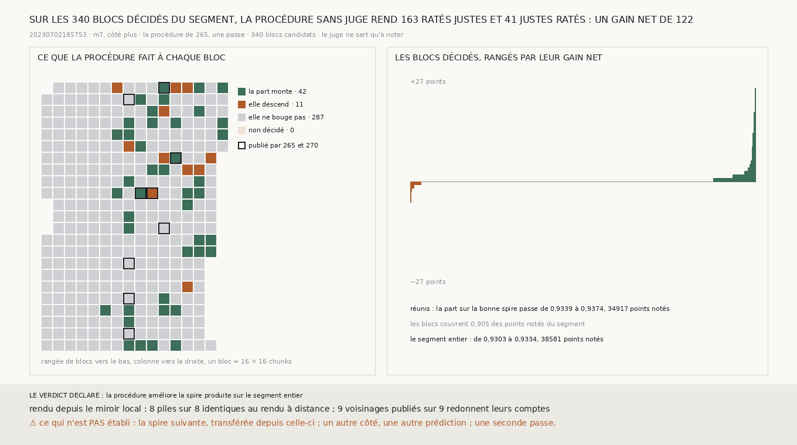

# `275` — La procédure sans juge de `265` tient-elle sur le segment entier ? Oui : sur les 340 blocs candidats, elle rend 163 ratés justes pour 41 justes ratés, un gain net de 122

*`265` a donné une procédure qui corrige la spire produite sans juge : l'ancre prise chez les voisins, la décision de `264`,
une passe. Elle n'avait tourné que sur neuf des 340 blocs que `257` admet, deux choisis et sept pris à pas réguliers par
`263`. Réunis, ces neuf blocs donnaient un gain net de 30 (`274`). Ce qui remplace l'humain qui corrige le transfert doit
corriger partout où il passe, pas seulement là où on l'a regardé travailler. Cette tranche fait tourner la même procédure,
sans rien y changer, sur les 340.*

## 0. Pourquoi cette tranche

C'est `R4-P95`. Le module est écrit avant qu'un seul bloc neuf ne soit rendu, et il déclare ses issues : si, sur tous les
blocs décidés réunis, les ratés rendus justes sont plus nombreux que les justes rendus ratés, la procédure améliore la spire
produite sur le segment entier ; sinon, non. Le juge ne sert qu'à noter.

## 1. Ce qui change dans le calcul, et les deux contrôles

La procédure ne change pas, mais la façon de la calculer, si.

- Un pas de fenêtre en fenêtre ne dépend que des deux chunks de sa couture. Il est donc calculé une fois pour le segment, bloc
  par bloc, et la marche d'un voisinage est assemblée à partir des pas dont les deux chunks sont dans ses blocs. Sur les neuf
  voisinages publiés par `265` et `270`, les comptes sont redevenus les publiés, tous les neuf.
- Les piles sont rendues depuis un miroir local qui ne contient que les chunks qu'elles lisent. Ces chunks sont estimés à
  partir de la surface, avec une marge de 32 voxels, et téléchargés une seule fois. À distance, un bloc tirait environ 6 Go
  pour lire ses chunks. Un chunk que l'estimation oublierait se lirait comme du vide, sans erreur. C'est pour cela que huit
  piles déjà rendues à distance, les deux surfaces de quatre blocs, sont rendues à nouveau depuis le miroir à chaque
  lancement, dont celui de la mesure. Les huit sont identiques voxel pour voxel.

Si l'un de ces deux contrôles avait échoué, la mesure était indécidable.

## 2. Réunis

| réunis | blocs | ratés rendus justes | justes rendus ratés | gain net |
|---|---|---|---|---|
| **les 340** | **340** | **163** | **41** | **122** |
| les neuf publiés par `265` et `270` | 9 | 37 | 7 | 30 |
| les 331 autres | 331 | 126 | 34 | 92 |

Aucun bloc candidat n'est resté non décidé. La décision corrige 495 points. Sur les 34917 points notés des blocs, la part sur
la bonne spire passe de 0,9339 à 0,9374. La part monte sur 42 blocs, descend sur 11 et ne bouge pas sur 287. Les blocs
couvrent 0,905 des points notés du segment. Sur le segment entier, 38581 points notés, la part passe de 0,9303 à 0,9334.

⭐⭐⭐⭐ **Sur les 340 blocs candidats du segment, la procédure sans juge de `265` rend 163 ratés justes pour 41 justes ratés :
un gain net de 122, dont 92 hors des neuf blocs où elle avait été regardée** (`R4-F456`).

## 3. Bloc par bloc

Les blocs dont le gain net vaut au moins 3 en valeur absolue :

| bloc | points notés | avant | après | points corrigés | ratés rendus justes | justes rendus ratés | gain net |
|---|---|---|---|---|---|---|---|
| `(16, 256)` | 114 | 0,5877 | 0,8246 | 43 | 30 | 3 | 27 |
| le bloc de `257`, choisi | 154 | 0,474 | 0,6039 | 22 | 20 | 0 | 20 |
| le bloc de `259`, choisi | 151 | 0,6225 | 0,7152 | 29 | 15 | 1 | 14 |
| `(64, 160)` | 150 | 0,7467 | 0,8133 | 19 | 10 | 0 | 10 |
| `(320, 176)` | 169 | 0,7456 | 0,7811 | 6 | 6 | 0 | 6 |
| `(320, 192)` | 169 | 0,858 | 0,8876 | 9 | 5 | 0 | 5 |
| `(240, 240)` | 169 | 0,8462 | 0,8698 | 4 | 4 | 0 | 4 |
| `(336, 128)` | 169 | 0,929 | 0,9527 | 5 | 4 | 0 | 4 |
| `(48, 160)` | 166 | 0,8735 | 0,8916 | 6 | 4 | 1 | 3 |
| `(176, 208)` | 149 | 0,9597 | 0,9799 | 4 | 3 | 0 | 3 |
| `(240, 224)` | 145 | 0,8828 | 0,9034 | 3 | 3 | 0 | 3 |
| `(16, 192)` | 159 | 0,9371 | 0,9182 | 4 | 0 | 3 | −3 |
| `(160, 160)` | 169 | 0,8225 | 0,787 | 6 | 0 | 6 | −6 |

Quatre blocs portent 71 des 122 : `(16, 256)`, que personne n'avait regardé et où la part gagne le plus, les deux blocs
choisis, et `(64, 160)`. Sur `(160, 160)`, la procédure rend 6 justes ratés, comme dans `265` : la garde de `274` n'est pas appliquée ici.

## 4. Le verdict

**LA PROCÉDURE AMÉLIORE LA SPIRE PRODUITE SUR LE SEGMENT ENTIER.**

La spire produite corrigée sur tout le segment est enregistrée
(`data/spire_voisine/transfert_suivante_corrige_265_20230702185753_m7_du_cote_plus.npy`). C'est elle qu'une chaîne
transférerait ensuite.

## 5. Ce que cette tranche ne dit pas

- ⚠⚠ La spire suivante, transférée depuis celle-ci.
- ⚠ Un autre côté, une autre prédiction, une seconde passe.
- ⚠ Pourquoi 11 blocs descendent. Sur le segment entier, le gain est de trois millièmes de la part : la procédure corrige
  peu de points, et la plupart des points notés étaient déjà justes.

## 6. Les sondes, et ce que le rendu a coûté

Une batterie de **8** contrôles et une figure de **11**. Assemblés bloc par bloc, les pas redonnent au bit près la marche de
`les_pas_de_fenetre`, y compris sans le bloc du coin. Une table ne porte la couture de l'est que si son voisin est rendu. La
décision d'un bloc est celle de `265`, compte pour compte, et seuls les points corrigés changent. La réunion ne prend que les
blocs décidés. La reproduction exige les comptes publiés. Les issues s'excluent. Trois contrôles cassés exprès ont échoué :
une couture gardée vers un voisin hors du voisinage, la couture de l'est lue sans voisin rendu, un gain net nul compté comme
une amélioration. Dans la figure, deux contrôles cassés ont échoué : le gain d'un bloc pris comme ses seuls ratés rendus
justes, et un titre qui écrit un gain figé.

Le rendu du segment a demandé trois correctifs d'infrastructure, chacun avec ses contrôles :

- `vc_render_tifxyz` crée ses 109 couches avant de les remplir, et il saute une pile dont les 109 fichiers existent. Quatre
  piles coupées en route ont ainsi été déclarées rendues sans qu'un pixel change. Aucune n'a été lue par une mesure publiée.
  Elles sont mises de côté, rien n'est supprimé. Une pile n'est désormais complète qu'avec un témoin de fin, posé après un
  rendu allé au bout, et une pile inachevée est mise de côté avant d'être refaite.
- Une résolution de nom échouée a arrêté le rendu à sa huitième rangée de blocs. Un téléchargement est maintenant réessayé,
  et seule une absence que S3 déclare se lit comme un chunk vide.
- Un redémarrage de l'éditeur a tué le rendu au milieu d'une rangée. Les piles coupées ont été refaites, et le contrôle du
  miroir a été repassé à l'identique.

## 7. Ce qui reste

`R4-P95` reste ouverte. La procédure tient sur un segment en une passe, mais pas encore sur une boucle, et la chaîne ne
transfère pas encore la spire suivante depuis la spire corrigée.
