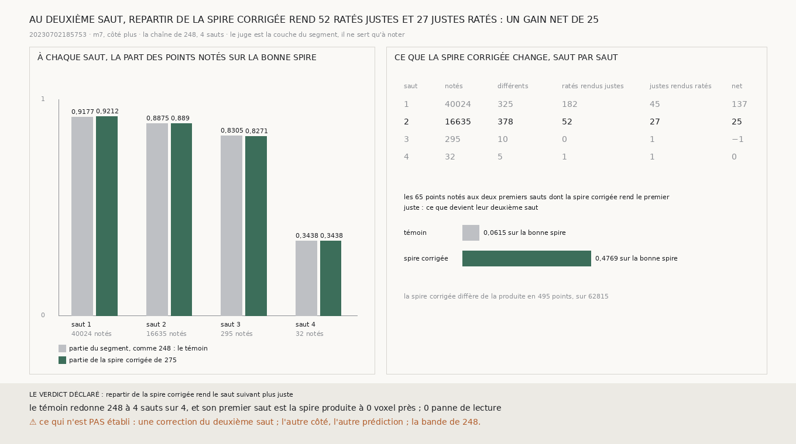

# `276` — Repartir de la spire corrigée rend-il le saut suivant plus juste ? Oui : au deuxième saut, la chaîne rend 52 ratés justes pour 27 justes ratés, un gain net de 25

*`275` a corrigé la spire produite sur les 340 blocs candidats du segment, sans juge. Mais `248` a montré qu'un saut raté est
définitif : la chaîne reste décalée d'une spire pour tous les sauts suivants. Une spire corrigée n'est un progrès pour le
déroulement que si la chaîne repart d'elle mieux que de la spire produite. Cette tranche fait repartir la chaîne de `248` de
la spire corrigée, et regarde le saut d'après.*

## 0. Pourquoi cette tranche

C'est `R4-P95` : ce qui remplace l'humain doit tenir de spire en spire, pas seulement sur la spire qu'il corrige. Le module est
écrit avant que la chaîne ne reparte de la spire corrigée, et il déclare ses issues au deuxième saut : si, parmi ses points
notés, les ratés que la chaîne partie de la spire corrigée rend justes sont plus nombreux que les justes qu'elle rend ratés,
repartir de la spire corrigée rend le saut suivant plus juste ; sinon, non.

## 1. La procédure et son contrôle

La chaîne de `248`, sans rien y changer, sur le segment `20230702185753`, la prédiction `m7`, du côté plus, quatre sauts, deux
fois. Le témoin part du segment, comme `248`, et son premier saut est la spire produite. L'autre part de la spire corrigée de
`275` : son premier saut n'est pas lu, il est la spire corrigée, et chaque saut suivant part de la surface que le précédent a
produite, le long de sa normale. Le juge est celui de `248`, la h-ième couche du segment le long de sa normale.

Le témoin redonne `248` aux quatre sauts, points notés et part sur la bonne spire, et son premier saut est la spire produite à
0 voxel près. Aucune lecture de la prédiction n'est tombée en panne.

## 2. Saut par saut

| saut | points notés | témoin | partie de la spire corrigée | ratés rendus justes | justes rendus ratés | gain net |
|---|---|---|---|---|---|---|
| 1 | 40024 | 0,9177 | 0,9212 | 182 | 45 | 137 |
| **2** | **16635** | **0,8875** | **0,889** | **52** | **27** | **25** |
| 3 | 295 | 0,8305 | 0,8271 | 0 | 1 | −1 |
| 4 | 32 | 0,3438 | 0,3438 | 1 | 1 | 0 |

La spire corrigée diffère de la spire produite en 495 points sur 62815. Au premier saut, le juge de `248` n'est pas celui de
`275` : il note d'autres points, et ses comptes ne sont pas ceux de `275`. La troisième et la quatrième couches du segment ne
notent presque aucun point.

⭐⭐⭐⭐ **Repartie de la spire corrigée, la chaîne de `248` rend au deuxième saut 52 ratés justes pour 27 justes ratés : un gain
net de 25. Des 65 points dont la spire corrigée rend le premier saut juste, 0,4769 retombent juste au deuxième, contre 0,0615
pour le témoin** (`R4-F457`).

Pour le témoin, un premier saut raté entraîne presque toujours le deuxième. La correction du premier saut en rattrape un peu
moins de la moitié au saut suivant.

## 3. Le verdict

**REPARTIR DE LA SPIRE CORRIGÉE REND LE SAUT SUIVANT PLUS JUSTE.**

Ce que la chaîne partie de la spire corrigée atteint au deuxième saut est enregistré
(`data/spire_voisine/deuxieme_saut_depuis_la_corrigee_265_20230702185753_m7_du_cote_plus.npy`).

## 4. Ce que cette tranche ne dit pas

- ⚠⚠ Pourquoi un peu plus de la moitié des premiers sauts rendus justes ne le restent pas au deuxième, et d'où viennent les 27
  justes rendus ratés. Le premier saut corrigé change la normale et le vote des voisins d'où part le deuxième.
- ⚠ Une correction du deuxième saut. L'autre côté, l'autre prédiction. La bande de `248`, sur laquelle `275` n'a rien corrigé.

## 5. Les sondes

Une batterie de **8** contrôles et une figure de **11**. Partie du premier pas qu'elle aurait fait, la chaîne redonne ses
sauts un à un, et le premier saut donné n'est pas lu. Un premier saut juste donné rend le deuxième juste, et un premier saut
qui a sauté une spire la fait sauter au deuxième aussi. Le bilan ne compte que les points notés, la reprise que les points
notés aux deux premiers sauts, et les issues se lisent au deuxième saut. Quatre contrôles cassés exprès ont échoué : la chaîne
qui ignore le premier saut donné, un point non noté compté, le verdict lu au premier saut, la reprise sans exiger le deuxième
saut noté. Le dernier passait d'abord : le contrôle ne l'exerçait pas, et il a été durci. Dans la figure, deux contrôles cassés
ont échoué : les barres de la spire corrigée tracées avec la part du témoin, et le titre lu au premier saut.

La chaîne de `248` accepte désormais un premier saut donné. Sa batterie passe toujours, avec ses **38** contrôles.

## 6. Ce qui reste

`R4-P95` reste ouverte. La correction passe d'un saut au suivant, mais pas entière : il reste à corriger le deuxième saut lui
aussi, et à voir si la chaîne tient ainsi plus loin que deux spires.
