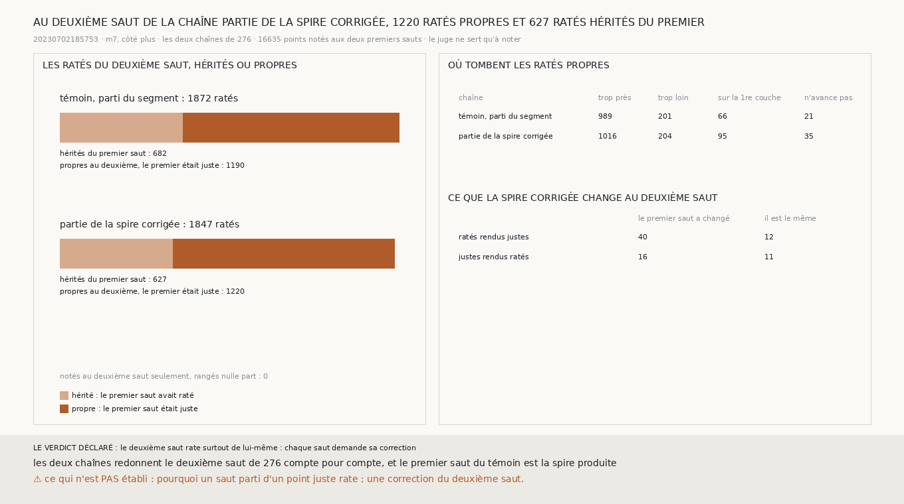

# `277` — Les ratés du deuxième saut viennent-ils du premier ? Surtout non : repartie de la spire corrigée, la chaîne rate 1220 points au deuxième saut dont le premier était juste, et 627 dont le premier avait raté

*`276` a fait repartir la chaîne de `248` de la spire corrigée de `275`. Au deuxième saut, elle rend 52 ratés justes pour 27
justes ratés. Mais elle rate encore 1847 des 16635 points notés. Si ces ratés viennent du premier saut, corriger le premier
suffit à la chaîne. S'ils viennent du deuxième saut lui-même, chaque saut demande sa propre correction. Cette tranche range
les ratés du deuxième saut selon ce qu'était le premier.*

## 0. Pourquoi cette tranche

C'est `R4-P95` : ce qui remplace l'humain doit savoir à quel saut corriger. Le module est écrit avant que les ratés ne soient
rangés. Sur les points notés aux deux premiers sauts, par le juge de `248`, un raté du deuxième saut est hérité si le premier
saut de la même chaîne avait raté, propre s'il était juste. Les issues portent sur la chaîne partie de la spire corrigée : si
les ratés propres sont plus nombreux que les hérités, le deuxième saut rate surtout de lui-même, et chaque saut demande sa
correction ; sinon, il rate surtout parce que le premier a raté.

Les deux chaînes de `276` sont refaites telles quelles. Elles redonnent le deuxième saut de `276` compte pour compte, et le
premier saut du témoin est la spire produite.

## 1. Hérités ou propres

| chaîne | ratés du deuxième saut | hérités | propres |
|---|---|---|---|
| le témoin, parti du segment | 1872 | 682 | 1190 |
| **partie de la spire corrigée** | **1847** | **627** | **1220** |

Les 16635 points notés au deuxième saut le sont tous au premier. La spire corrigée retire 55 ratés hérités au deuxième saut, et
en ajoute 30 propres.

⭐⭐⭐⭐ **Repartie de la spire corrigée, la chaîne rate au deuxième saut 1220 points dont le premier saut était juste, et 627
dont il avait raté : le deuxième saut rate surtout de lui-même** (`R4-F458`).

## 2. Où tombent les ratés propres

| chaîne | trop près | trop loin | retombés sur la première couche | d'un saut qui n'avance pas |
|---|---|---|---|---|
| le témoin | 989 | 201 | 66 | 21 |
| partie de la spire corrigée | 1016 | 204 | 95 | 35 |

La plupart des ratés propres tombent trop près de la deuxième couche, sans retomber sur la première.

Au deuxième saut, la spire corrigée rend juste 52 ratés : 40 dont le premier saut a changé, 12 dont il est le même. Elle rend
ratés 27 justes : 16 dont le premier saut a changé, 11 dont il est le même. Un premier saut inchangé change le deuxième par ses
voisins, qui donnent la normale et le vote.

## 3. Le verdict

**LE DEUXIÈME SAUT RATE SURTOUT DE LUI-MÊME : CHAQUE SAUT DEMANDE SA CORRECTION.**

## 4. Ce que cette tranche ne dit pas

- ⚠⚠ Si le juge a raison sur les ratés trop près. `248` publie que, au deuxième saut du témoin sur ce segment, 0,7205 des
  ratés trop près tombent là où les couches du segment sautent plus d'un pas et demi : le juge y a peut-être compté un tour que
  le segment n'a pas tracé. Cette tranche ne range pas les ratés propres selon ce critère.
- ⚠ Pourquoi un saut parti d'un point juste rate. Une correction du deuxième saut. Un côté, une prédiction.

## 5. Les sondes

Une batterie de **6** contrôles et une figure de **11**. Un raté est hérité si le premier saut a raté, propre sinon, sur les
seuls points notés aux deux sauts. Un point noté au deuxième saut seulement n'est rangé nulle part, mais il est compté. Un raté
propre resté sur la première couche est trop près et d'un saut qui n'avance pas. Les changements du deuxième saut sont rangés
selon que le premier a changé, et les issues s'excluent. Quatre contrôles cassés exprès ont échoué : hérité et propre
inversés, les points notés au seul deuxième saut rangés, le verdict qui départage une égalité vers « de lui-même », les
changements rangés sans regarder le premier saut. Dans la figure, deux contrôles cassés ont échoué : les segments tracés dans
l'ordre inverse, et le titre lu sur le témoin.

La fonction de `276` qui fait les deux chaînes en est sortie pour servir ici. Refaite après ce découpage, la mesure de `276`
redonne son JSON publié à l'identique, hors sa durée.

## 6. Ce qui reste

`R4-P95` reste ouverte. Corriger le premier saut ne suffit pas à la chaîne : le deuxième saut doit être corrigé lui aussi, et
il faut d'abord savoir combien de ses ratés trop près sont des ratés du juge.
