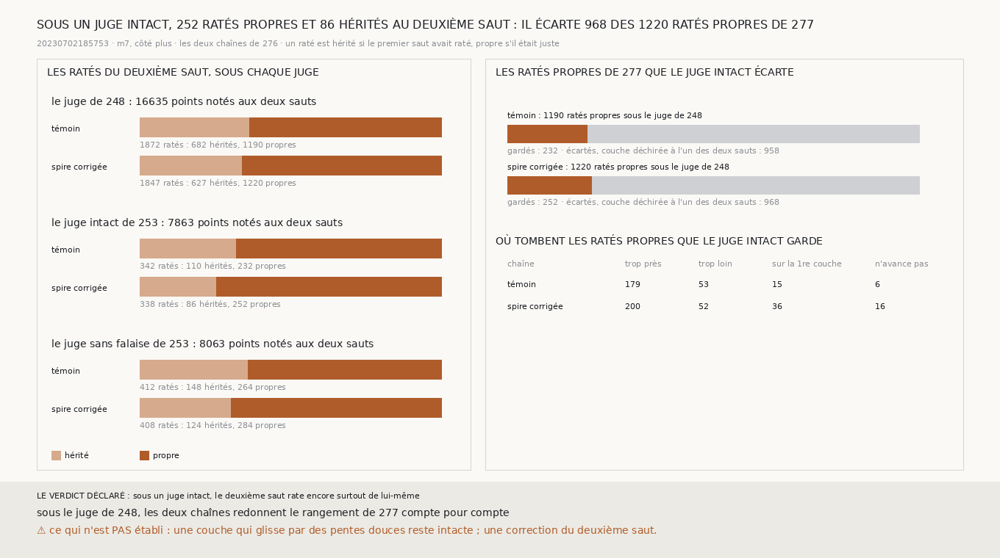

# `278` — Sous un juge qui ne se déchire pas, le deuxième saut rate-t-il encore de lui-même ? Oui : 252 ratés propres pour 86 hérités, mais ce juge écarte 968 des 1220 ratés propres de `277`

*`277` a rangé les ratés du deuxième saut de la chaîne partie de la spire corrigée : 1220 dont le premier saut était juste,
627 dont il avait raté. Il en a conclu que chaque saut demande sa correction. Mais ces ratés propres tombent surtout trop près,
et `248` publie que la plupart des ratés trop près du deuxième saut tombent là où les couches du segment sautent plus d'un pas
et demi. D'après `252`, c'est là que la couche du juge se déchire. Cette tranche rejuge le rangement de `277` avec le juge
intact de `253`.*

## 0. Pourquoi cette tranche

C'est `R4-P95`. Si les ratés propres de `277` sont surtout des déchirures du juge, sa conclusion ne tient pas. Le module est
écrit avant le rejugement. Le juge intact est celui que `253` a déclaré avant sa propre mesure : au saut h, un point n'est noté
que si la h-ième couche du segment existe en face de lui, n'est bordée d'aucune falaise et tient à la plus grande pièce de la
couche. Les issues portent sur la chaîne partie de la spire corrigée, sous ce juge : si les ratés propres sont plus nombreux que
les hérités, le deuxième saut rate encore surtout de lui-même ; sinon, il rate surtout parce que le premier a raté.

Les deux chaînes de `276` sont refaites telles quelles. Sous le juge de `248`, elles redonnent le rangement de `277` compte pour
compte.

## 1. Sous chaque juge

| juge | points notés aux deux sauts | chaîne | ratés du deuxième saut | hérités | propres |
|---|---|---|---|---|---|
| le juge de `248` | 16635 | le témoin | 1872 | 682 | 1190 |
| le juge de `248` | 16635 | partie de la spire corrigée | 1847 | 627 | 1220 |
| **le juge intact de `253`** | **7863** | le témoin | 342 | 110 | 232 |
| **le juge intact de `253`** | **7863** | **partie de la spire corrigée** | **338** | **86** | **252** |
| le juge sans falaise de `253` | 8063 | le témoin | 412 | 148 | 264 |
| le juge sans falaise de `253` | 8063 | partie de la spire corrigée | 408 | 124 | 284 |

⭐⭐⭐⭐ **Sous le juge intact de `253`, la chaîne partie de la spire corrigée rate au deuxième saut 252 points dont le premier
saut était juste et 86 dont il avait raté. Ce juge écarte 968 des 1220 ratés propres de `277`** (`R4-F459`).

Le juge intact écarte aussi 958 des 1190 ratés propres du témoin. La plupart des ratés propres de `277` sont donc là où la
couche du juge se déchire à l'un des deux sauts, mais ceux qui restent sont encore plus nombreux que les hérités.

## 2. Ce que la spire corrigée ajoute

Sous le juge intact, la spire corrigée retire 24 ratés hérités et ajoute 20 ratés propres. Parmi ses ratés propres, 36
retombent sur la première couche, contre 15 pour le témoin, et 16 viennent d'un saut qui n'avance pas, contre 6.

## 3. Le verdict

**SOUS UN JUGE INTACT, LE DEUXIÈME SAUT RATE ENCORE SURTOUT DE LUI-MÊME.**

## 4. Ce que cette tranche ne dit pas

- ⚠⚠ Pourquoi, partie d'un point corrigé, la chaîne retombe plus souvent sur la couche d'où elle part.
- ⚠ Une couche qui glisse d'une spire à l'autre par des pentes douces reste intacte, et le juge intact la garde. Un point juste
  dont le juge se déchire est écarté. Une correction du deuxième saut.

## 5. Les sondes

Une batterie de **5** contrôles et une figure de **11**. Un point que le juge ne note pas n'est ni juste ni raté. Un raté propre
écarté à l'un des deux sauts est compté écarté. Le juge intact écarte les bords d'une déchirure et la petite pièce au-delà. Les
issues se lisent sous le juge intact. Trois contrôles cassés exprès ont échoué : le juge ignoré, un raté écarté au seul deuxième
saut, le verdict lu sous le juge de `248`. Dans la figure, deux contrôles cassés ont échoué : les barres d'un juge tracées avec
les comptes d'un autre, et le titre lu sous le juge de `248`.

## 6. Ce qui reste

`R4-P95` reste ouverte. Même sous un juge intact, chaque saut demande sa correction. Et la spire corrigée ajoute des ratés
propres d'un genre précis : des sauts qui retombent sur la couche d'où ils partent.
