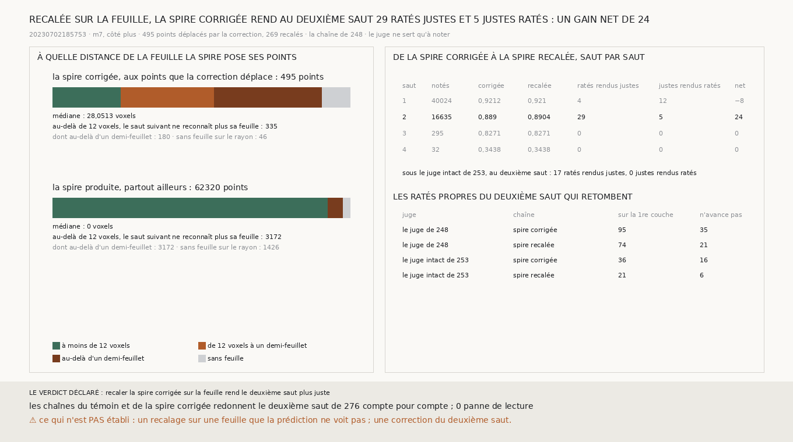

# `279` — Recaler la spire corrigée sur la feuille rend-il le deuxième saut plus juste ? Oui : au deuxième saut, 29 ratés rendus justes pour 5 justes rendus ratés, un gain net de 24

*`278` a montré que la spire corrigée ajoute au deuxième saut des ratés propres d'un genre précis : des sauts qui retombent
sur la couche d'où ils partent. La correction de `265` pousse un point de l'écart que lit la marche, et cet écart n'est pas
celui d'une feuille. Le point corrigé tombe sur la bonne spire, mais pas sur la feuille. Or le saut suivant de `247` ne
reconnaît sa feuille de départ que si elle est à moins de 12 voxels. Au-delà, il la prend pour la suivante et retombe sur
elle. Cette tranche recale la spire corrigée sur la feuille avant de faire repartir la chaîne.*

## 0. Pourquoi cette tranche

C'est `R4-P95`. Le transfert de `247` pose toujours ses points sur une feuille : le vote prend la feuille la plus proche de sa
cible, à moins d'un demi-feuillet. La correction ne le fait pas. Le recalage est déclaré avant la mesure. Pour chaque point que
la correction a déplacé, on prend, parmi les centres des plages de feuille que `m7` voit sur le rayon du premier saut, le plus
proche de la spire corrigée s'il en est à moins d'un demi-feuillet ; sinon le point garde la spire corrigée. C'est la règle du
vote de `247`, appliquée une fois et sans consensus.

Les issues portent sur le deuxième saut. Si, parmi ses points notés, les ratés que la spire recalée rend justes sont plus
nombreux que les justes qu'elle rend ratés, recaler la spire corrigée sur la feuille rend le deuxième saut plus juste ; sinon,
non. Les chaînes du témoin et de la spire corrigée redonnent le deuxième saut de `276` compte pour compte. Aucune lecture n'est
tombée en panne.

## 1. Où la correction pose ses points

| spire | points | médiane de la distance à la feuille | au-delà de 12 voxels | au-delà d'un demi-feuillet | sans feuille sur le rayon |
|---|---|---|---|---|---|
| la spire corrigée, aux points que la correction déplace | 495 | 28,0513 | 335 | 180 | 46 |
| la spire produite, partout ailleurs | 62320 | 0 | 3172 | 3172 | 1426 |

La correction pose la plupart de ses points là où le saut suivant ne reconnaît plus leur feuille. Le recalage en déplace 269.

## 2. Saut par saut

| saut | points notés | partie de la spire corrigée | partie de la spire recalée | ratés rendus justes | justes rendus ratés | gain net |
|---|---|---|---|---|---|---|
| 1 | 40024 | 0,9212 | 0,921 | 4 | 12 | −8 |
| **2** | **16635** | **0,889** | **0,8904** | **29** | **5** | **24** |
| 3 | 295 | 0,8271 | 0,8271 | 0 | 0 | 0 |
| 4 | 32 | 0,3438 | 0,3438 | 0 | 0 | 0 |

Sous le juge intact de `253`, le deuxième saut compte 17 ratés rendus justes et 0 juste rendu raté. Parmi ses ratés propres,
ceux qui retombent sur la première couche passent de 36 à 21, et ceux d'un saut qui n'avance pas de 16 à 6. Le témoin en a 15
et 6.

⭐⭐⭐⭐ **La correction pose 335 des 495 points qu'elle déplace à plus de 12 voxels de leur feuille. Recalée sur la feuille, la
spire corrigée rend au deuxième saut 29 ratés justes pour 5 justes ratés : un gain net de 24** (`R4-F460`).

Au premier saut, le recalage coûte 12 justes pour 4 ratés rendus justes.

## 3. Le verdict

**RECALER LA SPIRE CORRIGÉE SUR LA FEUILLE REND LE DEUXIÈME SAUT PLUS JUSTE.**

## 4. Ce que cette tranche ne dit pas

- ⚠⚠ Où tombent les 12 points que le recalage rend ratés au premier saut.
- ⚠ Un recalage sur une feuille que la prédiction ne voit pas : 46 points déplacés n'ont aucune feuille sur leur rayon. Une
  correction du deuxième saut. Un autre côté, une autre prédiction.

## 5. Les sondes

Une batterie de **6** contrôles et une figure de **11**. La feuille la plus proche est prise sur le rayon, et elle manque là où
le rayon n'en voit aucune. Un point déplacé va sur elle s'il en est à moins d'un demi-feuillet, et garde sa place sinon. Un
point que la correction n'a pas déplacé ne bouge pas. La distance compte les points sans feuille et ceux au-delà de 12 voxels.
Le bilan nomme chaque spire à sa place, et les issues se lisent au deuxième saut. Cinq contrôles cassés exprès ont échoué : le
recalage sans la borne du demi-feuillet, le recalage de tous les points, la reconnaissance comptée au demi-feuillet, le verdict
lu au premier saut, les deux spires échangées dans le bilan. Ce dernier contrôle passait d'abord, parce que sa fixture donnait
la même part aux deux spires ; il a été rendu dissymétrique. Dans la figure, deux contrôles cassés ont échoué : un segment de
distance compté sans retirer les points sans feuille, et le titre lu au premier saut.

## 6. Ce qui reste

`R4-P95` reste ouverte. Une correction doit finir sur une feuille, comme le transfert. Il reste à corriger le deuxième saut
lui-même.
