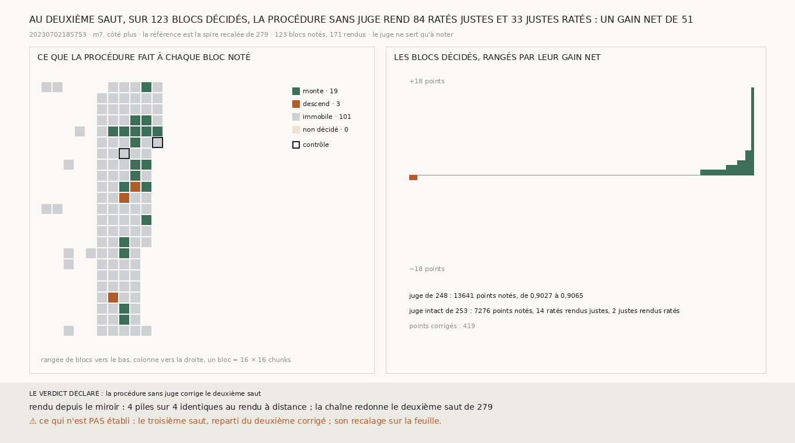

# `280` — La procédure sans juge de `265` corrige-t-elle le deuxième saut ? Oui : sur les 123 blocs notés du deuxième saut, elle rend 84 ratés justes pour 33 justes ratés, un gain net de 51

*`277` et `278` ont montré que le deuxième saut rate surtout de lui-même : même parti d'une spire corrigée, chaque saut
demande sa propre correction. `279` a recalé la spire corrigée sur la feuille, et la chaîne repartie de là rend un deuxième
saut plus juste. Cette tranche applique au deuxième saut la procédure de `265`, sans rien y changer. La référence est la
spire recalée, et la surface corrigée est le deuxième saut qui en part.*

## 0. Pourquoi cette tranche

C'est `R4-P95`. Ce qui remplace l'humain qui corrige le transfert doit corriger chaque saut, pas seulement le premier. Le
module est écrit avant qu'un seul bloc ne soit rendu, et il déclare ses issues. Si, sur tous les blocs décidés réunis, les
ratés rendus justes sont plus nombreux que les justes rendus ratés, la procédure corrige le deuxième saut ; sinon, non. La
mesure est indécidable si la chaîne ne redonne pas le deuxième saut de `279`, si le contrôle du miroir n'est pas identique,
ou s'il manque une pile. Le juge, la deuxième couche du segment, ne sert qu'à noter. Le juge intact de `253` est rapporté
à côté.

## 1. Ce qui change dans le calcul, et les contrôles

La procédure est celle de `275`, et seules ses deux surfaces changent : la spire recalée de `279` sert de référence, et le
deuxième saut qui en part est la surface corrigée. Avec ses surfaces par défaut, le module de `275` redonne toujours les
neuf voisinages publiés.

- Un bloc candidat de `257` est noté s'il porte au moins un point du juge du deuxième saut : **123** blocs. On rend les
  blocs notés et leurs voisins candidats en croix, soit **171** blocs et **342** piles.
- La chaîne repartie de la spire recalée redonne le deuxième saut de `279` compte pour compte : 16635 points notés,
  29 ratés rendus justes, 5 justes rendus ratés.
- Les deux blocs notés qui portent le plus de points, `(96, 256)` et `(112, 208)`, sont rendus à distance sur les deux
  surfaces, puis à nouveau depuis le miroir. Les quatre piles sont identiques voxel pour voxel.

Aucune pile ne manque, et aucun bloc noté n'est resté non décidé.

## 2. Réunis

| juge | blocs | points notés | avant | après | ratés rendus justes | justes rendus ratés | gain net |
|---|---|---|---|---|---|---|---|
| **le juge de `248`** | **123** | **13641** | **0,9027** | **0,9065** | **84** | **33** | **51** |
| le juge intact de `253` | 123 | 7276 | 0,9611 | 0,9628 | 14 | 2 | 12 |

La décision corrige 419 points. La part monte sur 19 blocs, descend sur 3 et ne bouge pas sur 101.
Parmi ces 101, il y a 3 blocs où le bilan ne note aucun point. Les blocs couvrent 0,82 des points notés du deuxième saut.

⭐⭐⭐⭐ **Au deuxième saut, la procédure sans juge de `265`, prise sur la spire recalée, rend 84 ratés justes pour 33 justes
ratés sur 123 blocs : un gain net de 51. Sous le juge intact, 14 pour 2** (`R4-F461`).

## 3. Bloc par bloc

Les blocs dont le gain net vaut au moins 3 en valeur absolue :

| bloc | points notés | avant | après | points corrigés | ratés rendus justes | justes rendus ratés | gain net |
|---|---|---|---|---|---|---|---|
| `(16, 240)` | 167 | 0,7665 | 0,8743 | 31 | 21 | 3 | 18 |
| `(128, 224)` | 135 | 0,5481 | 0,5852 | 26 | 5 | 0 | 5 |
| `(80, 208)` | 146 | 0,7397 | 0,774 | 12 | 6 | 1 | 5 |
| `(64, 240)` | 135 | 0,7185 | 0,7407 | 14 | 3 | 0 | 3 |
| `(80, 240)` | 114 | 0,7368 | 0,7632 | 35 | 4 | 1 | 3 |
| `(128, 240)` | 161 | 0,6584 | 0,677 | 3 | 3 | 0 | 3 |

Les six portent 37 des 51. Aucun bloc ne perd plus d'un point : chacun des trois qui descendent rend un juste raté de plus
que de ratés justes.

## 4. Le verdict

**LA PROCÉDURE SANS JUGE CORRIGE LE DEUXIÈME SAUT.**

Le deuxième saut corrigé est enregistré
(`data/spire_voisine/deuxieme_saut_corrige_265_20230702185753_m7_du_cote_plus.npy`).

## 5. Ce que cette tranche ne dit pas

- ⚠⚠ Le troisième saut, reparti du deuxième saut corrigé. `279` a montré qu'une correction doit finir sur une feuille : ce
  deuxième saut corrigé n'est pas encore recalé.
- ⚠ Pourquoi la procédure rend ici 33 justes ratés pour 84 ratés justes, quand elle en rendait 41 pour 163 au premier
  saut (`275`).
- ⚠ Un autre côté, une autre prédiction, une seconde passe.

## 6. Les sondes, et ce que le rendu a coûté

Une batterie de **5** contrôles et une figure de **11**. Une surface lue point par point vaut −1 partout où l'un des trois
axes manque. Un bloc est noté s'il porte au moins un point du juge, et seulement lui. Les blocs à rendre sont le bloc noté et
ses voisins candidats en croix. Le contrôle prend les deux blocs notés qui portent le plus de points. Les issues s'excluent,
et la mesure est indécidable sans ses contrôles.

Quatre contrôles cassés exprès ont échoué : un bloc noté même sans point du juge, les voisins oubliés, le contrôle pris sur
les blocs les moins notés, un axe manquant gardé. Le premier passait d'abord : son test portait une clause toujours vraie,
et le point du juge tombait dans la fenêtre d'un voisin. La clause est retirée, et le point est posé au milieu de son bloc.
Dans la figure, deux contrôles cassés ont échoué : le gain d'un bloc pris comme ses seuls ratés rendus justes, et un titre
qui écrit un gain figé.

L'éditeur est tombé pendant le rendu. Le rendu tournait alors sans aucune borne : trois rendus à environ quatre cœurs
chacun, pour une charge de 22,7 sur 22 threads avec l'éditeur. Il a été relancé dans une unité systemd bornée en processeur
et en mémoire. Les piles complètes ont été gardées, et le contrôle du miroir était déjà identique.

## 7. Ce qui reste

`R4-P95` reste ouverte. Le premier et le deuxième saut se corrigent par la même procédure, chacun contre le saut d'avant
recalé. Il reste à recaler le deuxième saut corrigé, à faire repartir la chaîne de là, et à corriger le troisième saut.
