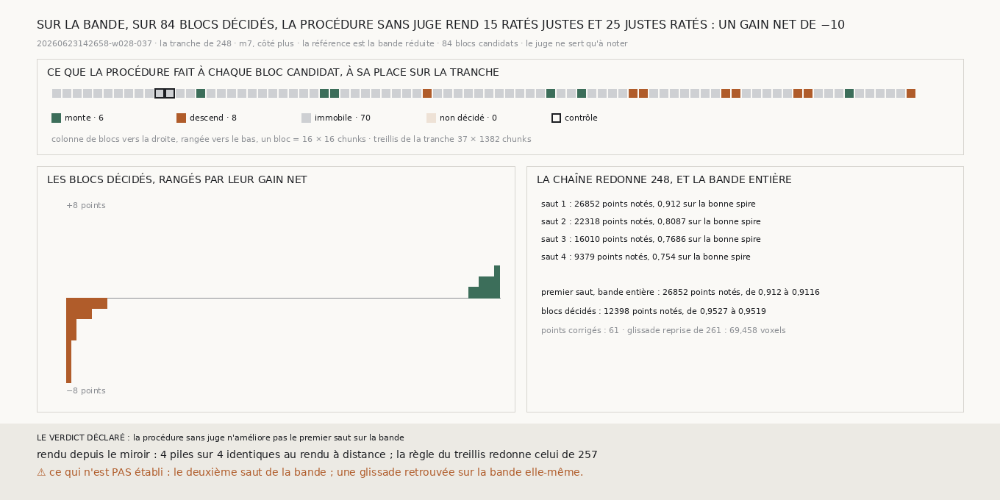

# `281` — La procédure sans juge de `265` tient-elle sur la bande `w028-037` ? Non : sur les 84 blocs candidats du premier saut, elle rend 15 ratés justes pour 25 justes ratés, un gain net de −10

*Sur le segment `20230702185753`, la procédure de `265` corrige le premier saut (`275`) puis le deuxième (`280`). Mais ce
segment ne sert plus de juge au-delà : ses couches notent 295 points au troisième saut et 32 au quatrième. La bande
`20260623142658-w028-037` trace dix spires d'un seul tenant, et c'est le juge de `248`. Avant d'y corriger le deuxième
saut, cette tranche demande si la procédure y corrige le premier. C'est la première fois qu'elle change de segment.*

## 0. Pourquoi cette tranche

C'est `R4-P95`. Ce qui remplace l'humain qui corrige le transfert doit corriger chaque saut, et il faut un juge pour le
voir faire au-delà du deuxième. Sur la tranche de `248`, côté plus, les couches de la bande notent 0,8794, 0,7309, 0,5243
et 0,3071 des points aux sauts 1 à 4. La bande a été tracée par d'autres, sans rien savoir de cette méthode.

Le module est écrit avant qu'une seule pile de la bande ne soit rendue, et il déclare ses issues. Sur tous les blocs décidés
réunis, si les ratés rendus justes sont plus nombreux que les justes rendus ratés, la procédure améliore le premier saut sur
la bande ; sinon, non. Trois cas rendent la mesure indécidable : la chaîne ne redonne pas `248`, la règle du treillis ne
redonne pas celui de `257`, ou le contrôle du miroir n'est pas identique. Il ne doit non plus manquer aucune pile. Le juge,
la première couche de la bande, ne sert qu'à noter.

## 1. Ce qui change dans le calcul, et les contrôles

La procédure est celle de `275`, sans rien y changer : les blocs candidats de `257`, l'ancre prise sur les voisins, la
décision de `264`, une passe, les pas calculés bloc par bloc. La tranche et la chaîne sont celles de `248` (les rangées de
0,45 à 0,55, toutes les colonnes, `m7`, côté plus). Le premier saut de cette chaîne est la surface corrigée ; la bande
réduite à la maille de la chaîne est la référence. La glissade de la décision est celle que `261` a retrouvée sur le
segment `20230702185753`, **69,458** voxels, reprise telle quelle.

- La chaîne redonne `248` saut par saut, compte pour compte : 26852, 22318, 16010 et 9379 points notés.
- Le treillis des chunks est celui du volume que le rendu produit : la grille de la tranche (232 × 8840), au pas de sa
  grille (20 voxels), coupée en chunks de 128, soit 37 × 1382 chunks. Sur le segment `20230702185753`, la même règle redonne
  le treillis que `257` lit dans le volume publié, 396 × 285.
- La tranche fait 37 chunks de haut : les **84** blocs candidats sont tous sur la rangée de blocs 16. On les rend tous, soit
  **168** piles.
- Les deux blocs candidats qui portent le plus de points notés, `(16, 176)` et `(16, 192)`, sont rendus à distance sur les
  deux surfaces, puis à nouveau depuis le miroir. Les quatre piles sont identiques voxel pour voxel.

Aucune pile ne manque, aucun bloc n'est resté non décidé, et la lecture n'a connu aucune panne.

## 2. Réunis

| juge | blocs | points notés | avant | après | ratés rendus justes | justes rendus ratés | gain net |
|---|---|---|---|---|---|---|---|
| **la première couche de la bande** | **84** | **12398** | **0,9527** | **0,9519** | **15** | **25** | **−10** |

La décision corrige 61 points, sur 17 blocs. La part monte sur 6 blocs, descend sur 8 et ne bouge pas sur 70. Parmi ces 70,
il y a 9 blocs où le bilan ne note aucun point. Les blocs couvrent 0,4617 des points notés du premier saut de la bande. Sur
la bande entière, la part passe de 0,912 à 0,9116.

⭐⭐⭐⭐ **Sur la bande `w028-037`, la procédure sans juge de `265`, glissade de `261` comprise, rend au premier saut 15 ratés
justes pour 25 justes ratés sur 84 blocs : un gain net de −10** (`R4-F462`).

## 3. Bloc par bloc

Les blocs dont le gain net vaut au moins 3 en valeur absolue :

| bloc | points notés | avant | après | points corrigés | ratés rendus justes | justes rendus ratés | gain net |
|---|---|---|---|---|---|---|---|
| `(16, 928)` | 167 | 0,8144 | 0,7665 | 17 | 1 | 9 | −8 |
| `(16, 1344)` | 156 | 0,8718 | 0,8462 | 4 | 0 | 4 | −4 |
| `(16, 1248)` | 169 | 0,9172 | 0,9349 | 4 | 3 | 0 | 3 |

Les trois portent −9 des −10. Le bloc `(16, 928)` porte à lui seul −8 : sur ses 17 points corrigés, la décision rend 9 justes
ratés pour 1 raté juste.

## 4. Le verdict

**LA PROCÉDURE SANS JUGE N'AMÉLIORE PAS LE PREMIER SAUT SUR LA BANDE.**

Le premier saut corrigé est enregistré
(`data/spire_voisine/premier_saut_corrige_265_20260623142658-w028-037_m7_du_cote_plus.npy`).

## 5. Ce que cette tranche ne dit pas

- ⚠⚠ Pourquoi. La glissade est celle de `261`, retrouvée sur un autre segment ; une glissade retrouvée sur la bande
  elle-même n'est pas établie. La bande part plus haut, 0,9527 sur ses blocs contre 0,9339 sur ceux de `275`, et la décision
  y corrige 61 points sur 84 blocs, quand elle en corrigeait 495 sur 340 au premier saut du segment `20230702185753`.
  Aucun de ces écarts n'est établi comme la cause.
- ⚠ Si un gain net de −10, dont −8 sur un seul bloc, se distingue de zéro : le module comparait les deux comptes, sans seuil.
- ⚠ Les 0,54 des points notés du premier saut qui tombent hors des blocs candidats : ce que la procédure y ferait n'est pas
  mesuré.
- ⚠ Le deuxième saut de la bande, un autre côté, une autre prédiction.

## 6. Les sondes, et ce que le rendu a coûté

Une batterie de **8** contrôles et une figure de **11**. La tranche garde les rangées de `248`. Le treillis compte le dernier
chunk entamé. La chaîne refaite n'est reproduite que si ses points notés et sa part égalent `248` à chaque saut. Une surface
lue point par point vaut −1 là où un axe manque. Les issues s'excluent, et la mesure est indécidable sans ses contrôles.

Quatre contrôles cassés exprès ont échoué : le treillis compté par division tronquée, la tranche décalée d'une rangée, la
reproduction qui ignore les points notés, un gain nul compté comme une amélioration. Dans la figure, deux contrôles cassés ont
échoué : le gain d'un bloc pris comme ses seuls ratés rendus justes, et un titre qui écrit un gain figé.

Le rendu et la mesure ont tourné dans des unités systemd bornées en processeur et en mémoire. Le miroir de la rangée de
blocs compte 21377 chunks, dont 19306 téléchargés : 40,5 Go en 1158 s, à 35 Mo/s. Les 164 piles hors contrôle ont été rendues en 2858 s depuis le début, sans échec.
La mesure finale, avec les 104 tables de pas qui restaient, a pris 573 s.

## 7. Ce qui reste

`R4-P95` reste ouverte. Sur le segment `20230702185753`, la même procédure corrige le premier et le deuxième saut ; sur la
bande, elle n'améliore pas le premier. Avant de corriger le deuxième saut de la bande, il faut savoir ce qui change d'un
segment à l'autre, et d'abord retrouver la glissade sur la bande elle-même.
