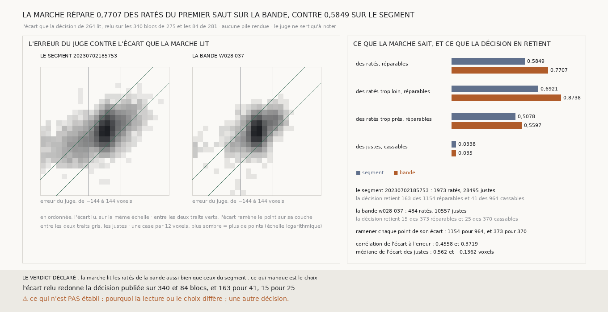

# `282` — Sur la bande `w028-037`, la marche lit-elle les ratés du premier saut comme sur le segment ? Oui : elle en répare 0,7707, contre 0,5849 sur le segment. Ce qui manque est le choix : la décision retient 15 des 373 ratés réparables, et 25 des 370 justes cassables

*`281` a trouvé que la procédure de `265` n'améliore pas le premier saut de la bande (15 ratés justes pour 25 justes ratés),
quand elle l'améliore sur le segment `20230702185753` (163 pour 41, `275`). La procédure a deux étages : la marche lit un
écart, et la décision de `264` choisit les points à ramener de cet écart. Cette tranche les sépare sans rien rendre : elle
relit l'écart de chaque point sur les blocs de `275` et de `281`, et demande au juge ce que cet écart ferait s'il était
appliqué.*

## 0. Pourquoi cette tranche

C'est `R4-P95`. Un point que le juge dit raté est réparable si l'écart lu le ramène à moins d'un demi-feuillet de sa couche ;
un point juste est cassable si l'écart lu l'en éloigne d'un demi-feuillet ou plus. Ces deux parts ne dépendent pas de la
décision : elles disent ce que la marche sait. Le module est écrit avant la mesure, et il déclare ses issues. Si la part des
ratés réparables est, sur la bande, au moins celle du segment, la marche lit les ratés de la bande aussi bien, et ce qui
manque est le choix ; sinon, elle les lit moins bien. La mesure est indécidable si l'écart relu ne redonne pas la décision
publiée.

## 1. Ce qui est lu, et les contrôles

Aucune pile n'est rendue et aucune table de pas n'est refaite. L'écart est celui que la décision lit, calculé comme `265` le
calcule : la marche d'un seul tenant sur le bloc et ses voisins candidats, pour les deux surfaces, leur différence, moins
l'ancre, portée aux points de la maille. Chaque surface est notée par le juge qui a noté sa procédure : les deux juges de
`275` sur le segment, la première couche de la bande sur la bande.

- Sur chacun des **340** blocs du segment et des **84** blocs de la bande, la décision de `264`, prise sur l'écart relu,
  redonne les points corrigés publiés.
- Réunis, les réparables et les cassables qu'elle retient redonnent les ratés rendus justes et les justes rendus ratés
  publiés : 163 et 41 sur le segment, 15 et 25 sur la bande.

L'écart est lu sur 30468 points notés du segment et 11041 de la bande.

## 2. Ce que la marche sait

| | le segment `20230702185753` | la bande `w028-037` |
|---|---|---|
| ratés, justes | 1973, 28495 | 484, 10557 |
| **des ratés, réparables** | **0,5849** | **0,7707** |
| des ratés trop loin, réparables | 0,6921 | 0,8738 |
| des ratés trop près, réparables | 0,5078 | 0,5597 |
| des justes, cassables | 0,0338 | 0,035 |
| corrélation de l'écart à l'erreur | 0,4558 | 0,3719 |
| médiane de l'écart des justes | 0,562 voxel | −0,1362 voxel |

⭐⭐⭐⭐ **Sur la bande, l'écart que la marche lit répare 0,7707 des ratés du premier saut, contre 0,5849 sur le segment, et
casse une part des justes pareille, 0,035 contre 0,0338. Mais la décision n'en retient que 15 des 373 réparables, pour 25 des
370 cassables** (`R4-F463`).

## 3. Ce que la décision en retient

| | réparables | retenus | cassables | retenus |
|---|---|---|---|---|
| le segment | 1154 | 163, soit 0,1412 | 964 | 41, soit 0,0425 |
| la bande | 373 | 15, soit 0,0402 | 370 | 25, soit 0,0676 |

Sur le segment, la décision retient les réparables plus souvent que les cassables. Sur la bande, c'est l'inverse.

Ramener chaque point de son écart rendrait 1154 ratés justes pour 964 justes ratés sur le segment, et 373 pour 370 sur la
bande. La bande a 22 fois plus de justes que de ratés : à une part cassable pareille à celle du segment, ses justes cassables
pèsent autant que ses ratés réparables.

## 4. Vu après coup, hors du verdict

L'histogramme de la figure montre où tombent les ratés. Sur la bande, 412 des 484 ratés sont à moins de 60 voxels de leur
couche, à la case de 12 voxels près ; sur le segment, 1220 des 1973. La médiane de l'écart des ratés réparables vaut 29,7271
voxels sur la bande et 32,5635 sur le segment, quand la décision cherche un glissement à 69,458 voxels, la glissade de `261`.

## 5. Le verdict

**LA MARCHE LIT LES RATÉS DE LA BANDE AUSSI BIEN QUE CEUX DU SEGMENT : CE QUI MANQUE EST LE CHOIX.**

## 6. Ce que cette tranche ne dit pas

- ⚠⚠ Pourquoi la décision choisit mal sur la bande. Que les ratés y soient à moins d'un pas, quand la décision cherche des
  glissements d'un pas, est vu après coup et n'est pas établi comme la cause.
- ⚠ Un raté réparable n'est pas un glissement que la marche a vu : un raté à 40 voxels de sa couche est ramené par tout écart
  de 4 à 76 voxels du même côté. La part réparable dit ce que ferait l'écart, pas ce qu'il désigne.
- ⚠ Une décision qui choisirait mieux, le deuxième saut, un autre côté, une autre prédiction.

## 7. Les sondes

Une batterie de **11** contrôles et une figure de **11**. Un raté est réparable si l'écart le ramène à moins d'un
demi-feuillet, un juste cassable s'il l'en éloigne d'autant. Un point sans erreur notée ou sans écart lu ne compte pas. L'écart
relu redonne point pour point la décision de `275` sur des profondeurs tirées au hasard. Les issues s'excluent, et la mesure
est indécidable sans ses contrôles.

Quatre contrôles cassés exprès ont échoué : la réparation lue au signe opposé, les cassables comptés parmi les ratés, l'ancre
prise sur tout le voisinage bloc compris, une égalité comptée comme une lecture moins bonne. Dans la figure, trois contrôles
cassés ont échoué : la barre de la bande qui porte la part du segment, un titre qui écrit une part figée, une carte qui compte
ses cases au lieu de ses points.

L'histogramme a été ajouté au rapport avant tout résultat : la première mesure a été arrêtée avant d'avoir rien écrit, et le
journal de la mesure le garde. La mesure a pris 15,2 s, dans une unité systemd bornée.

## 8. Ce qui reste

`R4-P95` reste ouverte. Sur la bande, la marche lit les ratés, et c'est le choix de `264` qui ne les retient pas. La décision à
éprouver ensuite est une décision qui choisit sans le juge parmi des écarts de moins d'un pas.
