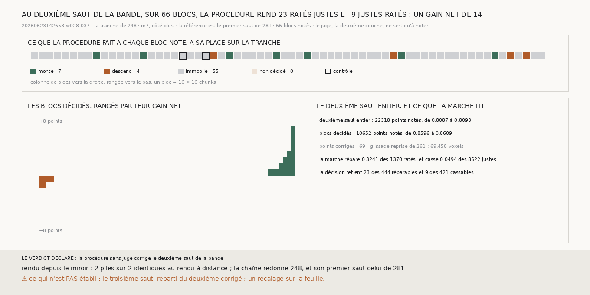

# `283` — La procédure sans juge de `265` corrige-t-elle le deuxième saut de la bande `w028-037` ? Oui : sur les 66 blocs notés, elle rend 23 ratés justes pour 9 justes ratés, un gain net de 14

*Sur la bande, la procédure de `265` n'améliore pas le premier saut (`281`). La marche y lit pourtant les ratés, et c'est la
décision qui ne les retient pas (`282`). Sur le segment `20230702185753`, la même procédure corrige le deuxième saut (`280`).
Cette tranche l'applique au deuxième saut de la bande, sans rien y changer. La référence est le premier saut que `281` a
rendu, non corrigé, et la surface corrigée est le deuxième saut qui en part.*

## 0. Pourquoi cette tranche

C'est `R4-P95`. Ce qui remplace l'humain doit corriger chaque saut, et la bande est le seul juge de ce dépôt qui note au-delà du
deuxième. Au deuxième saut, la chaîne de `248` sur la bande rate 0,1913 des points notés, dont 0,1452 trop près. Le module est
écrit avant qu'une seule pile du deuxième saut ne soit rendue, et il déclare ses issues. Sur les blocs décidés réunis, si les
ratés rendus justes sont plus nombreux que les justes rendus ratés, la procédure corrige le deuxième saut de la bande ; sinon,
non. Le juge, la deuxième couche de la bande, ne sert qu'à noter.

## 1. Ce qui change dans le calcul, et les contrôles

La procédure est celle de `280`. Seules ses deux surfaces changent : le premier saut de la bande est la référence, et le
deuxième saut qui en part est la surface corrigée. Une glissade que le premier saut a déjà se retrouve dans les deux marches, et
s'annule.

- Un bloc candidat de `281` est noté s'il porte au moins un point du juge du deuxième saut : **66** blocs sur 84. Avec leurs
  voisins candidats, **67** blocs sont rendus. Les piles du premier saut sont celles de `281`, et seules celles du deuxième
  saut sont neuves.
- La chaîne redonne `248` aux quatre sauts, compte pour compte, et son premier saut est, point pour point, celui dont `281` a
  rendu les piles.
- Les deux blocs notés qui portent le plus de points, `(16, 608)` et `(16, 656)`, sont rendus à distance sur la surface
  neuve, puis depuis le miroir. Les deux piles sont identiques voxel pour voxel.

Aucune pile ne manque, aucun bloc n'est resté non décidé, et la lecture n'a connu aucune panne.

## 2. Réunis

| juge | blocs | points notés | avant | après | ratés rendus justes | justes rendus ratés | gain net |
|---|---|---|---|---|---|---|---|
| **la deuxième couche de la bande** | **66** | **10652** | **0,8596** | **0,8609** | **23** | **9** | **14** |

La décision corrige 69 points, sur 16 blocs. La part monte sur 7 blocs, descend sur 4 et ne bouge pas sur 55. Les blocs
couvrent 0,4773 des points notés du deuxième saut. Sur le deuxième saut entier, la part passe de 0,8087 à 0,8093.

⭐⭐⭐⭐ **Au deuxième saut de la bande, la procédure sans juge de `265`, prise sur le premier saut, rend 23 ratés justes pour 9
justes ratés sur 66 blocs : un gain net de 14** (`R4-F464`).

## 3. Bloc par bloc

Les blocs dont le gain net vaut au moins 3 en valeur absolue :

| bloc | points notés | avant | après | points corrigés | ratés rendus justes | justes rendus ratés | gain net |
|---|---|---|---|---|---|---|---|
| `(16, 1056)` | 142 | 0,7746 | 0,831 | 15 | 10 | 2 | 8 |
| `(16, 800)` | 158 | 0,8418 | 0,8671 | 11 | 4 | 0 | 4 |
| `(16, 528)` | 167 | 0,8683 | 0,8862 | 3 | 3 | 0 | 3 |

Les trois portent 15 ; les 63 autres blocs réunis rendent −1. Aucun bloc ne perd plus de 2 points.

## 4. Ce que la marche lit, comme `282`

| | le premier saut (`282`) | le deuxième saut |
|---|---|---|
| ratés, justes | 484, 10557 | 1370, 8522 |
| des ratés, réparables | 0,7707 | 0,3241 |
| des ratés trop loin, réparables | 0,8738 | 0,4887 |
| des ratés trop près, réparables | 0,5597 | 0,2202 |
| des justes, cassables | 0,035 | 0,0494 |
| corrélation de l'écart à l'erreur | 0,3719 | 0,2343 |
| la décision retient | 15 des 373 réparables, 25 des 370 cassables | 23 des 444 réparables, 9 des 421 cassables |

Au deuxième saut, la marche répare une part plus faible des ratés qu'au premier, et moins encore des ratés trop près. Mais la
décision y retient plus de réparables que de cassables, quand elle faisait l'inverse au premier saut.

## 5. Le verdict

**LA PROCÉDURE SANS JUGE CORRIGE LE DEUXIÈME SAUT DE LA BANDE.**

Le deuxième saut corrigé est enregistré
(`data/spire_voisine/deuxieme_saut_de_la_bande_corrige_265_20260623142658-w028-037_m7_du_cote_plus.npy`).

## 6. Ce que cette tranche ne dit pas

- ⚠⚠ Si un gain net de 14 sur 10652 points notés se distingue de zéro : le module comparait les deux comptes, sans seuil, et trois
  blocs en portent 15.
- ⚠⚠ Le troisième saut, reparti du deuxième corrigé, et un recalage du deuxième saut corrigé sur la feuille.
- ⚠ Pourquoi la marche répare moins des ratés du deuxième saut, et surtout des ratés trop près.
- ⚠ Les 0,5227 des points notés du deuxième saut qui tombent hors des blocs notés.

## 7. Les sondes, et ce que le rendu a coûté

Une batterie de **4** contrôles et une figure de **11**. La référence est la surface produite de `281`, et elle vient d'abord.
Le premier saut refait est celui de `281` s'il l'égale point pour point, trous compris. La profondeur d'un saut se lit le long de
la normale de la bande, avec son signe. Les issues s'excluent, et la mesure est indécidable sans ses contrôles.

Trois contrôles cassés exprès ont échoué : les trous comblés par zéro avant la comparaison au premier saut de `281`, la
profondeur prise comme une distance sans signe, un gain nul compté comme une correction. Dans la figure, deux contrôles cassés
ont échoué : le gain d'un bloc pris comme ses seuls ratés rendus justes, et un titre qui écrit un gain figé.

WSL s'est arrêté pendant le rendu. Le calcul tournait alors sous une garde de 16 Go, avec trois rendus et six tables de pas en
parallèle, et deux validations d'autres dépôts tournaient en même temps. Le journal du noyau ne montre aucun manque de mémoire.
Le calcul a été relancé sous une garde de 7 Go et de six cœurs, une étape à la fois. Les 48 piles complètes ont été gardées, les
19 restantes rendues en 541,8 s, et les 49 tables de pas faites en 664,4 s. La mesure a pris 5,6 s.

## 8. Ce qui reste

`R4-P95` reste ouverte. Sur la bande, la procédure n'améliore pas le premier saut, mais elle corrige le deuxième. Il reste à
faire repartir la chaîne du deuxième saut corrigé et à corriger le troisième, que la troisième couche de la bande note.
