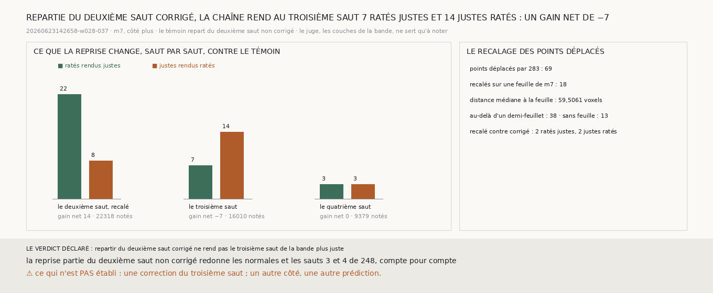

# `284` — Repartie du deuxième saut corrigé de la bande `w028-037`, la chaîne rend-elle le troisième saut plus juste ? Non : elle y rend 7 ratés justes pour 14 justes ratés, un gain net de −7

*`283` corrige le deuxième saut de la bande : 69 points déplacés, un gain net de 14. Une correction ne sert pourtant la chaîne que
si le saut suivant en profite. Cette tranche recale le deuxième saut corrigé sur la feuille, comme `279` l'a fait pour le premier
saut du segment `20230702185753`. Puis elle fait repartir la chaîne de `248` de là, pour le troisième et le quatrième saut, que
les couches de la bande notent.*

## 0. Pourquoi cette tranche

C'est `R4-P95`. Ce qui remplace l'humain doit corriger chaque saut, et chaque correction doit profiter au saut qui suit. Le module
est écrit avant que la chaîne ne reparte, et il déclare ses issues. Au troisième saut, si les ratés que la chaîne repartie rend
justes, là où le témoin les ratait, sont plus nombreux que les justes qu'elle rend ratés, repartir du deuxième saut corrigé rend
le troisième saut plus juste ; sinon, non. Le témoin est la même reprise, partie du deuxième saut non corrigé.

## 1. Ce qui est fait, et les contrôles

- Le recalage est celui de `279`. Chaque point que la correction a déplacé va sur le centre de plage de `m7` le plus proche, sur
  le rayon de la bande, s'il en est à moins d'un demi-feuillet ; sinon il garde sa profondeur corrigée.
- La position d'un point déplacé bouge le long de la normale de la bande, de ce que sa profondeur a bougé.
- Les normales de la surface d'où la chaîne repart sont recalculées comme `248` le fait après un saut.

Les contrôles tiennent :
- la chaîne redonne `248` aux quatre sauts ;
- partie du deuxième saut non corrigé, la reprise redonne les normales du deuxième saut de `248`, et ses troisième et quatrième
  sauts, compte pour compte ;
- le deuxième saut corrigé chargé déplace les 69 points de `283` ;
- la lecture n'a connu aucune panne.

## 2. Le deuxième saut, recalé

Le recalage ne déplace que **18** des 69 points. La correction pose les 69 points à une médiane de **59,5061** voxels de la feuille
la plus proche : 48 au-delà des 12 voxels où le saut suivant reconnaît sa feuille, 38 au-delà d'un demi-feuillet, et 13 sans
feuille sur le rayon.

| le deuxième saut | ratés rendus justes | justes rendus ratés | gain net |
|---|---|---|---|
| corrigé, contre le témoin | 23 | 9 | 14 |
| recalé, contre le témoin | 22 | 8 | 14 |
| recalé, contre corrigé | 2 | 2 | 0 |

## 3. Les sauts suivants

| saut | points notés | où les deux chaînes diffèrent | le témoin | la reprise | ratés rendus justes | justes rendus ratés | gain net |
|---|---|---|---|---|---|---|---|
| **3** | **16010** | 95 | **0,7686** | **0,7681** | **7** | **14** | **−7** |
| 4 | 9379 | 100 | 0,754 | 0,754 | 3 | 3 | 0 |

⭐⭐⭐⭐ **Repartie du deuxième saut corrigé et recalé de la bande, la chaîne rend au troisième saut 7 ratés justes pour 14 justes
ratés : un gain net de −7. Au quatrième, 3 pour 3** (`R4-F465`).

## 4. Le verdict

**REPARTIR DU DEUXIÈME SAUT CORRIGÉ NE REND PAS LE TROISIÈME SAUT DE LA BANDE PLUS JUSTE.**

Le deuxième saut recalé est enregistré
(`data/spire_voisine/deuxieme_saut_de_la_bande_corrige_recale_265_20260623142658-w028-037_m7_du_cote_plus.npy`).

## 5. Ce que cette tranche ne dit pas

- ⚠⚠ Pourquoi le troisième saut perd. La correction laisse 38 points à plus d'un demi-feuillet de toute feuille, et le recalage
  ne les touche pas ; ce n'est pas établi comme la cause.
- ⚠ Si un gain net de −7 se distingue de zéro : le module comparait les deux comptes, sans seuil.
- ⚠ Une correction du troisième saut, un autre côté, une autre prédiction.

## 6. Les sondes

Une batterie de **6** contrôles et une figure de **10**. Un point déplacé bouge le long de la normale de la bande, de ce que sa
profondeur a bougé, et une profondeur absente ne déplace rien. Les normales de la reprise sont celles que la chaîne calcule après
un saut. La reprise ne redonne `248` que si ses sauts, pris à leur rang, égalent les publiés. Les issues s'excluent, et la mesure
est indécidable sans ses contrôles.

Quatre contrôles cassés exprès ont échoué : le déplacement pris le long d'un autre axe, une profondeur absente comptée comme
zéro, un saut jugé contre la couche d'un autre rang, un gain nul compté comme un saut plus juste. Dans la figure, deux contrôles
cassés ont échoué : une barre qui porte un autre compte que le sien, et un titre qui écrit un gain figé.

La mesure a pris 31,9 s, dans une unité systemd bornée à 7 Go et à six cœurs.

## 7. Ce qui reste

`R4-P95` reste ouverte. Sur la bande, la procédure corrige le deuxième saut, mais la chaîne qui en repart rend le troisième saut
moins juste. La correction pose ses points loin de toute feuille, et le recalage n'en ramène que 18 sur 69.
