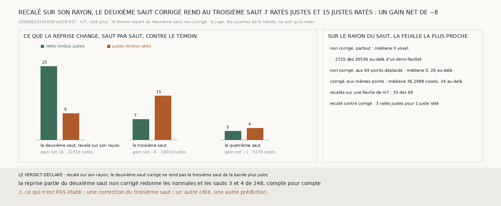

# `285` — Recalé sur le rayon d'où il part, le deuxième saut corrigé de la bande rend-il le troisième saut plus juste ? Non : 7 ratés justes pour 15 justes ratés, un gain net de −8

*`284` recale le deuxième saut corrigé de la bande sur les feuilles du rayon de la bande, parti d'elle le long de sa normale.
Or ce rayon est celui du premier saut. La chaîne lit le deuxième saut depuis chaque point du premier saut, le long de sa normale,
et c'est sur ce rayon-là qu'elle pose ses points sur une feuille. Cette tranche refait le recalage de `284` sur ce rayon, puis
fait repartir la chaîne pour le troisième et le quatrième saut.*

## 0. Pourquoi cette tranche

C'est `R4-P95`. Une correction doit finir sur une feuille (`279`), et c'est sur le rayon du saut que la chaîne cherche la sienne.
Le module est écrit avant ce recalage, et il déclare ses issues. Au troisième saut, si les ratés que la chaîne repartie rend
justes, là où le témoin les ratait, sont plus nombreux que les justes qu'elle rend ratés, le deuxième saut recalé sur son rayon
rend le troisième saut plus juste ; sinon, non.

## 1. Ce qui est fait, et les contrôles

Chaque point que la correction de `283` a déplacé est projeté sur le rayon de son saut. Il va sur le centre de plage de `m7` le
plus proche de cette projection, s'il en est à moins d'un demi-feuillet, et se pose alors sur le rayon ; sinon il garde sa
position corrigée. Le reste est `284`.

Les contrôles tiennent : la chaîne redonne `248` aux quatre sauts ; partie du deuxième saut non corrigé, la reprise redonne ses
normales et ses troisième et quatrième sauts ; le deuxième saut corrigé chargé déplace les 69 points de `283` ; la lecture n'a
connu aucune panne.

## 2. Sur le rayon du saut, la feuille la plus proche

| | points | médiane | au-delà d'un demi-feuillet | sans feuille sur le rayon |
|---|---|---|---|---|
| le deuxième saut non corrigé, partout | 30536 | 0 voxel | 2725 | 204 |
| le deuxième saut non corrigé, aux points que la correction déplace | 69 | 0 voxel | 26 | 2 |
| **le deuxième saut corrigé, aux mêmes points** | **69** | **36,2988 voxels** | **34** | **2** |

Sur ce rayon, le deuxième saut non corrigé pose ses points sur une feuille : la médiane vaut zéro. La correction les en écarte, et
le recalage en ramène **33** sur 69, contre 18 dans `284`.

## 3. Saut par saut

| saut | points notés | où les deux chaînes diffèrent | le témoin | la reprise | ratés rendus justes | justes rendus ratés | gain net |
|---|---|---|---|---|---|---|---|
| 2, recalé | 22318 | 43 | 0,8087 | 0,8094 | 25 | 9 | 16 |
| **3** | **16010** | 96 | **0,7686** | **0,7681** | **7** | **15** | **−8** |
| 4 | 9379 | 121 | 0,754 | 0,7539 | 3 | 4 | −1 |

Recalé sur son rayon, le deuxième saut gagne 2 de plus que corrigé seul : 3 ratés rendus justes pour 1 juste rendu raté.

⭐⭐⭐⭐ **Recalé sur le rayon d'où il part, le deuxième saut corrigé de la bande gagne 16 au deuxième saut, mais la chaîne qui en
repart rend au troisième saut 7 ratés justes pour 15 justes ratés : un gain net de −8** (`R4-F466`).

## 4. Le verdict

**RECALÉ SUR SON RAYON, LE DEUXIÈME SAUT CORRIGÉ NE REND PAS LE TROISIÈME SAUT DE LA BANDE PLUS JUSTE.**

Le deuxième saut recalé sur son rayon est enregistré
(`data/spire_voisine/deuxieme_saut_de_la_bande_corrige_recale_sur_son_rayon_265_20260623142658-w028-037_m7_du_cote_plus.npy`).

## 5. Ce que cette tranche ne dit pas

- ⚠⚠ Pourquoi le troisième saut perd, sur le bon rayon comme sur celui de `284`. Ni le rayon du recalage ni le nombre de points
  recalés ne change le compte au troisième saut : −7 dans `284`, −8 ici.
- ⚠ Si un gain net de −8 se distingue de zéro : le module comparait les deux comptes, sans seuil.
- ⚠ Une correction du troisième saut, un autre côté, une autre prédiction.

## 6. Les sondes

Une batterie de **4** contrôles et une figure de **10**. Un point se projette sur le rayon de son saut, depuis le point d'où il
part, le long de sa normale. Un point recalé se pose sur le rayon, et les autres ne bougent pas. La projection va sur la feuille
la plus proche à moins d'un demi-feuillet. Les issues s'excluent, et la mesure est indécidable sans ses contrôles.

Trois contrôles cassés exprès ont échoué : la projection prise depuis l'origine du volume et non depuis le point d'où le saut
part, tous les points posés sur le rayon, un gain nul compté comme un saut plus juste. Dans la figure, deux contrôles cassés ont
échoué : une barre qui porte un autre compte que le sien, et un titre qui écrit un gain figé.

La mesure a pris 31,7 s, dans une unité systemd bornée à 7 Go et à six cœurs.

## 7. Ce qui reste

`R4-P95` reste ouverte. Sur la bande, la procédure corrige le deuxième saut, et le recalage sur le bon rayon y ajoute un peu.
Mais la chaîne qui repart du deuxième saut corrigé rend le troisième moins juste, quel que soit le rayon du recalage.
