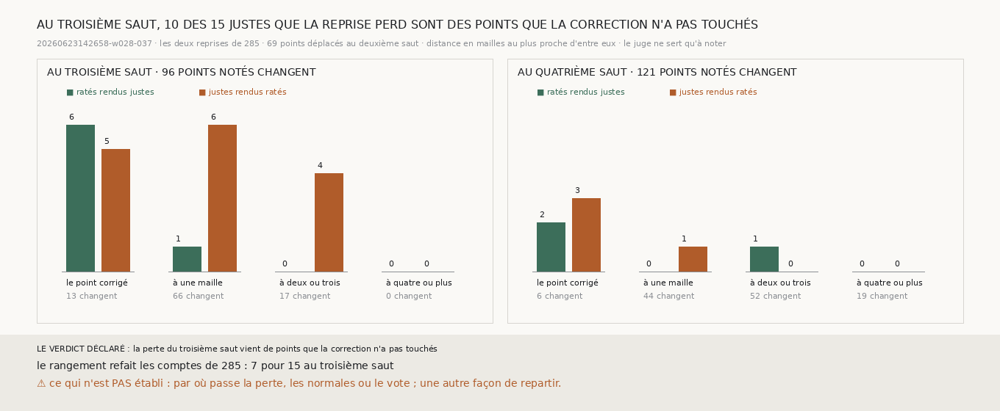

# `286` — Les justes que la chaîne repartie perd au troisième saut de la bande sont-ils les points que la correction a déplacés ? Non : 10 des 15 sont des points qu'elle n'a pas touchés

*Repartie du deuxième saut corrigé de la bande, recalé sur son rayon, la chaîne rend au troisième saut 7 ratés justes pour 15
justes ratés (`285`). La correction n'a pourtant déplacé que 69 points au deuxième saut. Un point déplacé peut changer le saut
suivant de deux façons : il part lui-même d'ailleurs, ou il change ses voisins. La chaîne recalcule en effet les normales par
différences entre mailles voisines, et son vote vise la médiane d'un carré de trois mailles, tour après tour. Cette tranche range
chaque changement du troisième saut par sa distance au plus proche point déplacé.*

## 0. Pourquoi cette tranche

C'est `R4-P95`. Le remède n'est pas le même selon la réponse : si la perte vient des points corrigés, c'est la correction qu'il
faut revoir ; si elle vient de leurs voisins, c'est la façon dont la chaîne repart d'une surface corrigée. Le module est écrit
avant ce rangement, et il déclare ses issues. Si plus de la moitié des justes que la reprise rend ratés au troisième saut sont
des points que la correction a déplacés, la perte vient des points corrigés eux-mêmes ; sinon, elle vient de points que la
correction n'a pas touchés.

## 1. Le rangement, et le contrôle

Les deux reprises sont celles de `285`. Son module a été découpé pour qu'elles se refassent ici, et, refait après ce découpage,
il redonne sa mesure à l'identique. La distance est en mailles : la plus grande des deux différences d'indices au plus proche
point déplacé. Le rangement refait les comptes de `285` : 7 pour 15 au troisième saut, 3 pour 4 au quatrième.

## 2. Au troisième saut

| distance au plus proche point déplacé | points notés qui changent | ratés rendus justes | justes rendus ratés |
|---|---|---|---|
| le point déplacé lui-même | 13 | 6 | 5 |
| une maille | 66 | 1 | 6 |
| deux ou trois mailles | 17 | 0 | 4 |
| quatre mailles ou plus | 0 | 0 | 0 |

Aux points déplacés eux-mêmes, la reprise rend 6 ratés justes pour 5 justes ratés. À côté d'eux, 1 pour 10.

⭐⭐⭐⭐ **Au troisième saut de la bande, 10 des 15 justes que la chaîne repartie du deuxième saut corrigé rend ratés sont des
points que la correction n'a pas touchés, à une, deux ou trois mailles d'un point déplacé. Aux points déplacés eux-mêmes, elle
rend 6 ratés justes pour 5 justes ratés** (`R4-F467`).

## 3. Au quatrième saut

| distance au plus proche point déplacé | points notés qui changent | ratés rendus justes | justes rendus ratés |
|---|---|---|---|
| le point déplacé lui-même | 6 | 2 | 3 |
| une maille | 44 | 0 | 1 |
| deux ou trois mailles | 52 | 1 | 0 |
| quatre mailles ou plus | 19 | 0 | 0 |

Au quatrième saut, les changements s'étendent à quatre mailles et plus, mais n'y rendent rien juste ni raté.

Parmi les points déplacés, 13 sont notés au deuxième et au troisième saut. Ceux qui étaient justes au deuxième saut recalé le
restent au troisième, 6 ; et ceux qui y étaient ratés le restent, 7.

## 4. Le verdict

**LA PERTE DU TROISIÈME SAUT VIENT DE POINTS QUE LA CORRECTION N'A PAS TOUCHÉS.**

## 5. Ce que cette tranche ne dit pas

- ⚠⚠ Par où la perte passe : les normales recalculées ou le vote. Les deux lisent les voisins, et ce rangement ne les sépare pas.
- ⚠ Une façon de repartir qui ne touche pas les voisins.
- ⚠ Si ces comptes, de l'ordre de dix points, se distinguent du hasard.

## 6. Les sondes

Une batterie de **7** contrôles et une figure de **11**. La distance en mailles est la plus grande des deux différences d'indices
au plus proche point déplacé. Un juste que la reprise rate est rangé à la distance de son point, et un point non noté ne compte
pas. Les classes couvrent toutes les distances une fois. Les issues s'excluent, et la mesure est indécidable sans son contrôle.

Trois contrôles cassés exprès ont échoué : la distance prise comme la somme des deux différences, les points non notés comptés,
une moitié exacte comptée comme une majorité. Dans la figure, deux contrôles cassés ont échoué : une barre qui porte un autre
compte que le sien, et un titre qui écrit un compte figé.

La mesure a pris 31,3 s, dans une unité systemd bornée à 7 Go et à six cœurs.

## 7. Ce qui reste

`R4-P95` reste ouverte. Aux points que la correction déplace, le troisième saut ne perd pas ; c'est autour d'eux qu'il perd. Il
reste à séparer les normales du vote, et à faire repartir la chaîne sans déranger les voisins d'un point corrigé.
