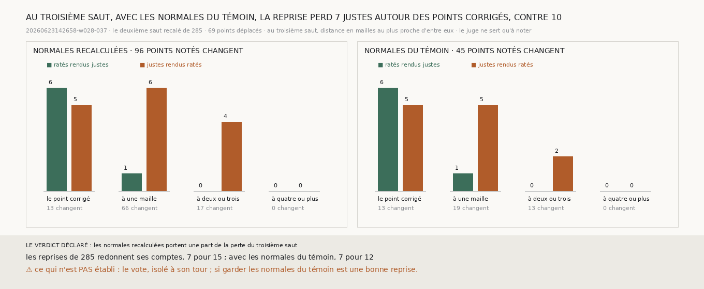

# `287` — Les normales recalculées portent-elles la perte du troisième saut de la bande, autour des points corrigés ? En partie : avec les normales du témoin, la reprise perd 7 justes autour d'eux, contre 10

*`286` trouve que 10 des 15 justes que la chaîne repartie du deuxième saut corrigé perd au troisième saut sont des points que
la correction n'a pas touchés. Deux mécanismes de la chaîne lisent les voisins d'un point. Le premier est le recalcul des normales
de la surface d'où elle repart, par différences entre mailles voisines. Le second est le vote, qui vise la médiane d'un carré de
trois mailles. Cette tranche fait repartir la chaîne du même deuxième saut recalé, mais avec les normales du témoin : aucune
normale n'est recalculée à partir des points déplacés.*

## 0. Pourquoi cette tranche

C'est `R4-P95`, et c'est la question que `286` laisse ouverte. Le module est écrit avant cette reprise, et il déclare ses issues.
Si les justes que la reprise rend ratés à une maille ou plus d'un point déplacé sont moins nombreux que dans `285`, les normales
recalculées portent une part de la perte ; sinon, elles ne la portent pas, et la perte passe par le vote ou par la lecture.

## 1. Ce qui est fait, et les contrôles

Le deuxième saut recalé est celui de `285`, refait à l'identique. La chaîne en repart pour le troisième et le quatrième saut avec
les normales du deuxième saut de `248`, celles du témoin ; après le troisième saut, les normales sont recalculées comme
d'habitude. Le témoin est celui de `285`, parti du deuxième saut non corrigé avec ces mêmes normales. Les reprises de `285`
redonnent ses comptes, 7 pour 15 au troisième saut et 3 pour 4 au quatrième, et la lecture n'a connu aucune panne.

## 2. Au troisième saut

| distance au plus proche point déplacé | normales recalculées : changent | ratés rendus justes | justes rendus ratés | normales du témoin : changent | ratés rendus justes | justes rendus ratés |
|---|---|---|---|---|---|---|
| le point déplacé lui-même | 13 | 6 | 5 | 13 | 6 | 5 |
| une maille | 66 | 1 | 6 | 19 | 1 | 5 |
| deux ou trois mailles | 17 | 0 | 4 | 13 | 0 | 2 |
| quatre mailles ou plus | 0 | 0 | 0 | 0 | 0 | 0 |

Avec les normales du témoin, 45 points notés changent au troisième saut, contre 96 ; à une maille d'un point déplacé, 19 contre
66. Aux points déplacés eux-mêmes, rien ne change : 6 ratés rendus justes pour 5 justes rendus ratés.

⭐⭐⭐⭐ **Avec les normales du témoin, la chaîne repartie du deuxième saut corrigé de la bande perd 7 justes autour des points
corrigés au troisième saut, contre 10 avec les normales recalculées. Sur tout le troisième saut, elle rend 7 ratés justes pour
12 justes ratés, un gain net de −5, contre −8** (`R4-F468`).

Au quatrième saut, elle rend 3 ratés justes pour 4 justes ratés, comme dans `285`.

## 3. Le verdict

**LES NORMALES RECALCULÉES PORTENT UNE PART DE LA PERTE DU TROISIÈME SAUT.**

## 4. Ce que cette tranche ne dit pas

- ⚠⚠ Où passent les 7 justes perdus qui restent : par le vote, ou par la lecture du rayon d'un point voisin. Le vote n'est pas
  isolé ici.
- ⚠ Si garder les normales du témoin est une bonne façon de repartir : le troisième saut perd encore, et ces comptes sont de
  l'ordre de dix points.

## 5. Les sondes

Une batterie de **3** contrôles et une figure de **11**. Autour des points corrigés veut dire à une maille ou plus, le point
lui-même exclu. La reprise suit les normales qu'on lui donne, sans les recalculer d'abord. Les issues s'excluent, et la mesure est
indécidable sans ses contrôles.

Trois contrôles cassés exprès ont échoué : le point corrigé compté parmi ses voisins, des normales remplacées par une direction
fixe, une égalité comptée comme une perte moindre. Dans la figure, deux contrôles cassés ont échoué : une barre qui porte un autre
compte que le sien, et un titre qui écrit un compte figé.

La mesure a pris 34,6 s, dans une unité systemd bornée à 7 Go et à six cœurs.

## 6. Ce qui reste

`R4-P95` reste ouverte. Les normales recalculées portent 3 des 10 justes perdus autour des points corrigés. Il reste à isoler le
vote, et à trouver une reprise qui ne perde pas le troisième saut.
