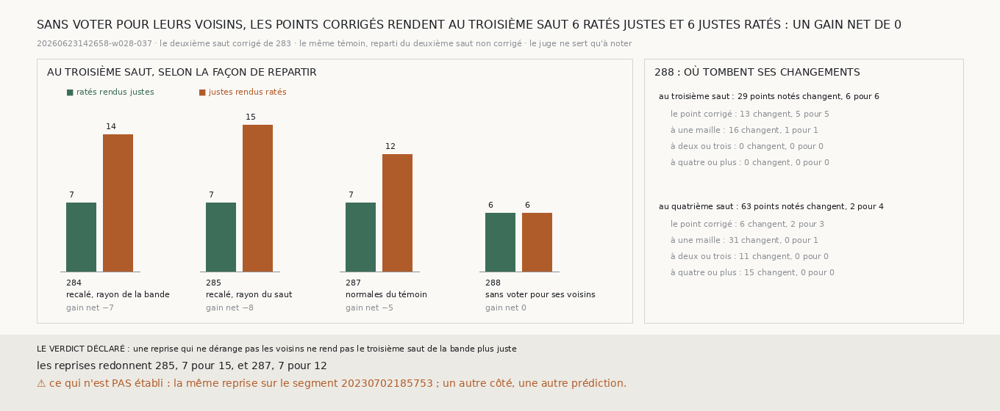

# `288` — Une reprise qui ne dérange pas les voisins des points corrigés rend-elle le troisième saut de la bande plus juste ? Non, mais elle ne le perd plus : 6 ratés justes pour 6 justes ratés, un gain net de 0

*De `284` à `287`, la chaîne repartie du deuxième saut corrigé de la bande perd le troisième saut, et surtout autour des points
corrigés (`286`). Avec les normales du témoin, un voisin d'un point corrigé lit le même rayon que le témoin, depuis la même
position ; il ne peut plus changer que par le vote, qui vise la médiane d'un carré de trois mailles (`287`). Cette reprise garde
les normales du témoin, et les points corrigés ne votent plus pour leurs voisins : leur correction vaut pour eux.*

## 0. Pourquoi cette tranche

C'est `R4-P95`. Le module est écrit avant cette reprise, et il déclare ses issues. Au troisième saut, si les ratés que la reprise
rend justes sont plus nombreux que les justes qu'elle rend ratés, une reprise qui ne dérange pas les voisins rend le troisième
saut plus juste ; sinon, non.

## 1. Ce qui change dans le calcul, et les contrôles

Le vote de `247` et la chaîne de `248` prennent désormais un masque facultatif : seuls les points marqués entrent dans la médiane
du vote de leurs voisins. Sans masque, rien ne change, et les batteries des deux modules le vérifient. La reprise part du deuxième
saut recalé de `285`, avec les normales du témoin comme dans `287`. Au troisième et au quatrième saut, les points que la correction
a déplacés ne votent plus pour leurs voisins ; eux-mêmes votent comme avant.

Les contrôles tiennent : les reprises de `285` redonnent ses comptes, 7 pour 15 au troisième saut ; avec tous les points
votants, la reprise redonne ceux de `287`, 7 pour 12 ; la lecture n'a connu aucune panne.

## 2. Au troisième saut, selon la façon de repartir

| la reprise | ratés rendus justes | justes rendus ratés | gain net |
|---|---|---|---|
| `284`, recalée sur le rayon de la bande | 7 | 14 | −7 |
| `285`, recalée sur son rayon | 7 | 15 | −8 |
| `287`, avec les normales du témoin | 7 | 12 | −5 |
| **`288`, sans voter pour ses voisins** | **6** | **6** | **0** |

Avec cette reprise, 29 points notés changent au troisième saut : 13 aux points déplacés eux-mêmes, qui rendent 5 ratés justes pour
5 justes ratés, et 16 à une maille, 1 pour 1. Plus rien ne change à deux mailles ou plus.

⭐⭐⭐⭐ **Repartie du deuxième saut corrigé de la bande avec les normales du témoin, et sans que les points corrigés votent pour
leurs voisins, la chaîne rend au troisième saut 6 ratés justes pour 6 justes ratés : un gain net de 0, contre −8 dans `285`**
(`R4-F469`).

Au quatrième saut, elle rend 2 ratés justes pour 4 justes ratés, dont 3 aux points déplacés eux-mêmes.

## 3. Le verdict

**UNE REPRISE QUI NE DÉRANGE PAS LES VOISINS NE REND PAS LE TROISIÈME SAUT DE LA BANDE PLUS JUSTE.**

## 4. Ce que cette tranche ne dit pas

- ⚠⚠ Pourquoi 16 points changent encore à une maille. Un point qui ne vote plus retire sa voix de la médiane de ses voisins,
  quand le témoin, lui, vote : ne plus voter n'est pas voter comme le témoin.
- ⚠ Le quatrième saut, où les normales sont de nouveau recalculées à partir des points déplacés.
- ⚠ La même reprise sur le segment `20230702185753`, un autre côté, une autre prédiction. Et ces comptes sont de l'ordre de dix
  points.

## 5. Les sondes

Une batterie de **4** contrôles et une figure de **11**. Un point qui ne vote pas n'entre plus dans la médiane de ses voisins, et
sans masque le vote est celui d'avant. La reprise passe le masque au vote de chaque saut. Les issues s'excluent, et la mesure est
indécidable sans ses contrôles.

Trois contrôles cassés exprès ont échoué : le vote qui ignore le masque, la chaîne qui ne le passe pas au vote, un gain nul compté
comme un saut plus juste. Dans la figure, deux contrôles cassés ont échoué : une barre qui porte un autre compte que le sien, et un
titre qui écrit un gain figé.

La mesure a pris 40,9 s, dans une unité systemd bornée à 7 Go et à six cœurs.

## 6. Ce qui reste

`R4-P95` reste ouverte. La perte du troisième saut vient de la façon dont la chaîne repart, et une reprise qui ne dérange pas les
voisins la supprime ; mais elle ne transforme pas encore le gain du deuxième saut en gain au troisième.
